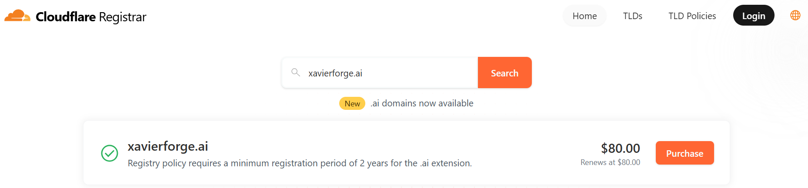
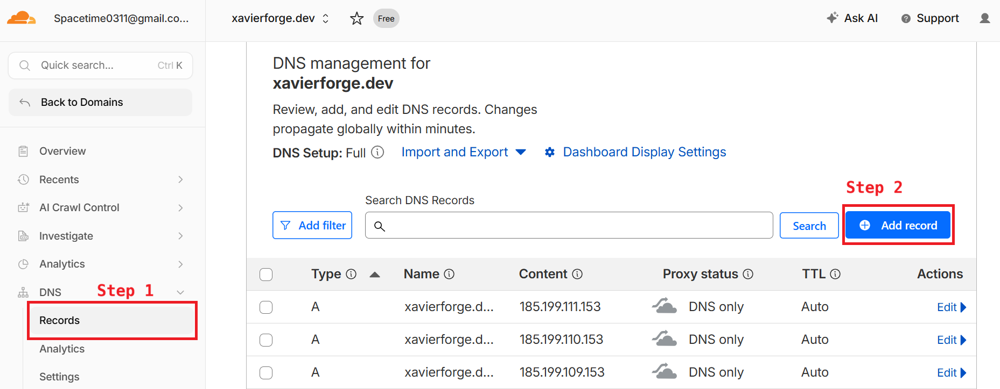
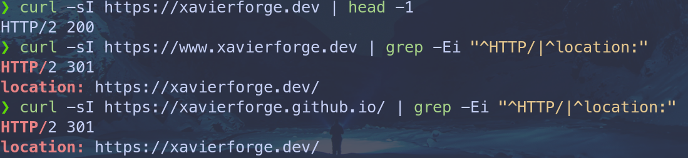
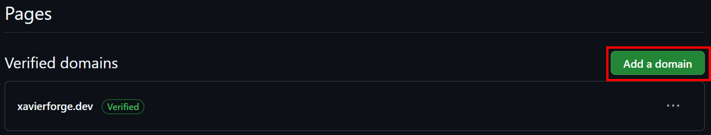
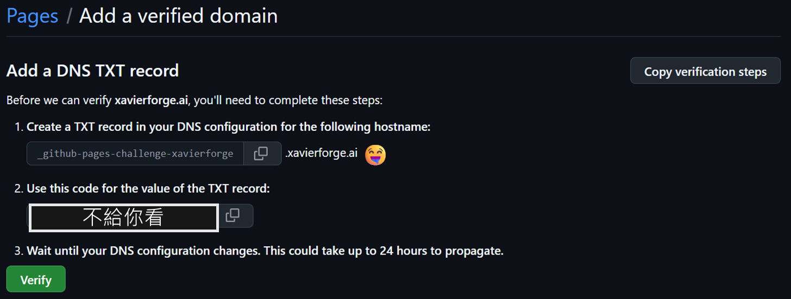
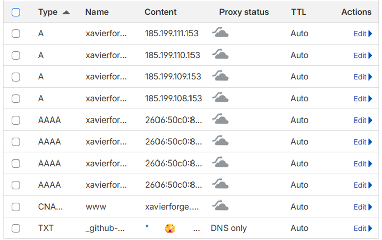

這陣子趁著把部落格從 Hexo 遷移到 Astro，順手把整個寫作與發布的體驗大翻新了一遍。

至於為什麼想 "搬家" 呢？
主要是因為原本依賴的 Hexo 主題已經許久無人維護，加上發文流程實在有點小麻煩，每次寫完文章，都得在不同平台手動調整格式、貼來貼去。

剛好我從去年開始全面改用 Obsidian 來管理筆記，就一直想著要改善這段工作流，所以就一鼓作氣拉著 Claude Code 來幫我搬家了。
現在的體驗就順暢多了，只要把想發表的文章放進 Vault 裡的 `published` 資料夾，並搭配適當的 frontmatter，就能自動發布，再也不用像以前那樣做繁瑣的手動排版了。

而在這次搬家做功課的過程中，我到處觀摩了許多人架設的部落格 (順便參考一下大家的 stack)，發現大家都有屬於自己的酷酷網域。
看著看著心裡不免也癢了起來，決定自己也要來弄一個，所以，這篇文章就誕生啦。
## 恍然大悟：GitHub Pages 與個人網域不是二選一
不過，在下定決心要買網域、準備掏卡結帳時，我其實一直有一個迷思。

一直以來，我都以為使用 GitHub Pages 放個人網站的話，網址就只能固定在 `<GitHub帳號>.github.io`。
如果想換成酷酷的個人網域，就得去另外找個主機商或是平台來部署，所以我一開始滿腦子都在想：「天啊，哪一個平台遷移起來最輕鬆？」

但稍微爬文研究一下之後，我馬上意識到自己根本問錯問題了。
原來這兩者完全是可以並存的！根本不需要做選擇，照樣能把網站免費掛在 GitHub Pages 上，同時把網址從 `xxx.github.io` 換成自己的專屬網域名稱。
講得白話一點，GitHub Pages 繼續負責當 "房子" (免費的主機託管)，而自訂網域只是幫這棟房子掛上一個好看的 "專屬門牌" 而已。
換句話說，這趟所謂的 "遷移" 根本稱不上遷移，純粹是花錢買個門牌就能解決的事。

但事情當然沒有我想的那麼簡單，實際走一遍發現，整個設定與驗證的流程其實挺有趣的，期間也踩了幾個小坑，非常值得記錄下來。
所以接下來就是我從 "買網域" 到 "新網域正式上線" 的完整流程。

先交代一下我的環境 Stack，如果讀者的配置跟我類似，基本上可以直接照抄：
- **框架**：Astro 6
- **託管**：GitHub Pages (使用 GitHub Actions 自動部署)
- **DNS 代管**：Cloudflare
## 第一步：選網域與查可用性
### TLD (頂級網域) 怎麼選？
要買網域遇到的第一個問題絕對是：名字要取什麼？

這部分對我來說相對簡單，考量到個人品牌的延續性，我在 `xavierdataforge` 與 `xavierforge` 之間猶豫了一下，最後選了後者。
一來長度不會太長，二來也能保留 forge 這個鍛造、打造的意象，但這部分完全看個人喜好，大家自己發揮創意即可。
決定好主名字後，接下來就是要選網域後綴了 (也就是 TLD，Top-Level Domain)。
我整理了幾個常見後綴的粗略比較與大約的年費，供大家參考：

| 後綴     | 年費 (約) | 備註                                                    |
| ------ | ------ | ----------------------------------------------------- |
| `.dev` | ~\$12   | 開發者味極濃！整個 TLD 都在 HSTS preload 名單裡 (強制走 HTTPS，非常安全乾淨)。 |
| `.com` | ~\$10   | 最通用、最便宜，一般大眾最熟悉的經典款。                                  |
| `.app` | ~\$14   | 跟 `.dev` 一樣強制 HTTPS，但語感上比較偏向「應用程式」或軟體產品。              |
| `.io`  | ~\$50   | 科技圈與新創的最愛，但價格偏貴，且 `.io` 屬地近年在國際上有些不確定性。               |
| `.ai`  | ~\$80   | 超級潮，搭上 AI 順風車，但貴非常多 (而且通常最少要綁定註冊 2 年)。                |

最後我毫不猶豫地選了 `.dev`，理由是它跟 `.ai` 一樣看起來很酷 (絕對不是因為這個錢幾乎可以多訂一個月的 MAX)，而且在瀏覽器層級就強制 HTTPS，感覺非常乾淨俐落。
### 查網域有沒有被註冊
網域這種東西講求先搶先贏，選好心儀的名字後，得先確認它還是 "自由之身"，否則前面的想了半天的酷名字瞬間就白費了。
而根據選的後綴不同，查詢可用性的指令也會有點差異。
首先，如果您選的是 `.com` 或 `.io`，可以直接在終端機用 `whois` 指令查詢 (如果沒裝記得先安裝)：
```bash
whois xavierforge.com   # 回傳 "No match for domain" = 可註冊
whois xavierforge.io    # 回傳 "Domain not found."   = 可註冊
```
但如果您跟我一樣選了 `.dev` 或 `.app` 這種由 Google (Charleston Road Registry) 營運的 TLD，系統內建的 `whois` 通常查不到最底層的註冊局資訊。
這時候改用 RDAP (HTTP 介面的查詢協定) 會最準確。
我們可以透過 `curl` 來看 HTTP 狀態碼，回傳 `404` 代表還沒人註冊，回傳 `200` 就代表來晚了一步：
```bash
# rdap.org 會 302 轉到對應註冊局，記得加 -L 跟隨轉址
curl -sL -o /dev/null -w "%{http_code}\n" https://rdap.org/domain/xavierforge.dev
# 看到印出 404，恭喜，可以註冊！
```
確認 `xavierforge.dev` 可以註冊後，我就直接到 [Cloudflare Registrar](https://www.cloudflare.com/products/registrar/) 下單買起來了 (好吧，其實直接在網頁查就知道有沒有被註冊過了)。
這裡強烈推薦在 Cloudflare 買網域，因為他們主打「原價續約」，沒有一堆首年便宜、次年宰肥羊的定價陷阱。

> [!WARNING] 溫馨提醒
> 網域註冊一旦刷卡下單就無法反悔，也不退款，所以送出前請務必把眼睛睜大，再三檢查拼字有沒有錯！
## 第二步：在 Cloudflare 設定 DNS
買好網域後，我們要設定 DNS，讓這個新門牌能正確指向 GitHub Pages 這棟房子。
請進到 Cloudflare 後台 $\rightarrow$ 您的網域 $\rightarrow$ DNS $\rightarrow$ Records，準備新增以下幾筆紀錄。

注意，稍後在加紀錄時，Proxy 一定要關成 DNS only (灰雲)，這朵雲預設是 **橘色 (Proxied)**，**一定要記得點一下變成灰色 (DNS only)**。
這是因為，開橘雲的話流量會先走 Cloudflare 自己的 SSL 憑證，GitHub 系統就沒辦法自動為我們的網域簽發專屬的 Let's Encrypt 憑證，甚至還可能因為兩邊的 SSL 模式衝突，導致網站陷入無窮轉址迴圈 (Redirect Loop)。
而設定成灰雲，代表流量會直接乾淨地打到 GitHub Pages，讓 GitHub 全權處理發憑證的事宜。
1. **各位觀眾！新增 4 條 A 紀錄 (根網域，Name 填 `@`)**
   A 紀錄 (Address Record) 最基本的工作，就是把網域 (例如 `xavierforge.dev`) 翻譯成伺服器的 **IPv4 位址**。可以把它想成通訊錄，負責把人名對應到電話號碼。
   請把 Name 填 `@` (代表根網域)，並將 IP 指向 GitHub 的伺服器：
   - `185.199.108.153`
   - `185.199.109.153`
   - `185.199.110.153`
   - `185.199.111.153`
2. **新增 4 條 AAAA 紀錄 (根網域，Name 填 `@`)**
   AAAA 紀錄跟 A 紀錄的功能一模一樣，只不過它是用來對應新一代、長得很複雜的 **IPv6 位址**。
   現在主流的服務器 (包含 GitHub Pages) 都已經支援 IPv6 了，強烈建議一起設定上去，確保各種網路環境都能順暢連線。
   同樣把 Name 填 `@`，IP 填入：
   - `2606:50c0:8000::153`
   - `2606:50c0:8001::153`
   - `2606:50c0:8002::153`
   - `2606:50c0:8003::153`
3. **新增 1 條 CNAME 紀錄 (www 子網域)**
   CNAME (別名紀錄) 不能指向 IP 位址，而是用來把一個網域指向「另一個網域名稱」。
   我們把它設定給 `www`，這等於告訴瀏覽器：「如果有訪客敲 `www.xavierforge.dev` 的門，直接幫我轉交給 GitHub Pages 處理就好！」
   這招在用託管服務時超方便，要是哪天 GitHub 換了 IP，我們也不用回來改設定，GitHub 自己知道該怎麼處理。
   - Name: `www`
   - Target: `xavierforge.github.io`

設定好之後，可以在終端機用 `dig` 指令驗證一下 DNS 有沒有擴散生效：
```bash
dig +short xavierforge.dev
# 應該要回傳剛剛設定的那四個 185.199.x.153 IP

dig +short www.xavierforge.dev
# 應該要回傳 xavierforge.github.io.
```
## 第三步：Repo 側設定 (Astro + GitHub Pages)
回到我們本機的專案，有兩個地方需要調整，而且我們還要準備一份 GitHub Actions 腳本來幫我們做全自動部署。
1. **加上 `public/CNAME` 檔案：**
   在 `public` 資料夾下建一個名為 `CNAME` (全大寫、無副檔名) 的檔案，裡面只要寫入裸網域即可。
   Astro 建置時會把它原封不動地複製進 `dist/` 裡：
   ```plaintext
   xavierforge.dev
   ```
2. **更新 Astro 站台 URL：**
   為了確保網站產生的 canonical link、Sitemap、RSS 還有社群分享用的 OG image 都能使用新網址，必須修改設定檔。
   以我的專案為例，只要去改 `src/site.config.ts` 即可：
   ```typescript
   url: "https://xavierforge.dev/",
   ```
3. **準備 GitHub Actions 部署腳本：**
   既然都說了要改善發文體驗，全自動部署當然是一定要的。
   如果讀者跟我一樣是 Astro 專案，可以在專案根目錄建立 `.github/workflows/pages.yml`，內容可以直接抄我這份：
   ```yaml
   name: Deploy to GitHub Pages

   on:
     push:
       branches:
         - main
     workflow_dispatch:

   permissions:
     contents: read
     pages: write
     id-token: write

   concurrency:
     group: pages
     cancel-in-progress: false

   jobs:
     build:
       runs-on: ubuntu-latest
       steps:
         - name: Checkout
           uses: actions/checkout@v6

         - name: Setup Node
           uses: actions/setup-node@v6
           with:
             node-version: "22"
             cache: "npm"

         - name: Install dependencies
           run: npm ci

         - name: Build
           run: npm run build

         - name: Upload Pages artifact
           uses: actions/upload-pages-artifact@v5
           with:
             path: ./dist

     deploy:
       needs: build
       runs-on: ubuntu-latest
       environment:
         name: github-pages
         url: ${{ steps.deployment.outputs.page_url }}
       steps:
         - name: Deploy to GitHub Pages
           id: deployment
           uses: actions/deploy-pages@v5
   ```
這段腳本其實很單純，主要就是指定 Node.js 環境 (我用 v22)、跑 `npm ci` 裝依賴、`npm run build` 打包 Astro 專案。
接著再利用 GitHub 官方的 `upload-pages-artifact` 把打包好的 `./dist` 資料夾傳上去，最後交由 `deploy-pages` 幫我們部署到 GitHub Pages 上。
把前兩步改好的檔案跟這份 YAML 腳本一起 commit 並 push 上 GitHub 後，GitHub Actions 就會啟動，全自動幫我們重新打包並部署。

不過，事情就是在這裡出現了一個會踩坑的地方！
### ⚠️ 踩坑點 1：用 GitHub Actions 部署時，CNAME 檔不會自動設定 Custom domain
網路上很多舊教學都會說：「只要把 CNAME 檔推上去，GitHub Pages 就會自動幫我們設好自訂網域。」
但事實上，那是以前透過推播 `gh-pages` 分支來部署才有的「舊行為」。
我這裡同時已經升級成上面那套用 `actions/deploy-pages` 的現代化部署流程，artifact 裡的 CNAME 檔並**不會**自動寫進 GitHub 的 Pages 設定裡，我們必須手動去登記。
這部分可以去 GitHub 網頁 UI 設定 (Repo $\rightarrow$ Settings $\rightarrow$ Pages $\rightarrow$ Custom domain 填入網域)。
或者像我一樣耍酷用 GitHub CLI 呼叫 API 來解決 (先別急著按 Enter 送出，請往下看 ⚠️ 踩坑點 2)：
```bash
gh api --method PUT repos/<owner>/<repo>/pages \
  -f cname=xavierforge.dev \
  -f build_type=workflow      # 明確告訴 GitHub 我們用 workflow 部署，避免設定跑掉
```
### ⚠️ 踩坑點 2：API 的「先有雞還是先有蛋」
如果讀者打算像我一樣，雙手不離開鍵盤，用 `gh` 指令一路設定到底，這裡要特別小心一個狀態衝突的坑。
假設我們的 Repo 剛好處於強制 HTTPS 開啟的狀態 (`https_enforced: true`)，當我們按下 Enter，帥氣地送出上面那段設定 CNAME 的指令時，GitHub 會直接報錯： `The certificate does not exist yet (HTTP 404)`
這是因為，GitHub 想要強制 HTTPS，但我們才剛換上新網域，它根本還沒把新憑證簽發下來。
此時我們必須要先退一步，照著以下順序來做：先確保 `Enforce HTTPS` 是關閉的並設定 CNAME → 等待 GitHub 把憑證簽好 (狀態變成 `approved`) → 最後再把 `Enforce HTTPS` 打開。
為了確保萬無一失，這裡直接附上防呆一條龍指令：
```bash
# 1. 綁定新網域，並強制帶上 https_enforced=false 來避開 404 報錯
gh api --method PUT repos/<owner>/<repo>/pages \
  -f cname=xavierforge.dev \
  -f build_type=workflow \
  -F https_enforced=false

# 2. 檢查憑證簽發狀態
# 重複敲這行，直到終端機印出的狀態變成 'approved' 為止 (通常需要等個幾分鐘)
gh api repos/<owner>/<repo>/pages \
  | python3 -c "import sys,json;c=json.load(sys.stdin).get('https_certificate') or {};print(c.get('state'))"

# 3. 憑證 approved 之後，執行最後這行把強制 HTTPS 重新打開
gh api --method PUT repos/<owner>/<repo>/pages -F https_enforced=true
```
## 第四步：驗證有沒有成功
指令敲完、設定好之後，就可以來檢查一下各種轉址有沒有如預期運作。
我們可以直接在終端機用 `curl` 來驗證看看：
```bash
# 1. 主網域應該要回傳 200 OK (第一行會顯示 HTTP/2 200)
curl -sI https://xavierforge.dev | head -1

# 2. www 子網域應該要 301 轉址到裸網域 (Apex)
# 這裡我們用 grep -Ei 把狀態碼 (HTTP) 跟目標位址 (location) 一起抓出來看
curl -sI https://www.xavierforge.dev | grep -Ei "^HTTP/|^location:"

# 3. 舊的 github.io 網址應該也要 301 轉到新網域 (這樣舊的 SEO 與外部連結才不會斷)
curl -sI https://xavierforge.github.io/ | grep -Ei "^HTTP/|^location:"
```
如果設定正確，主網域會順利拿到 `200`，而後面兩個轉址的指令，終端機預期會印出類似這樣的輸出：

看到這兩行，確認都有乖乖回傳 `301` 並指到新網域，就完美了！
## 第五步：帳號層級網域驗證 (防搶接管)
最後一步非常重要，我們要將這個網域綁定驗證到自己的 GitHub 帳號上。
因為如果不做這一步，當哪天剛好 CNAME 紀錄沒設好，或是手滑改錯，其他有心的 GitHub 使用者可能會把 `*.xavierforge.dev` 填進他自己 Repo 的 Custom domain，這樣就把我的網域 "搶接管 (Subdomain Takeover)"，拿去掛他自己的網站了 (也太壞！)。
這部分沒有公開的 API 可以打，必須乖乖切換到瀏覽器走網頁 UI：
1. 開啟帳號設定的 Pages 頁面：[https://github.com/settings/pages](https://github.com/settings/pages) (注意！是 "個人帳號" 的 Settings，不是單一 Repo 的 Settings)。
2. 點擊 `Verified domains` $\rightarrow$ `Add a domain`，輸入網域 (例如 `xavierforge.dev`)。

3. GitHub 會給我們一筆 TXT 紀錄的資訊：

   - **Name：** `_github-pages-challenge-<GitHub帳號>`
   - **Value：** 一串隨機生成的 token 字串。
4. 回到 Cloudflare 的 DNS 設定頁面，新增這筆 TXT 紀錄。
   現在完整的設定應該長這樣：

5. 在終端機用 `dig` 確認紀錄生效後，回到 GitHub 按下 `Verify`。
   ```bash
   # 檢查 TXT 紀錄是否已經在 DNS 上生效
   dig +short TXT _github-pages-challenge-<GitHub帳號>.xavierforge.dev
   ```

網頁上驗證完成後，還可以用 API 檢查一下 Repo 的 Pages 狀態，確認 `protected_domain_state` 是不是變成 `verified` 了：
```bash
gh api repos/<owner>/<repo>/pages \
  | python3 -c "import sys,json;print(json.load(sys.stdin).get('protected_domain_state'))"
# 如果終端機印出 verified，恭喜大功告成！
```
## 總結
整套折騰下來，專屬的新網域總算是正式上線了！
HTTPS 憑證、各種 301 轉址、防搶接管機制全部到位，搭配上 Obsidian 自動發布的流程，打完收工。
最後幫未來的自己 (也幫正在看這篇的各位) 濃縮一下這次踩過的幾個關鍵雷點：
1. **GitHub Pages 不排斥自訂網域：** 它免費幫我們當主機，網域只是我們買的門牌，兩者絕對可以完美並存。
2. **Cloudflare 一定要開灰雲 (DNS only)：** 不要開橘雲 (Proxied)，否則 GitHub 簽不了憑證，還會引發 SSL 轉址迴圈。
3. **Actions 部署與 CNAME：** 升級到 `deploy-pages` 部署後，程式碼裡的 `CNAME` 檔不會自動幫我們設定 Custom domain，必須自己打 API 或去 Settings 登記。
4. **憑證先後順序：** 要先設 CNAME (維持 HTTPS 關閉) → 等憑證 approved → 才能開 `https_enforced=true`。
5. **Astro 設定別忘記：** 記得同步修改 `site` URL，免得 Sitemap、RSS 或 OG Image 還指著舊網址。
6. **`.dev` 網域自帶安全感：** HSTS preload 讓瀏覽器強制走 HTTPS，所以純 HTTP 的 404 完全不用理會。
7. **記得做帳號層級的網域驗證：** 保護好自己的網域，防止被惡意搶接管。

把這個流程記錄下來，下次如果又手癢想開新站，就有現成的 SOP 可以照著跑啦！