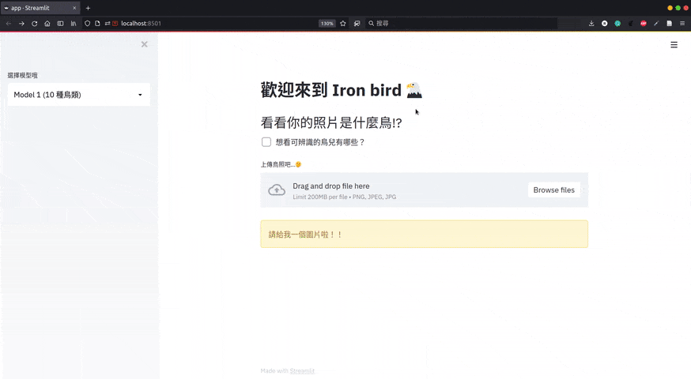
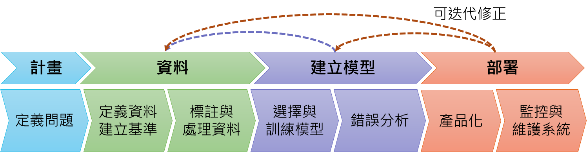
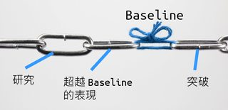

:::caution[AI-translated]
This article was machine-translated from the original Chinese with AI assistance.

If anything reads oddly or looks wrong, please [leave a comment](#comments) and I'll fix it.
:::

> This is the 30-day completion index and recap of my run at the 2021 iThome Ironman contest. Each entry was originally published on iThome — click through to read the original.
## 🏆 This series won an Honorable Mention at the 2021 iThome Ironman

---
## Closing thoughts
Thirty days flew by — it was my first time entering, completely green, and I honestly didn't think I'd make it to this day.
Keeping up a daily post really tests your willpower (and gave my PowerPoint diagramming skills a serious workout, haha). There were even two long holiday weekends in the middle where I nearly let myself go.
The original motivation: I'd been knocking around the machine learning field for about two years, going from beginner to having some grasp of it, and it happened to coincide with everyone talking about getting AI into production. So I wanted to take the chance to inventory what steps a machine learning product goes through from concept to actual output, and what you need to consider along the way — then use those concepts to build a simple web app:

You can tell this app is a long way from perfect, but at least it's a foot in the door, a step toward something larger.

The articles in this challenge are basically my notes from Part 1 of the Coursera specialization [Machine Learning Engineering for Production (MLOps) Specialization](https://www.coursera.org/specializations/machine-learning-engineering-for-production-mlops), "Introduction to Machine Learning in Production."

To keep things coherent and each day's post easy to read, I didn't include the deeper hands-on parts later in the course (built on [TensorFlow Extended (TFX)](https://www.tensorflow.org/tfx?hl=zh-tw)), but I really do recommend giving the course a listen — it covers how large-scale applications are actually done in real business settings.

I'd also recommend the material from [Full Stack Deep Learning](https://fullstackdeeplearning.com/). After this challenge wraps up I'll finally fill in that long-overdue gap, and share it with everyone when I get the chance!

If you're on the busier side, I strongly recommend Willis's series this year, [Talking MLOps from the Angle of Getting AI into Production](https://ithelp.ithome.com.tw/users/20121130/ironman/4015) — it's all neatly organized and walks you through it step by step. Not reading it would honestly be doing yourself a disservice, so go open a tab right now: [Day 30: A Comprehensive Rundown of MLOps Levels 0–2](https://ithelp.ithome.com.tw/articles/10274317).

Finally, thank you to my three children who subscribed — I really didn't expect anyone would do me the honor, haha.
## Article index
The whole series revolves around the "machine learning product lifecycle" diagram below, so I'll organize it here in posting order:

＊Image adapted from [Introduction to Machine Learning in Production](https://www.coursera.org/learn/introduction-to-machine-learning-in-production/home/welcome)
### 1. Overview
- [[Day 01] Prologue — Who Killed the Model?](https://ithelp.ithome.com.tw/articles/10265358)
- [[Day 02] Why MLOps — From "Flat Earth" to the Cosmos](https://ithelp.ithome.com.tw/articles/10265468)
- [[Day 03] The Machine Learning Product Lifecycle — Somebody Save Me](https://ithelp.ithome.com.tw/articles/10265896)
### 2. Deployment
- [[Day 04] The Challenges of Deploying Models — Data Loves a Costume Change Too!?](https://ithelp.ithome.com.tw/articles/10267729)
- [[Day 05] Deployment Patterns — My Model Is Named Tweety](https://ithelp.ithome.com.tw/articles/10268119)
- [[Day 06] Monitoring & Maintenance — Go Open Your Own Detective Agency!](https://ithelp.ithome.com.tw/articles/10268867)
- [[Day 07] Deploying YOLOv4 with fastAPI (1/2) — Interacting via the Built-in Client](https://ithelp.ithome.com.tw/articles/10269911)
- [[Day 08] Deploying YOLOv4 with fastAPI (2/2) — Writing Your Own Client](https://ithelp.ithome.com.tw/articles/10270393)
### 3. Building the Model
- [[Day 09] Building a Machine Learning Model — The Way Andrew Ng Says To](https://ithelp.ithome.com.tw/articles/10270985)
- [[Day 10] The Challenge of Hitting Business Metrics — The Fall of Test-Set Performance](https://ithelp.ithome.com.tw/articles/10271734)
- [[Day 11] Building a Baseline — The First Step of Any ML Project](https://ithelp.ithome.com.tw/articles/10272420)

> Behind the scenes: I really wanted to capture this analogy in a picture, but lacking any drawing ability, I spent ages hunting down this background image and nearly capsized right here, haha.
- [[Day 12] Error Analysis — Growing Through Mistakes](https://ithelp.ithome.com.tw/articles/10273175)
- [[Day 13] Data Augmentation — I Want It All.jpg](https://ithelp.ithome.com.tw/articles/10273884)
- [[Day 14] Audit Performance — Models Need Their Final-Exam Audit Too ༼ಢ_ಢ༽](https://ithelp.ithome.com.tw/articles/10274410)
- [[Day 15] ML Experiment Management — Flip the Face-Down Trap Card: the Ledger!](https://ithelp.ithome.com.tw/articles/10275212)
### 4. Data
- [[Day 16] Data! — Data Is My Superpower](https://ithelp.ithome.com.tw/articles/10275652)
- [[Day 17] Defining Data — Is Being Clear Really That Hard?](https://ithelp.ithome.com.tw/articles/10276457)
- [[Day 18] Revisiting HLP — Human(?) Performance Is About Lifting Others as You Lift Yourself](https://ithelp.ithome.com.tw/articles/10276854)
- [[Day 19] Collecting Data — You've Got to Take Responsibility for It!](https://ithelp.ithome.com.tw/articles/10277122)
- [[Day 20] Data Labeling (1/2) — Forget about the price tag ♫](https://ithelp.ithome.com.tw/articles/10277720)
- [[Day 21] Data Labeling (2/2) — Various Labeling Methods](https://ithelp.ithome.com.tw/articles/10278202)
- [[Day 22] Validating Data — Keep It Clean! Installing the Gatekeeper of the Data World](https://ithelp.ithome.com.tw/articles/10278667)
- [[Day 23] The Data Journey — I Really Want to Go Out and Play V1.0 ٩(●ᴗ●)۶](https://ithelp.ithome.com.tw/articles/10278825)
### 5. Scoping
- [[Day 24] Scoping — Just as Planned](https://ithelp.ithome.com.tw/articles/10279726)
### 6. Final Project
- [[Day 25] Final Project (1/5) — Goals and Plan Overview](https://ithelp.ithome.com.tw/articles/10279962)
- [[Day 26] Final Project (2/5) — Getting Started](https://ithelp.ithome.com.tw/articles/10280136)
- [[Day 27] Final Project (3/5) — Running the App Locally](https://ithelp.ithome.com.tw/articles/10280584)
- [[Day 28] Final Project (4/5) — Deploying the Model to Google AI Platform](https://ithelp.ithome.com.tw/articles/10281097)
- [[Day 29] Final Project (5/5) — Deploying the App to Google App Engine](https://ithelp.ithome.com.tw/articles/10281139)

Oh, and I'll get the [GitHub](https://github.com/eatPizza311/iThome-2021ironman) README filled in as soon as I can. See you next year~
(From your future self: turns out "next time" was two years later, hehe.)
