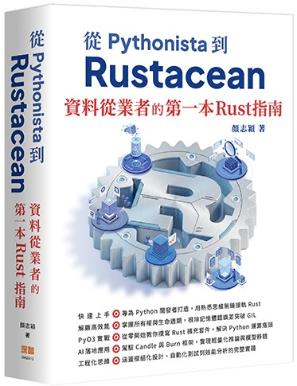
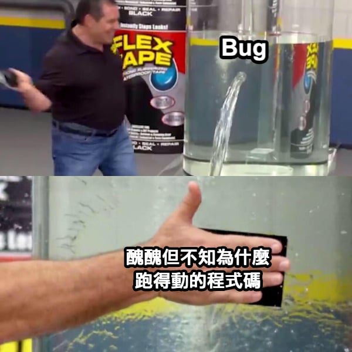

:::caution[AI-translated]
This article was machine-translated from the original Chinese with AI assistance.

If anything reads oddly or looks wrong, please [leave a comment](#comments) and I'll fix it.
:::

> Here's the 30-day completion index and recap of my run at the 2023 iThome Ironman contest. Each entry was originally published on iThome — click through to read the original.
## This series later became a book!
This Ironman series was later heavily revised and expanded into my first book, **"From Pythonista to Rustacean: A Data Practitioner's First Guide to Rust"** (published by GoTop / Deep Wisdom).

If you'd like a more complete, more up-to-date, more systematic version, your support is very welcome:

- 📕 [books.com.tw](https://www.books.com.tw/products/0011044858)
- 📗 [Tenlong Bookstore](https://www.tenlong.com.tw/products/9786267757789)
> Compared to this series, the book adds a hands-on PyO3 extension project, AI-in-production applications with the Candle and Burn frameworks, and a more complete take on engineering practices.

---
## Today's Ferris
It's the final day — congrats to me for finishing! These 30 days were a lot like generating art with Stable Diffusion: sometimes maddening, sometimes smooth sailing, but either way we grew through the attempts. Here's a heap of finish-line sprint shots, with [Ferris boy](https://www.youtube.com/watch?v=dQw4w9WgXcQ) taking center stage (as in the cover above).
## Closing thoughts
I survived~ I have to say, running it "raw" (no buffer of pre-written posts) is pretty hardcore. Writing this down to remind myself: next time, stockpile some articles, or else...

＊A note to my future self: this is a topical meme — ["You're just like a chawanmushi" — eye contact at a sushi bar sparks a clash](https://www.youtube.com/watch?v=xr8PzQ7qntk&t=5s).

This challenge once again dragged on across two holiday weekends (even though I was the fifth person to sign up, haha), and on top of that my cat needed to see the vet (a healthy little one now, thank heaven, thank earth, [thank fate for letting us meet](https://www.youtube.com/watch?v=Mh5r3aD2iwg&t=23s)). It was genuinely hard to polish the articles to a level I was fully happy with — especially the project part, where I really couldn't spend much time debugging and optimizing, and could only find a way to get the existing code running. That's probably the biggest regret of this challenge:

I think many contestants can relate to this: there's no end to finishing an article, but the Ironman deadline is midnight (the system standard time at the bottom, UTC+0800, turns red — terrifying). Either way, the work is finished the moment a reader sees it, so I'm grateful to everyone who tuned in — especially those who fearlessly clicked the oddly placed hyperlinks, unsurprisingly found something weird, and still managed a knowing smile. And I didn't expect five more subscribers than last time — many thanks for letting me contribute to the little bell in your top-right corner!

Finally, the goal of this challenge was to explore, from a Python user's angle, whether Rust + MLOps is worth it. Here's my personal conclusion (discussion welcome in the comments below!):

> I believe Rust is absolutely part of the future — it brings us better performance and cleaner solutions. But for the community this is an addition, not a replacement, just as Scala and R are still around and the little elephant Hadoop will keep us company into old age. For the foreseeable future Python will keep its throne as king of ML, but Rust is absolutely a powerful Swiss Army knife in the toolkit. All in all, Rust + MLOps really is worth it — when we need performance, it's a perfect fit!
> 
## Article index
Over the past 30 days we first brought Rust into our daily workflow, built an LLM chatbot project, and then discussed how Rust can be applied from the angles of data, model, and product — what a thrilling ride!

Here's the in-order roundup of each topic's posts — please enjoy:
### 1. From Python to Rust
> Using the workflow every software project goes through to explain how to gracefully move from Python to Rust — basically, convincing everyone why they should learn Rust 🤣
- [[Day 02] From Python 🐍 to Rust 🦀 | A Super Overview, and What About Mojo🔥?](https://ithelp.ithome.com.tw/articles/10319293)
- [[Day 03] From Python 🐍 to Rust 🦀 | Let's Get to Work! Install, Environment, and Dependency Management](https://ithelp.ithome.com.tw/articles/10321315)
- [[Day 04] Use It Wherever You Go 🏃 — the Rust MLOps GitHub Template and Developing in Containers](https://ithelp.ithome.com.tw/articles/10322608)
- [[Day 05] Rust's Deadly Combo 🧨 — Makefile, Let's Roll, Baby](https://ithelp.ithome.com.tw/articles/10323209)
- [[Day 06] The Unstoppable Wheel 🌪️ — GitHub Actions Gets Rust CI Spinning](https://ithelp.ithome.com.tw/articles/10324013)
- [[Day 07] Rust x Unit Testing x MLOps (Part 1)](https://ithelp.ithome.com.tw/articles/10324999)
- [[Day 08] Rust x Unit Testing x MLOps (Part 2)](https://ithelp.ithome.com.tw/articles/10325651)
- [[Day 09] From Python 🐍 to Rust 🦀 | The Final MLOps Comparison ⚔️ and Sustainable Environments 🍀](https://ithelp.ithome.com.tw/articles/10326453)
### 2. Project!
> Building a chatbot project that uses a Huggingface LLM model
> 
- [[Day 10] Iron Llama 🦙 LLM chatbot 🤖 (1/10) | Project Intro](https://ithelp.ithome.com.tw/articles/10327495)
- [[Day 11] Iron Llama 🦙 LLM chatbot 🤖 (2/10) | Pre-flight Prep](https://ithelp.ithome.com.tw/articles/10328736)
- [[Day 12] Iron Llama 🦙 LLM chatbot 🤖 (3/10) | A Little Leptos Class](https://ithelp.ithome.com.tw/articles/10329279)
- [[Day 13] Iron Llama 🦙 LLM chatbot 🤖 (4/10) | The Data Structures of a Conversation](https://ithelp.ithome.com.tw/articles/10329850)
- [[Day 14] Iron Llama 🦙 LLM chatbot 🤖 (5/10) | Signal & Action](https://ithelp.ithome.com.tw/articles/10330642)
- [[Day 15] Iron Llama 🦙 LLM chatbot 🤖 (6/10) | GGML-Quantized LLaMa](https://ithelp.ithome.com.tw/articles/10331431)
- [[Day 16] Iron Llama 🦙 LLM chatbot 🤖 (7/10) | The Backend LLM API](https://ithelp.ithome.com.tw/articles/10332054)
- [[Day 17] Iron Llama 🦙 LLM chatbot 🤖 (8/10) | Loading a GGML Model in Rust](https://ithelp.ithome.com.tw/articles/10332674)
- [[Day 18] Iron Llama 🦙 LLM chatbot 🤖 (9/10) | Frontend Polish and the Final Result](https://ithelp.ithome.com.tw/articles/10332816)
- [[Day 19] Iron Llama 🦙 LLM chatbot 🤖 (10/10) | Conclusion and Outlook](https://ithelp.ithome.com.tw/articles/10334027)
### 3. Keep on Rusting
> Catching our breath to talk about Rust's learning resources and how to coexist with the borrow checker, Rust's most off-putting feature for newcomers
- [[Day 20] Intermission 🏖️ How Do You Get Through Rust's Tutorial Village? I'll Take On All Ten Borrow Checkers!](https://ithelp.ithome.com.tw/articles/10334331)
### 4. Rust + MLOps
> Back to the MLOps theme, discussing how Rust can shine here from an ML system design angle. This part draws on [Chip Huyen](https://huyenchip.com/)'s book [Designing Machine Learning Systems](https://learning.oreilly.com/library/view/designing-machine-learning/9781098107956/), grouped in two-to-three-day blocks, looking at ML systems from the three angles of data, model, and product, and how Rust can be applied in MLOps.
- [[Day 21] Machine Learning System Design 🏭 x Rust 🦀](https://ithelp.ithome.com.tw/articles/10335213)
- [[Day 22] Data Processing and Feature Engineering 🔢 (Part 1) | ML System Design 🏭](https://ithelp.ithome.com.tw/articles/10335893)
- [[Day 23] Data Processing and Feature Engineering 🔢 (Part 2) | ML System Design 🏭](https://ithelp.ithome.com.tw/articles/10336339)
- [[Day 24] Data Processing and Feature Engineering 🔢 (Part 3) | Rust x Jupyter Data Engineering 🦀](https://ithelp.ithome.com.tw/articles/10336919)
- [[Day 25] Model Development 🧠 (Part 1) | ML System Design 🏭](https://ithelp.ithome.com.tw/articles/10337842)
- [[Day 26] Model Development 🧠 (Part 2) | Rust x PyTorch Model Training and Export 🦀](https://ithelp.ithome.com.tw/articles/10337882)
- [[Day 27] Prediction Service 🚀 (Part 1) | ML System Design 🏭](https://ithelp.ithome.com.tw/articles/10338524)
- [[Day 28] Prediction Service 🚀 (Part 2) | Rust x Docker — Deploying the Iron Llama 🦙🦀](https://ithelp.ithome.com.tw/articles/10338993)
- [[Day 29] Final Column 🎞️ | Is Rust the Future of Data Analysis?](https://ithelp.ithome.com.tw/articles/10339414)

Alright, see you next time~
