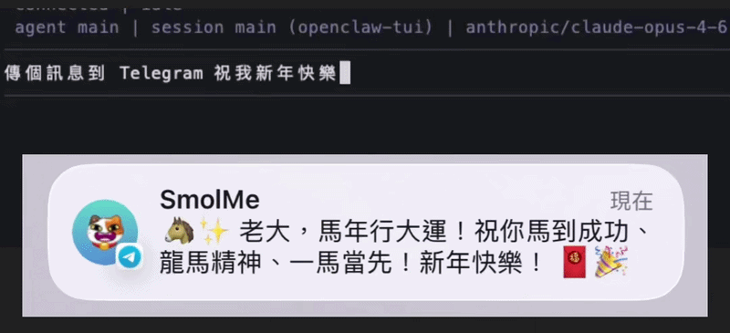

:::caution[AI-translated]
This article was machine-translated from the original Chinese with AI assistance.

If anything reads oddly or looks wrong, please [leave a comment](#comments) and I'll fix it.
:::

While doing the big Lunar New Year cleanup back home this year, I dug a long-idle Jetson Nano Developer Kit out of my box of treasures, and suddenly remembered I owned this little gem.  

But here in 2026, the compute power of my Jetson Nano P3450 (the B01 developer kit) is long past its prime.  

As it happens, I'd just read that [PicoClaw](https://github.com/sipeed/picoclaw/tree/main) can run on embedded dev boards, and I thought: even though the Jetson Nano has been retired, its compute power isn't half bad after all. Add in its extremely low power draw and a full GPIO interface, and it's still a great host for a local Agent Gateway.

And honestly, after seeing so many security disasters caused by Agents granted too much privilege, even though I roughly know how to lock things down, I still didn't dare hand this kind of AI Agent my main working hardware right away.  

So I figured I'd use the holiday break to see if I could turn this old-timer into a secure, isolated environment — my own little lobster tank — and raise a [Clawdbot-Moltbot-OpenClaw](https://github.com/openclaw/openclaw) inside it~
## System Specs
| Item    | Spec                                       |
| ------- | ------------------------------------------ |
| Board   | NVIDIA Jetson Nano (4GB)                   |
| GPU     | NVIDIA Maxwell with 128 NVIDIA CUDA® cores |
| CPU     | Quad-core ARM Cortex-A57                   |
| RAM     | 4GB 64-bit LPDDR4                          |
| Storage | 64GB MicroSD                               |
| OS      | Ubuntu 18.04.6 LTS (JetPack R32.7.6)       |
| Kernel  | 4.9.337-tegra                              |

First off, I have to say: since I'd completely lost all memory of the last time I used this kid, opening it up revealed a desktop crammed full of YOLOv4-related stuff, and I have no idea what kind of weird stalker system I was trying to build back then.
So this time I chose to reflash it completely, giving myself a clean slate, and updated JetPack to the last stable state before it went end-of-life.

For this part you can refer directly to NVIDIA's official [Get Started With Jetson Nano Developer Kit](https://developer.nvidia.com/embedded/learn/get-started-jetson-nano-devkit#intro), which has fairly complete instructions, so I won't repeat them here.

For connectivity, I plugged in a USB Wi-Fi adapter and mostly SSH in over the Local network to work on it, but occasionally I'll also hook up HDMI to check things like whether the browser is actually being launched correctly.
## The Jetson Nano's Inherent Limits and How to Break Through Them
As mentioned earlier, this version of the Jetson Nano has been thoroughly abandoned, with official support frozen at JetPack 4.6.1, which means the operating system is permanently locked to Ubuntu 18.04.
This limitation triggers a fatal chain reaction: the C standard library (`glibc`) bundled with Ubuntu 18.04 is too old.

Modern AI tools (including the Node.js 22+ that OpenClaw depends on) all require a newer `glibc` to compile and run.

If you follow the official docs and install Node.js directly, all you get is the cold, hard `Kernel too old` error.
Since the hardware and the underlying OS can't be changed, we have to work from the runtime environment and system security instead, building this sturdy lobster tank step by step.
### Step 1: Clean the Water and Reinforce the Tank (System Limits and Security Hardening)
Letting an Agent with shell execution privileges run wild on an old system is just a little too thrilling.

So before we start raising lobsters, we have to set up the defenses and squeeze out every bit of performance.
#### 1. Enable ESM for Security Updates
Although Ubuntu 18.04 lost regular support back in 2023, we can extend its life to 2028 through the free Expanded Security Maintenance (ESM).

Head to ubuntu.com/pro to get a free token (you get a quota of five machines), then run in the terminal:
```Bash
sudo pro attach YOUR_FREE_TOKEN 
sudo apt update && sudo apt upgrade -y
```
In my own testing, right after reflashing and enabling ESM, it immediately patched over three hundred potential security vulnerabilities.
#### 2. Create Swap and Disable Useless Services (Squeezing Out Memory)
This machine has a pitiful 4GB of RAM, so to keep OpenClaw from crashing when it runs out of memory, we have to forcibly carve out 4GB of disk space as virtual memory:
```Bash
sudo fallocate -l 4G /var/swapfile
sudo chmod 600 /var/swapfile
sudo mkswap /var/swapfile
sudo swapon /var/swapfile
echo '/var/swapfile none swap sw 0 0' | sudo tee -a /etc/fstab
```
Next, completely seal away `rpcbind` (Port 111) — an old service that's utterly useless on a standalone machine and is often used as a target for intranet attacks:
```Bash
sudo systemctl stop rpcbind.socket rpcbind.service
sudo systemctl disable rpcbind.socket rpcbind.service
sudo systemctl mask rpcbind.socket rpcbind.service
```
#### 3. Firewall and SSH Key Lockdown
To make sure only we can touch this tank of water.
##### Phase 1: Generate and Send the Key on the Control Host (e.g. a Laptop)
Open the terminal on the computer you normally work from and generate a more secure `ed25519` key (when it asks you to configure things, just press Enter to accept all the defaults):
```bash
ssh-keygen -t ed25519 -C "nano-key"
```
Next, send this generated public key over to the Jetson Nano (replace the IP with the actual address; if you're on the same WiFi Local network, you can check it with `ifconfig` — it should be the IP after `inet` on `wlan0`):
```bash
ssh-copy-id YOUR_USER@<Nano's IP address>
```
The system will ask you to enter the Nano's login password one last time; once you do, the public key is automatically written into the Nano's authorized list.
##### Phase 2: Disable Password Authentication and Enable the Firewall (Done on the Nano)
Immediately test `ssh YOUR_USER@<Nano's IP address>` from your control host and confirm that you can now log in directly without entering a password. Once that's confirmed, we can safely lock up the password-login backdoor.
In the Nano's terminal, type:
```bash
# 編輯 SSH 設定檔  
sudo vim /etc/ssh/sshd_config
```
Find the line `PasswordAuthentication yes` and change it to `no` (if there's a `#` comment symbol at the very front of that line, delete it as well).

After saving and quitting (`:wq`), restart the SSH service so the change takes effect:
```bash
sudo systemctl restart ssh
```
Finally, enable the UFW firewall, which by default blocks all uninvited connections (be sure to run the command that allows `ssh` first — otherwise, the moment the firewall comes up, even we'll be locked out the door):
```Bash
sudo apt install ufw -y
sudo ufw allow ssh
sudo ufw default deny incoming
sudo ufw default allow outgoing
sudo ufw enable
```
### Step 2: Cure the Old System's Indigestion — Eat My Special Bun!
Continuing the lobster-tank metaphor: OpenClaw, this modern AI lobster, originally feeds on Node.js 22+.

But the basic ecosystem in this tank of old Ubuntu 18.04 water (the C standard library `glibc`) is just far too ancient. If you force-feed it a new version of Node.js, the system gets severe indigestion and spits out the merciless `Kernel too old` error.

When facing this `glibc` error, Bun — which was recently acquired by Anthropic — is our perfect savior.
As a modern JavaScript runtime, it uses static compilation, completely ignoring the old underlying dependency limits of Ubuntu 18.04.

Add in its blazing startup speed and lower memory overhead, and it's tailor-made for this kind of [classic old jalopy](https://x.com/heroaca_anime/status/2016164303900954705/photo/1), so let's just install it right away:
```Bash
sudo apt install -y curl unzip
curl -fsSL https://bun.sh/install | bash
source ~/.bashrc
```
Note, though, that while Bun lets us install OpenClaw, [the official docs do not recommend using Bun as the runtime for a "production" Gateway](https://docs.openclaw.ai/install/bun), because it may run into some compatibility bugs when bridging to external messaging apps like WhatsApp or Telegram.

But for our tank of 2019-vintage old water (Ubuntu 18.04), this is already the easiest approach.

Since this is an extreme "junk reuse" sandbox experiment thrown together over the holidays, this little potential gastrointestinal side effect is just a compromise we have to accept to keep this AI lobster alive!
BTW, I personally actually ended up in the ER on Lunar New Year's Eve getting hooked up to an IV drip for acute gastroenteritis 🤦, which is exactly why I forced in this indigestion metaphor here.
### Step 3: Release the Lobster and Fix the Shebang
With this special Bun in hand, we can finally drop OpenClaw into the tank with peace of mind:
```Bash
bun install -g openclaw@latest
```

> [!NOTE] 2026/03/06 Update
> When running OpenClaw in a pure Bun environment, you'll often hit the error `Executable not found in $PATH: "node"`.  
> At first I did what the article below suggests and manually edited the script's shebang, but this gets overwritten and reset every time OpenClaw updates, and on top of that many underlying commands still look for `node` by default, so repeatedly patching it is just too much hassle.  
> Since our Jetson Nano never had native Node.js installed and doesn't need it, the most permanent fix is to simply create a symlink pointing the `node` command to `bun`, letting the highly compatible Bun step in as a pinch hitter.  
> As for why we can just point the `node` command straight at `bun`? It's because Bun was designed from the start as a drop-in replacement for Node.js, with a complete underlying implementation of Node.js's core APIs and module resolution mechanism. So when the system follows the shortcut and hands the task over, Bun can directly understand and correctly execute those scripts, and the program never even notices that Bun is really the one filling in.  
> Just run `ln -s $(which bun) ~/.bun/bin/node` in the terminal to create the shortcut, then type `node -v` and confirm that Bun's version number pops up — done. No matter how things get updated in the future, you'll never have to worry about it again!

But there's one small pitfall here: the shebang at the top of the OpenClaw executable defaults to `#!/usr/bin/env node`.

If you don't change it, the system will still naively go looking for that nonexistent Node.js, so remember to fix it after installation, forcing it to point at Bun:
```Bash
sed -i '1s|#!/usr/bin/env node|#!/usr/bin/env bun|' ~/.bun/install/global/node_modules/openclaw/openclaw.mjs
```
### Step 4: Make It Stay Put at the Bottom of the Tank (The Daemon Background Service Pitfall)
At this point, OpenClaw is finally in the tank!

But the shebang change we just made only gets the `openclaw` command itself to run properly, so it no longer throws an error from being unable to find Node.

In other words, we can now "manually" play with this lobster.
But if we want it to obediently stay put at the bottom of the tank and keep running even after we close the terminal (i.e. set up a systemd background service), we immediately step on the next landmine.

When we hopefully type out the official background-service install command:
```
openclaw onboard --install-daemon
```
you'll find the install script is very stubborn, still doggedly staring at the system environment and forcibly looking for any trace of Node 22+. Naturally, the script crashes and goes on strike because it can't find a Node that meets the standard.

So to keep the script from rummaging around the system environment, we have to use `bunx` to force the install script to run inside Bun's virtual environment. This successfully fools the system's check mechanism and lets us generate the service config file:
```Bash
bunx openclaw onboard --install-daemon
```
Follow the prompts all the way through, and you should be able to successfully create the service and reach the TUI or WebUI where you can configure the lobster's personality.

But! Don't celebrate just yet!

Open `~/.config/systemd/user/openclaw-gateway.service` and take a look — you should find that `ExecStart` has actually been hardcoded to a temporary path like `/tmp/bun-node-xxx/node`.
This is a fatal flaw: the moment the Nano reboots and `/tmp` is wiped, the lobster drops dead on the spot.
So here we have to manually swap it for the real Bun path (replace `YOUR_USER_NAME` with your Ubuntu login account):
```Bash
sed -i 's|/tmp/bun-node-[a-zA-Z0-9]*/node|/home/YOUR_USER_NAME/.bun/bin/bun|g' ~/.config/systemd/user/openclaw-gateway.service
systemctl --user daemon-reload
systemctl --user restart openclaw-gateway.service
```
Finally, type this line to enable Linger (user lingering), ensuring the service stays resident in the background:
```Bash
sudo loginctl enable-linger YOUR_USER_NAME
```
And there we go — this isolated, secure lobster tank is finished. We successfully worked around the OS limits of 2019 hardware and turned this retired Jetson Nano into a quiet, power-sipping AI secretary host!

In the future, whether I want to write some Rust skills for the Agent to call or have it run a quantitative-trading monitoring script in the background, I can mess around freely inside this sandbox without ever worrying that it'll wreck my main working machine.

Oh right, remember to run the following two commands regularly to make sure our usage stays secure:
```bash
openclaw security audit --deep  
openclaw security audit --fix
```
And here's my little lobster wishing everyone a (belated) Happy New Year:

## Closing Thoughts
Looking back, every one of these steps was really about finding ways to dodge the trouble caused by an aging system.
The Jetson Nano's fate is nailed by NVIDIA to JetPack 4.6.x, and this isn't simply a matter of the OS being stuck on Ubuntu 18.04 — its kernel, GPU drivers, and CUDA ecosystem are all deeply bound to the underlying L4T (Linux for Tegra).
We can't just casually run a command to upgrade the system, and even using a third-party modded OS might cost us the most precious thing of all — GPU acceleration support — at which point there'd be no reason to insist on a Jetson at all.
Beyond the operating system, this hardware's ecosystem is already extremely fragile, for example:
- **Node 22 absolutely will not install**: because it needs `glibc 2.28+`, but 18.04 can only offer `2.27`.
  Compiling from source yourself takes several hours, and using Docker runs into the limits of the old runtime.
- **Python 3.6 is already a fossil**: if you want to install modern AI packages, many wheels simply don't have prebuilt aarch64 versions.

So to squeeze any value out of it in 2026, the only rule for survival is: **never depend on the system's underlying libraries.**
That's exactly why we chose Bun, which brings its own runtime, this time.
In the future, if we want to expand this AI lobster's abilities, we'll have to follow the exact same logic and look for tools that can pack up their dependencies and take them along.

For example, Rust — which I'm fairly familiar with — has properties that fit this survival rule perfectly: cross-compile standalone, static, high-performance binaries that don't need to bow to the old system at all.

Next, I plan to write some local executables in Rust and drop them into this sandbox as the Agent's Custom Skills. For now I've only tested cross-compiling and calling Rust's default `Hello, world!`, but since I've already got a handle on this no-dependency-on-the-underlying-environment survival rule, I imagine I won't step on nearly as many bizarre pitfalls as I expand this lobster's skill tree in the future (probably).

Also, if OpenClaw really turns out to be too bloated, I might give the ultra-lightweight Rust rewrite [ZeroClaw](https://github.com/openagen/zeroclaw) a try.
  
That's all for today's share. See you all, and Happy New Year!
