:::caution[AI-translated]
This article was machine-translated from the original Chinese with AI assistance.

If anything reads oddly or looks wrong, please [leave a comment](#comments) and I'll fix it.
:::

> Let's play a game and learn how to write CUDA kernels, the algorithms that power 99% of deep learning 🤩
> This series introduces how to use Numba for CUDA programming. Due to length constraints, this article's puzzle walkthroughs only go up to Puzzle 8; for the rest, please see: [Learn CUDA with Numba! From Zero to Hero (Part 2)](/en/posts/numba-cuda-puzzles-2/)
> 2026/05/29: I originally just wanted to migrate this over from Medium, but I found there were so many places the first version didn't explain clearly, so I gave it a major overhaul — and even added two memes!!
## Preface
While learning deep learning, you'll surely keep seeing the term CUDA pop up in all sorts of environment-setup and installation tutorials. You could say it's been by our side from the very start of the journey, but much like air, even though we know it's important, we don't deeply feel its presence day to day.
This is mainly because the various deep learning frameworks have already taken care of this part for us (see the figure below), so in practice we rarely get a chance to deal with it directly:
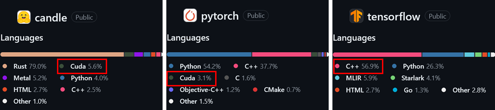
With the rise of LLMs, Diffusion Models, and other large-scale generative models (and NVDA's stock price 📈), the importance of GPU architecture grows by the day, and it's about time we learned some CUDA.
And when it comes to learning CUDA, we have to mention the puzzle game [GPU Puzzles](https://github.com/srush/GPU-Puzzles), developed by Sasha Rush ([@srush_nlp](https://x.com/srush_nlp)), a guru from Cornell Tech and Hugging Face:
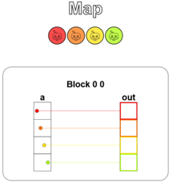
It offers interactive puzzles that let us learn CUDA's basic concepts while actually writing GPU kernel code, and it visualizes the results so we can build intuition more easily.

Even better, it uses Python's [Numba](https://numba.pydata.org/) library, so you can painlessly get the experience of writing low-level CUDA code without knowing [C](https://www.youtube.com/watch?v=QUuzIjIcUws) (in fact, Numba's syntax is quite close to C++, and I've checked all the hyperlinks in this article, so feel free to click them).

What's more, these puzzles increase in difficulty gradually, from getting familiar with basic concepts to implementing convolution. By the time you finish, you'll have gone from knowing nothing at all to understanding how the algorithms driving 99% of today's deep learning are realized at the hardware-acceleration level!

If reading this already has your fingers itching to give it a try, you can jump straight to [GPU Puzzles](https://github.com/srush/GPU-Puzzles), open it in Colab, and take on the challenge (remember to set the Runtime to use a GPU).
The complete solutions to the puzzles, as well as the author's other puzzle games (Tensor and Autodiff), can be found in my [Repo](https://github.com/xavierforge/puzzles). After you finish, remember to come back and check out the walkthroughs too.

But if you'd like to pick up some basic knowledge before solving the puzzles, so you're not fumbling in the dark while you work through them, then read on!
## CUDA 101
CUDA (which stands for Compute Unified Device Architecture) is an integrated software-and-hardware technology launched by NVIDIA. It's the company's official name for GPGPU (General-purpose computing on GPUs).

It not only defines the hardware architecture for GPGPU but also defines a programming model, letting us use NVIDIA GPUs for computations beyond image processing (like physics simulation, deep learning, etc. 😉).

From a developer's point of view, when we write a program in ordinary C, the code typically only lets us use the CPU to execute it. If we want to use the GPU, we traditionally had to use the more complicated graphics application programming interfaces (APIs), such as Direct3D or OpenGL. (Wow, this sentence mentions "program" so many times you could form a community out of them.)
CUDA, on the other hand, provides a set of C/C++ extensions (CUDA supports other languages too, but here we use C as an example), letting developers write parallel programs in a familiar language, and needing only **one program to make use of both pieces of hardware**.

In short, part of CUDA code is ordinary C, used to control the CPU, while another part is C extensions (emphasizing parallelization), used to control the GPU.
At compile time, the CUDA compiler splits the code apart and compiles each piece separately for its respective hardware.
### Hybrid computing model
To fully utilize the computing resources we have, CUDA adopts the concept of a hybrid computing model. In this concept, the CPU and GPU work together cooperatively, handing off all the parallel computation that the CPU isn't good at to the GPU, which is purpose-built for it.
In this model, we call the CPU the **Host** and the GPU the **Device**. They each have a memory space that only they can access, called **Host memory** and **Device memory** respectively.

The execution of a CUDA program is usually composed of the following main steps:
1. Allocate memory on the GPU.
2. Copy input data from Host memory to Device memory.
3. Load the GPU code and execute it.
4. Copy the results from Device memory back to Host memory.

The code in step 3 is also called a **kernel** — a GPU function launched by the Host and executed on the Device.

Note that all of these steps are initiated by the CPU, which is why it's called the Host. As the main controller of the entire computation, besides running its own computations it also has to prepare the data to be computed and dispatch kernels to run on the GPU — super busy!
In the figure below, the orange text marks the parts the CPU is responsible for. Whether it's sending and receiving data or allocating memory, the GPU can only passively react to the CPU (this is just a fairly basic model — the GPU isn't always quite so passive, but that's beyond the scope of this article):
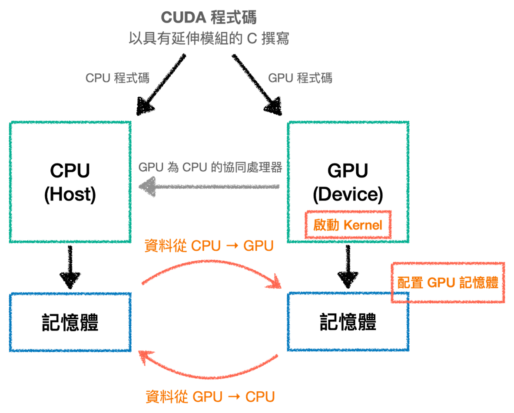
Of course, transferring data between hardware always has a cost, so when designing programs we need to avoid transferring back and forth multiple times as much as possible.
> [!NOTE] Kernel vs. Device function
> Note that CUDA programming has another concept that contrasts with the kernel — the **device function**. It refers to a GPU function that can only be called on the Device (by a kernel or another device function) and is executed on the Device.
> In other words, a kernel is usually called by the Host and executed on the Device, serving as the CPU's entry point into the GPU, whereas a device function is called by the Device (invoked by a kernel or another device function) and executed on the Device, serving as an ordinary function called internally within the GPU.
> But note that through **[Dynamic Parallelism](https://developer.nvidia.cn/blog/cuda-dynamic-parallelism-cn/)**, a kernel can actually launch another kernel on the GPU. So the defining trait of a kernel is that it "can be called by the Host," not that it "can only be called by the Host."
### Thread hierarchy
Among the steps above, moving data and allocating memory are relatively simple; the truly interesting part is writing the kernel, which is also our main goal today. But before that, we must once again emphasize that the GPU's characteristics are:
- It can efficiently launch a large number of threads.
- It runs a large number of threads in parallel.

To quote a famous line from the father of supercomputing, [Seymour Roger Cray](https://zh.wikipedia.org/zh-tw/%E8%A5%BF%E6%91%A9%C2%B7%E5%85%8B%E9%9B%B7) — "If you were plowing a field, which would you rather use: two strong oxen or 1024 chickens?" Never mind which one Cray himself thought was better; the GPU is our enormous flock of chickens!
This line also highlights that, compared to the CPU, the GPU emphasizes throughput rather than the latency of a single task.
This characteristic further leads to the core concept of parallel computing: "break a big problem into small problems, then solve these small problems **simultaneously**." The CUDA programming model summarizes this concept into the following guiding principle:

> When writing a kernel, pretend it will only be run by a single thread (write it in an ordinary sequential style). Then, when dispatching the kernel from the CPU, you tell it how many threads to launch, having all those threads execute this kernel.

Here, the program's parallelism is actually expressed at the moment the threads are launched. As for why, we have to start from the thread hierarchy — so let's introduce it from the bottom layer up.
#### Threads
The most basic component, used to execute code and store a small amount of state. Therefore, each thread has a fixed-size **local memory** at its disposal.

To make this easier to grasp, let's embody a thread as a guy named A-Wei (no idea why, it just feels fitting), with the local memory he can access being a can of beer (in practice we generally use B̷a̷r̷ ̷b̷e̷e̷r̷):
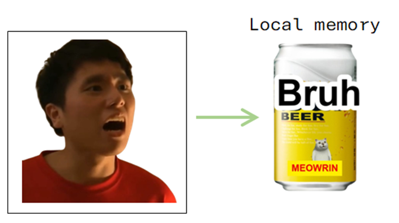
#### Blocks
A group of threads is called a block. In programming terms, they represent a group of threads working together to solve a subtask.
One of the most important details is that each thread can know its own position within the block through a built-in variable predefined by CUDA (`threadIdx`).
This way, we can explicitly assign each thread the part it's responsible for. This is the actual picture of what we said earlier — "parallelism is expressed when threads are launched": launch a whole bunch of threads at once, then rely on `threadIdx` to let each thread claim its own different piece of data.
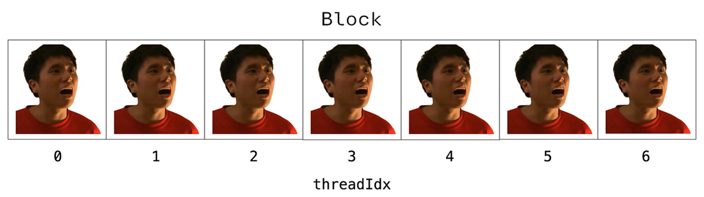
As developers, our task is to appropriately define the size of the block so the threads can cooperate to complete the computation.
But note that CUDA limits the number of threads **within each block** (currently at most 1024 on most GPUs), so sometimes we need multiple blocks to complete a computation.
In fact, CUDA also supports 2D and 3D blocks. The figure below shows a 2D block, whose width and height are the size of this block:
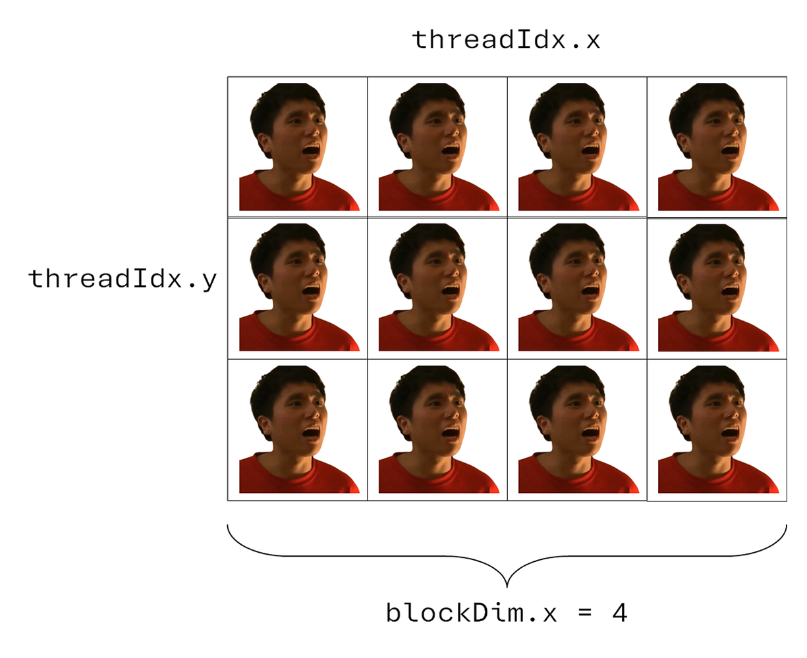
And since different threads often need to share data, threads living in the same block can communicate through **shared memory**.
Only the threads in that block can read from and write to this fixed-size block of memory. We can embody shared memory as a six-pack of beer (it's absurd, please bear with me):
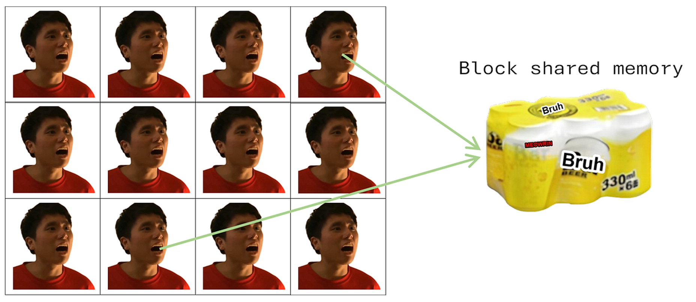
#### Grids
Finally, a combination of multiple blocks is called a grid (which likewise supports 1D, 2D, and 3D structures). Each block within it has the same size, and each has its own shared memory:
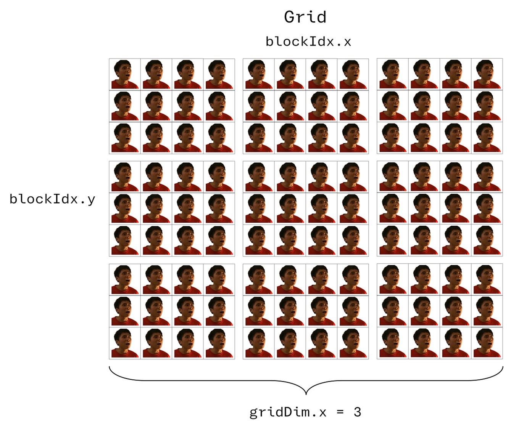
Similarly, in order to assign tasks to a specific thread, we must know its position in the grid, and this position must be a unique index within the grid. We therefore define the calculation as follows (suppose we want to designate the orange-shirted A-Wei talking back to grandma):
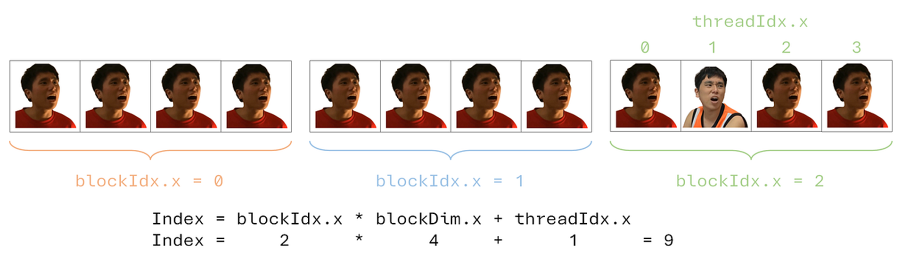
The reason we organize threads in this multi-dimensional way — into grids and blocks — is that when we encounter multi-dimensional problems, this arrangement is convenient and intuitive.
For example, when we want to process an 8×8 image, we can use an 8×8 2D block, letting each thread handle one pixel, so the coordinates map over naturally.
Of course, multiple dimensions are just one "for convenience" way of organizing things. The same work could be done with other arrangements; this style just makes the algorithm more intuitive.
(Strictly speaking, different arrangements do affect performance, which has to do with the way the GPU accesses memory. But that's beyond the scope of this article — for now, readers just need the impression that **arrangement affects efficiency**.)

What's more, this architecture also helps us break many problems down into relatively independent small problems: each block handles part of the overall problem, and the block then further subdivides that part among its internal threads.
Through the parallelism expressed by every thread in the same block running the same kernel code (just each handling different data), the computation can be completed faster, and the code is also easier to write, understand, and maintain.

For example, suppose we wrote a kernel responsible for `Bin-bin is such a loser`. Running it would have this effect:

*Source: [So many A-Weis in "No Escape from Jay"!! Can "Brother Jay" still get away with it this time?](https://www.youtube.com/watch?v=XUitZFxbjSQ)
### The GPU and the thread hierarchy
In fact, the thread hierarchy isn't just a way of organizing code; it also directly corresponds to how the hardware operates, allowing parallel computation to run more efficiently.
On the hardware side, the GPU is composed of multiple **Streaming Multiprocessors (SMs)**, and generally the higher-end the GPU, the more SMs it has.
When we dispatch a kernel from the CPU, it expands into a grid composed of blocks, and the GPU's internal scheduler is responsible for distributing these blocks to the various SMs.
Once a block is assigned to an SM, it stays there until it finishes — it won't be moved to another SM partway through.
Additionally, depending on the hardware resources a block needs (registers, shared memory, etc.), a single SM can also take in several blocks at once to process them concurrently.

So after a block is assigned to an SM, how does the SM actually "run" the threads inside it?
In practice, when an SM drives threads, it does so in groups called **warps** (rather than pushing each A-Wei one by one — yes, I still haven't forgotten that A-Wei is a thread).
On current NVIDIA GPUs, each warp is fixed at 32 threads.

By this point, all the characters — Thread, Block, Grid, SM, Warp — have made their entrance.
Now let's imagine the whole flow "from launching the kernel to the threads actually starting to run" using the concept of "Divide & Conquer," and clarify each character's role along the way:
First, when the kernel launches, it musters a whole troop of A-Wei threads, organizing them into a large army (Grid) made up of squads (Blocks), where each A-Wei knows clearly which squad it belongs to and which number it is within that squad (remember `threadIdx`?).
Next, the scheduler dispatches the various squads to different strongholds (SMs); a single stronghold can even garrison several squads at once. When the real fighting begins, each squad is further divided into platoons of 32 (Warps), and the A-Weis in the same platoon march to the same orders, synchronously performing the same action, each handling its own assigned piece of data.
Once everyone has completed the task at hand, these results scattered all over come together to form the final answer we want.
A divide, a compute, and a conquer — that's roughly the spirit of "Divide & Conquer."

And this "one command, a thousand troops execute in sync" mode of operation is precisely the hardware basis that makes the earlier mental model — "when writing a kernel, pretend only one thread is running" — hold up: we only need to figure out what one A-Wei should do, and the hardware will naturally let a whole platoon, a whole squad, and even a whole army of A-Weis run through it synchronously in units of warps.

This also echoes what we said at the very beginning, "throughput over latency."
An SM usually keeps many warps on standby at the same time. When one platoon of A-Weis gets stuck and has to stop and wait (for example, while reading from slower memory), the scheduler immediately swaps in another platoon that's ready to keep working, thereby "hiding" the waiting time and keeping the SM always busy.
In other words, the GPU doesn't pursue making any single A-Wei work as fast as possible; instead, it relies on always having plenty of warps on hand to swap in and keep busy, pushing overall output high. This is the spirit of the 1024 chickens (or, you could say, 1024 A-Weis).
> [!NOTE] A comparison with the CPU
> Readers with CPU experience might think of the operating system's context switch — when a thread gets stuck, another takes over. The idea is indeed similar.
> The difference is that switching threads on a CPU requires saving state like registers into memory and then loading it back, which is fairly costly, so the CPU is sparing about switching.
> But for warps on standby on a GPU, their state stays in the SM the whole time, so swapping costs almost nothing. That's why the GPU dares to use this "swap immediately when stuck" trick to hide latency.
> This is also where the latency-oriented CPU and the throughput-oriented GPU part ways.

The figure below shows the correspondence between the thread hierarchy and the GPU's hardware resources:
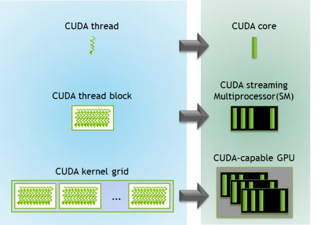
*Source: [CUDA Refresher: The CUDA Programming Model](https://developer.nvidia.com/blog/cuda-refresher-cuda-programming-model/)

Note that this figure is just a schematic of the hierarchical correspondence. The fact that it maps one thread to one CUDA core doesn't mean threads and cores are statically bound one-to-one.
Recalling the warp mechanism from earlier, what actually happens is that a large number of threads are scheduled onto an SM and take turns executing in units of warps, rather than a single thread occupying one core from start to finish.

Alright, now that we understand how an SM actually executes a kernel, let's pull our perspective back a bit and see what other benefits this block-based way of organizing brings.

One key benefit is hidden in a detail I deliberately glossed over earlier: which SM a block gets assigned to, and in what order it executes, are actually not guaranteed.
Precisely because no block is locked to a specific execution order or piece of hardware, this organizational scheme gains powerful scalability, letting us automatically adapt to hardware of different compute capabilities without modifying any code.

Take the figure below as an example. The same program containing 8 blocks: on a small GPU with only 4 SMs, each SM has to take turns handling two blocks; but on a large GPU with 8 SMs, each SM only needs to handle one block, and the overall speed easily doubles.
The key point is that this whole process is handled entirely by the GPU's own scheduling — we don't have to touch a single line of code:
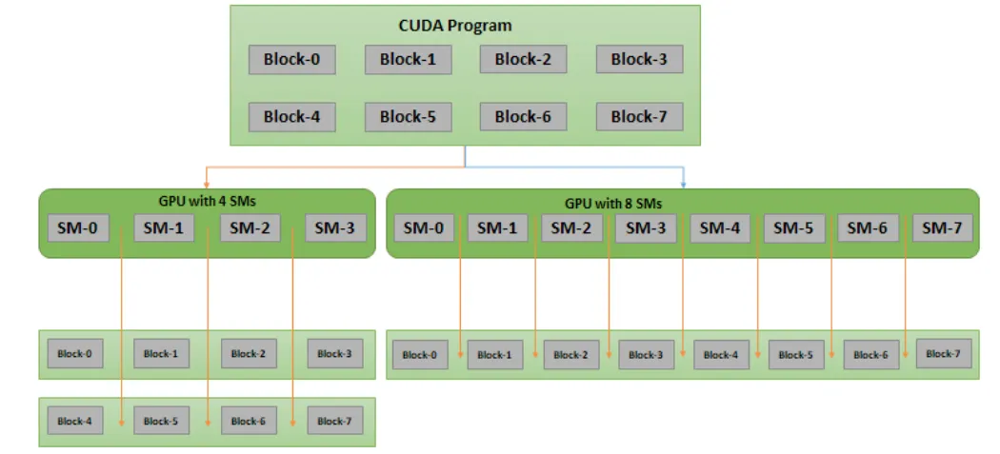
*Source: [CUDA Refresher: Getting started with CUDA](https://developer.nvidia.com/blog/cuda-refresher-getting-started-with-cuda/)

Finally, besides the local memory and block shared memory mentioned earlier, there's another kind of memory that threads of any block can access. We call it **global memory**.
And these three kinds of memory actually all correspond to real hardware on the GPU:
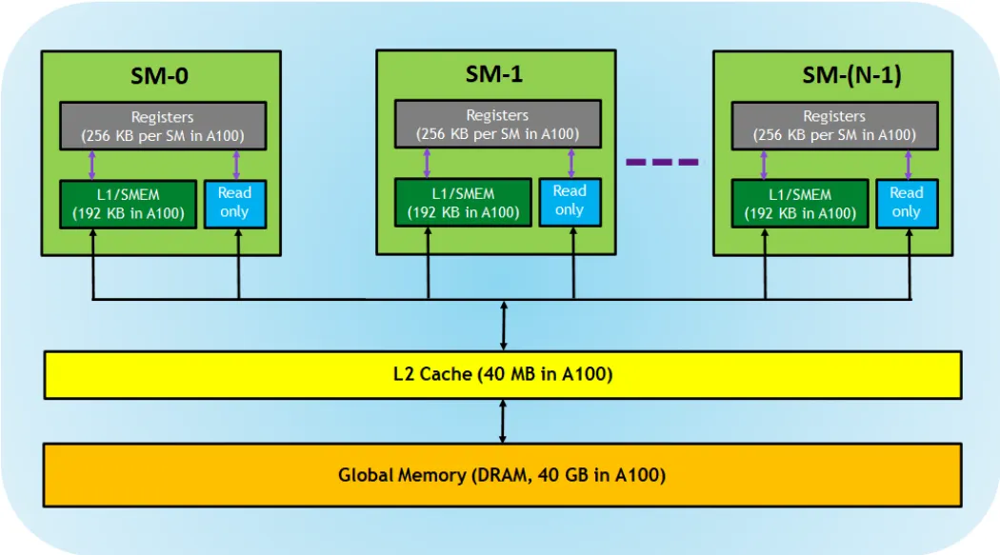
*Source: [CUDA Refresher: The CUDA Programming Model](https://developer.nvidia.com/blog/cuda-refresher-cuda-programming-model/)

- **Registers**: correspond to local memory. They're the fastest storage, private to each thread, and the compiler decides how to optimize their use.
- **L1 / shared memory (SMEM)**: corresponds to block shared memory. Located on each SM (on-chip), it's fast, can serve simultaneously as the L1 cache and shared memory, and is shared by all blocks on the same SM.
- **Global memory**: i.e., the DRAM on the GPU. Large in capacity but relatively the slowest, accessible by all threads.

From this we can see that memory closer to the thread and more private is usually faster but also smaller in capacity; conversely, the larger the capacity, the slower it is.
Therefore, even though the CUDA compiler already automatically optimizes memory usage, if developers follow this hierarchy and hold to the principle of **keeping data in the fast memory as much as possible**, they can usually squeeze out even better performance.
And exactly how to avoid the overhead caused by data moving between different memories is something we'll come to appreciate gradually through the hands-on practice ahead.
## Numba and the CUDA programming model
As mentioned earlier, we'll use the Numba library to learn CUDA. Its syntax is very close to CUDA C but has the readability of Python, and kernels written in Numba can directly access NumPy arrays (on the surface, at least — in reality, Numba automatically moves arrays between CPU and GPU behind the scenes for us, unless we control it manually).

But note that under the hood, Numba directly compiles Python code into kernels and device functions conforming to the CUDA execution model, so **not all Python syntax can be converted**.
The most common restriction is this: since the GPU isn't suited to dynamically allocating memory inside a kernel, any construct that "conjures up a new block of space on the fly" is generally unsupported — for example, a list comprehension (which produces a new list), or a NumPy operation that returns a new array.
In other words, if you hit a compile error, nine times out of ten the code was written too "fancy." Strip each thread's job down to the plainest form of reading a few values, computing, and writing them back, and it usually works.
For the complete list of supported features, see [Supported Python features in CUDA Python](https://numba.readthedocs.io/en/stable/cuda/cudapysupported.html).

That's enough conceptual stuff. Below, let's introduce a few of the most basic syntax patterns.
### A thread's position
When a kernel runs, its code is executed once by each thread, so every thread must know "who it is" before it can figure out which array elements it should be responsible for.

We can use a few variables provided by `numba.cuda` to deduce a thread's position (these variables were all hidden in the figures accompanying the earlier thread-hierarchy introduction, and you can guess what they mean from their names):
```python
from numba import cuda

# 這裡只示範位置計算，省略了裝飾器與完整結構
def kernel():
    x = cuda.blockIdx.x * cuda.blockDim.x + cuda.threadIdx.x
    y = cuda.blockIdx.y * cuda.blockDim.y + cuda.threadIdx.y
```
The calculation is pretty intuitive. Here, let's bring back our talk-back A-Wei once more:

### Writing a kernel
As a recap, a kernel is a function called from the CPU and executed on the GPU. This characteristic means a kernel **cannot explicitly return a value**: all computation results must be written into **an array passed in as an argument**. Even if the result is just a scalar, you have to catch it with a single-element array.

When writing one, you just add the `@cuda.jit` decorator to a Python function that conforms to this characteristic (for a device function, also add `device=True`):
```python
from numba import cuda
import numpy as np
import numba

# 裝置函式 (device function)，供 Kernel 內部呼叫
@cuda.jit(device=True)
def add(a, b):
    return a + b

@cuda.jit
def my_func(inp, out):
    # 注意：這裡刻意用上區域記憶體與裝置函式，純粹是為了一次展示這些寫法，
    # 單純做加 10 其實用不到它們
    # 宣告一塊每個執行緒私有的區域記憶體 (要指定大小與型別)
    local = cuda.local.array(5, numba.float32)
    
    # 找出自己的位置
    x = cuda.blockIdx.x * cuda.blockDim.x + cuda.threadIdx.x
    y = cuda.blockIdx.y * cuda.blockDim.y + cuda.threadIdx.y
    
    # 守門員：避免存取超出陣列範圍的位置
    if x < out.shape[0] and y < out.shape[1]:
        # 在區域記憶體裡放一個值
        local[1] = 10
        # 透過裝置函式相加，再寫回全域記憶體
        out[x, y] = add(inp[x, y], local[1])
```
### Launching a kernel
Note that we can't call `my_func` directly. Instead, we need to first prepare the data, set the shapes of the block and grid, and then launch it:
```python
# 準備輸入與輸出陣列 (這裡的形狀只是示範用，挑多大都行，
# 超出範圍的部分會由 Kernel 裡的守門員 (guard) 自動略過)
inp = np.arange(4 * 4, dtype=np.float32).reshape(4, 4)
out = np.zeros_like(inp)

# 設定 grid 與 block
threadsperblock = (4, 3)   # 每個區塊 4×3 個執行緒
blockspergrid = (1, 3)     # 每個網格 1×3 個區塊

# 啟動 Kernel
my_func[blockspergrid, threadsperblock](inp, out)

print(out)   # 每個元素都會是 inp 對應位置 + 10
```
This is really quite close to CUDA C's syntax already; the same thing in C would be written as `my_func<<<blockspergrid, threadsperblock>>>(inp, out)`.

We can break this into two steps:
1. **Kernel instantiation**: by specifying how many blocks per grid and how many threads per block, we instantiate the compiled kernel; the product of the two is the total number of threads.
   Note that once a kernel is compiled, it can be repeatedly instantiated and called multiple times with different thread hierarchies.
2. **Executing the kernel**: execute the kernel using the input array as an argument (plus the output array as needed).
   Note that kernels execute **asynchronously** — the call returns immediately, so if you need to wait for it to finish, you have to call [`cuda.synchronize()`](https://numba.readthedocs.io/en/stable/cuda-reference/host.html#numba.cuda.synchronize).

To sum up the explanation above, let me remind readers once more that CUDA programming has the following key points:
- When writing a kernel, we first assume the program will only execute on a single thread.
- Then, as needed, we can launch a large number of threads to run this kernel, but note that the number of threads per block has an upper limit (as mentioned earlier, currently 1024 on most GPUs). However, we can pile up the total count by increasing the number of blocks.
- Every thread knows its own position in the grid.

That's just a taste for the reader. In fact, this syntax is already enough for us to complete the puzzles. For more detailed explanations of Numba, please see the [NUMBA CUDA Guide](https://numba.readthedocs.io/en/stable/cuda/index.html).

---

## GPU Puzzles
> [!WARNING] A note beforehand
> Note that the introduction above is only meant to help us have a basic understanding of CUDA while solving the puzzles, so a lot of content has been omitted.  
> Some parts will be filled in when we encounter the relevant puzzles. If you want a deeper understanding of the CUDA programming model, please refer to the [CUDA C programming guide](http://docs.nvidia.com/cuda/cuda-c-programming-guide)!

Let's start with the first puzzle as an example to introduce the general structure of the puzzle code. It's mainly composed of three parts:
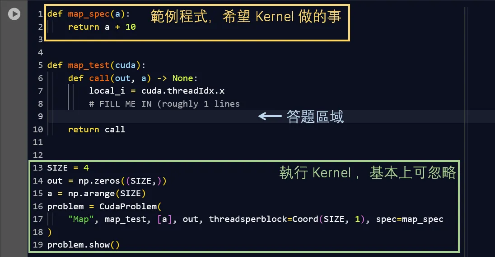
- **`xxx_spec(…)`**: an example, equivalent to the "first assume it only executes on a single thread" code mentioned earlier; it's also what we want the kernel to do, but **this part is only a hint and cannot be called directly**!
- **`xxx_test(cuda)`**: the answer area. It contains some pre-written code, and we just need to fill in our answer below the `# FILL ME IN` line.
- **The rest**: responsible for defining the block, executing the kernel, and visualizing the results. This part doesn't need to be changed.

The visualization provides two pieces of information to help us solve the puzzle:
- **Memory read/write counts:**
  This shows how many times each thread reads from and writes to global memory and shared memory.
  Since global memory is large in capacity but slower external (off-chip) memory, with extra overhead when accessing it, it can't match the speed of faster built-in (on-chip) memory like shared memory. So this information is provided during the puzzle to let us weigh the use of the two types of memory:
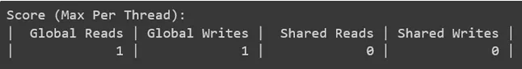
- **Visualization of the threads' communication pattern:**
  The key to parallel programming is the cooperation among threads, and just like getting along between people, good collaboration relies on communication.
  In CUDA, this kind of communication happens in memory, so writing a CUDA program is basically designing the "mapping between tasks (threads) and memory."
  In plain terms, it's deciding which data each thread reads, where it writes to, and how to do it efficiently.
  The puzzle has already defined the thread hierarchy for us and drawn it into pretty little rainbow circles (we recommend running it once before you start writing each time, so you can see the picture mapping the thread hierarchy to the input and output):
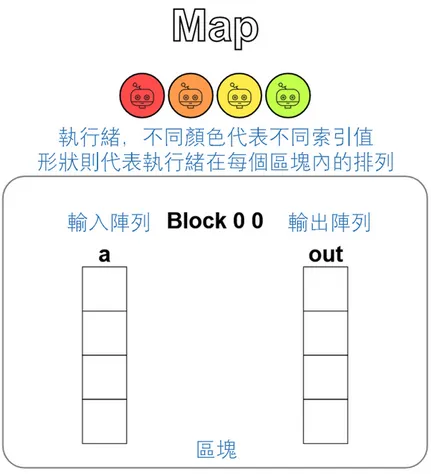
> [!WARNING] The orientation of the visualization
> Before we start solving, here's a heads-up!
> This set of exercises' visualization has two drawing conventions to keep in mind:
> - **1D arrays are drawn vertically**: this makes them convenient to line up side by side with `out`, so the `a` in the figure above is upright, with `local_i = 0` at the top and `local_i = 3` at the bottom; just count downward.
> - **2D matrices are drawn entirely along the CUDA axes**: `threadIdx.x` is the horizontal direction and `threadIdx.y` is the vertical direction, meaning in the author's figures the first dimension goes horizontally and the second goes vertically.
> 
> The second point requires special care, because it is **exactly the opposite** of our habit when writing NumPy `a[i, j]`, where from the NumPy perspective `i` is the row (vertical) and `j` is the column (horizontal).
> But this mismatch **only affects "reading the figure" and "looking at the print result," these two things**; you won't make errors when writing code (`out[local_i, local_j]` has only one definite location in memory).
> So when solving, please think uniformly from the CUDA perspective (`local_i` is the x-axis, `local_j` is the y-axis), and switch back to the NumPy default only when verifying the `print(out)` result. The same `out[1, 0]` appears in the top-right corner in the author's figure but in the bottom-left corner when printed.
> This mismatch isn't very noticeable in 1D, but in the 2D puzzles from Puzzle 4 onward (especially in non-square or multi-block situations) it becomes very obvious: the same `out[i, j]`'s position in the figure and its position when printed feel transposed.
> Keep this in mind, and please don't panic when you run into it.
### Puzzle 1 — Map
Alright, let's start warming up. For this puzzle, we'll explain the whole cell in a bit more detail, but for subsequent puzzles we'll only focus on `xxx_test(cuda)`.

The puzzle asks us to implement a kernel that adds 10 to each position of a vector `a` and writes the result into the `out` vector. Beyond that, the puzzle provides two extra pieces of information:
1. A reminder that we can only use basic Python syntax (arithmetic, array indexing, for loops, if-else clauses, etc.).
2. The amount of data is equal to the number of threads (You have 1 thread per position.).

The first point is to avoid the Python syntax conversion restrictions mentioned earlier; the second only becomes interesting when read together with the tip and full code that come with the puzzle.
Let's first look at the complete cell:
```python
def map_spec(a):
    return a + 10
    
def map_test(cuda):
    def call(out, a) -> None:
        local_i = cuda.threadIdx.x
        # FILL ME IN (roughly 1 lines)
        
    return call

SIZE = 4
out = np.zeros((SIZE,))
a = np.arange(SIZE)

problem = CudaProblem(
    "Map", map_test, [a], out, threadsperblock=Coord(SIZE, 1), spec=map_spec
)

problem.show()
```
Here, the `CudaProblem` at the bottom is just a helper provided by this exercise framework. It packages the kernel for us, runs it, and then visualizes the results; the details can be ignored. The only thing worth noting is the `threadsperblock=Coord(SIZE, 1)` argument.
It sets the block to `SIZE × 1 = 4` threads, which exactly corresponds to the shape `(SIZE,)` of the input vector `a` and output vector `out` — that is, "one thread per position."

Next, look at the puzzle's tip: "Imagine that each thread will run the `call` function once, with the only difference being that `cuda.threadIdx.x` changes each time."
This is really just the "when writing a kernel, pretend only one thread is running" mental model from earlier, and this mode of operation has a formal name in the GPU world that I haven't mentioned until now: SIMT (Single Instruction, Multiple Threads).
Congratulations, you've learned another term 🎉

A pattern like this — "each thread independently handles one position, does the same thing, then writes it back" — is the most basic Map in parallel computing (the input and output are 1-to-1 and completely independent of each other).
This is a pattern the GPU is very good at, and the solution is simple too: just use `threadIdx.x` as both the input and output index:
```python
def map_test(cuda):  
    def call(out, a) -> None:  
        local_i = cuda.threadIdx.x  
        # FILL ME IN (roughly 1 lines)  
        out[local_i] = a[local_i] + 10  
    return call
```
The result is shown below. You can see that each thread (distinguished by color) takes one element from the input vector `a`, adds 10, and writes it into the output vector `out`:
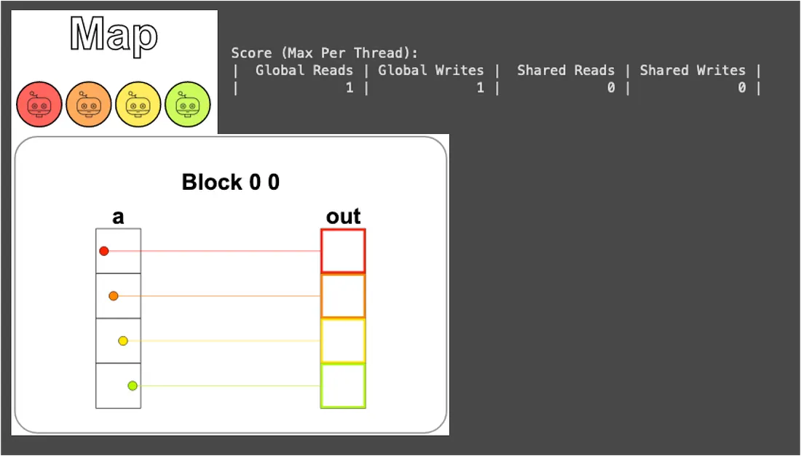
It's worth pausing here to clarify one thing: `a` and `out` were originally NumPy arrays on the Host (CPU), but `CudaProblem` moves them onto the GPU for us behind the scenes. So `a[local_i]` and `out[local_i] = ...` inside the kernel are actually dealing with global memory — which brings us back to what we said earlier, "Numba automatically moves arrays between CPU and GPU behind the scenes."

Additionally, because data and threads correspond 1-to-1, each thread only needs to read its own position once, compute, and write once to complete all the work. Therefore, global memory is read and written exactly once each — it can't get any fewer:

Next, running `problem.check()` shows the adorable doggo GIF that appears after passing:
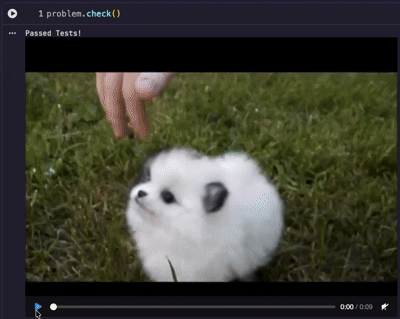
Ah! If you got it wrong, you'll see your output along with what the correct answer should look like:
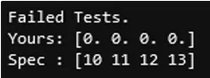
### Puzzle 2 — Zip
The puzzle asks us to implement a kernel that adds each position of vectors `a` and `b` together and writes the result into the `out` vector — just like aligning and clasping the teeth on both sides of a zipper one by one. That's why this operation is called Zip.

Compared to the first puzzle, the setup actually only adds one variation: the input goes from one to two. But the amount of data is still equal to the number of threads, so the "one thread per position" correspondence hasn't changed.
In other words, this puzzle is essentially still in the spirit of Map; it's just that this time each thread has to grab one value from each of two places and add them:
```python
def zip_test(cuda):  
    def call(out, a, b) -> None:  
        local_i = cuda.threadIdx.x  
        # FILL ME IN (roughly 1 lines)  
        out[local_i] = a[local_i] + b[local_i]  
    return call
```
The result is shown below:
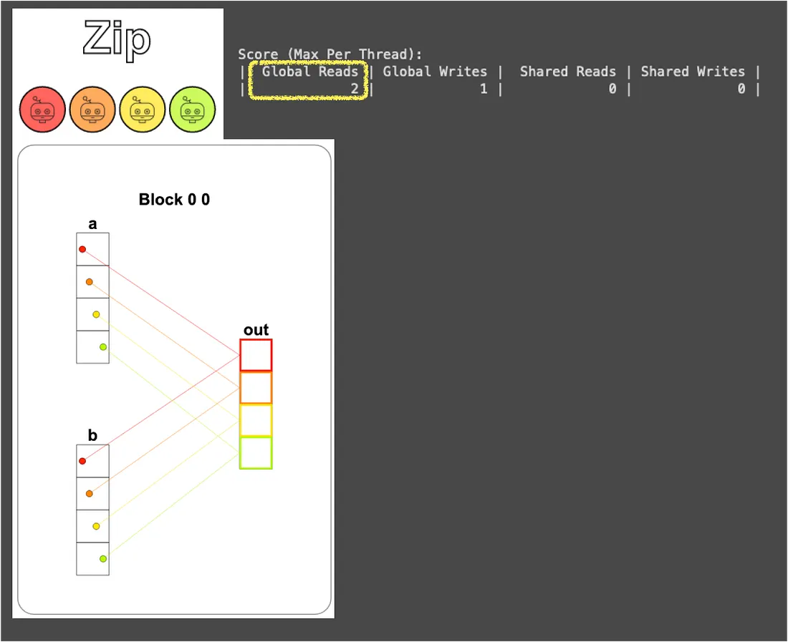
You can see that each thread takes one element from each of `a` and `b` and adds them (`a[local_i]`, `b[local_i]`), so global memory is read 2 times and written 1 time (one more read than Map).

And "2 reads, 1 write" is the cost of the Zip pattern: for each additional input vector, every thread has to make one more trip to global memory. When there are N input vectors, the global reads will be N times.
This has little impact in a simple scenario like Zip, but later, when we encounter puzzles where data gets reused, dutifully going to global memory every time becomes extravagant. This is foreshadowing — keep it in mind!
### Puzzle 3 — Guards
This puzzle, like the first, asks us to implement a kernel that adds 10 to each position of vector `a` and writes it into the `out` vector, but **this time there are more threads than data**.

Don't underestimate this difference — it's actually closer to real-world situations, because the number of threads in a block is usually a fixed, pre-chosen value (and it even favors multiples of 32, which relates to the warps mentioned earlier), while the amount of data won't conveniently match our choice. So having slightly more threads than data is almost the norm.

And when there are more threads than data, we have to be careful to let each piece of data be handled by only one thread, and not let the extra threads take an out-of-range `local_i` and do `out[local_i] = ...`. In Python, Numba will even stop us with an `IndexError: index 4 is out of bounds for axis 0 with size 4`. But in a real CUDA/C environment, no one will stop you — those out-of-bounds writes will land directly on someone else's memory, and things really will go wrong.

Of course, this doesn't mean threads with `threadIdx` greater than `size` can never be used. If you insist on assigning them work, you can, but then we'd have to design a separate index, converting their `local_i` back to a valid position within the `size` range — which is a bit too unintuitive:


So the most intuitive and effortless approach is to use a conditional clause to block off the out-of-range threads, letting them do nothing at all. This little condition is called a **guard**:
```python
def map_guard_test(cuda):  
    def call(out, a, size) -> None:  
        local_i = cuda.threadIdx.x  
        # FILL ME IN (roughly 2 lines)  
        if local_i < size:  
            out[local_i] = a[local_i] + 10  
    return call
```
From the visualization, you can see that we only used the first 4 threads, while the last 4 obediently sit still and do nothing:
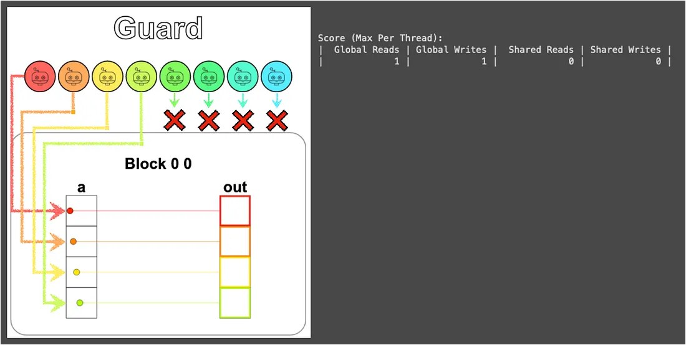
Don't underestimate this tiny `if` — starting from this puzzle, it appears in almost every puzzle that follows. Whenever threads and data don't line up, just whip out the guard:

### Puzzle 4 — Map 2D
This puzzle is the 2D version of the previous one. Since our data becomes two-dimensional, the block had better be arranged in two dimensions to match, so that each piece of data can intuitively correspond to a two-dimensional `(i, j)` index, and the guard can be written naturally too.

The puzzle's design thoughtfully wants us to review the fact that "there are always slightly more threads than data," so it's set up as 2×2 data paired with 3×3 threads. But I'm sure this definitely won't stump our clever readers:
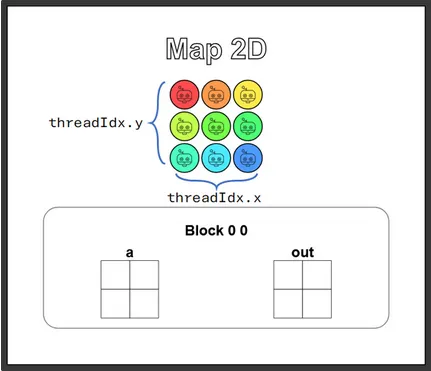
```python
def map_2D_test(cuda):  
    def call(out, a, size) -> None:  
        local_i = cuda.threadIdx.x  
        local_j = cuda.threadIdx.y  
        # FILL ME IN (roughly 2 lines)  
        if local_i < size and local_j < size:  
            out[local_i, local_j] = a[local_i, local_j] + 10  
    return call
```
Compared to the 1D version, the code basically just adds a `local_j`, and the guard gains one more condition (`local_i` and `local_j` both have to be in range).
Accessing the array follows the NumPy habit of `my_array[i, j]` — nothing novel here.
The visualization result is as follows:
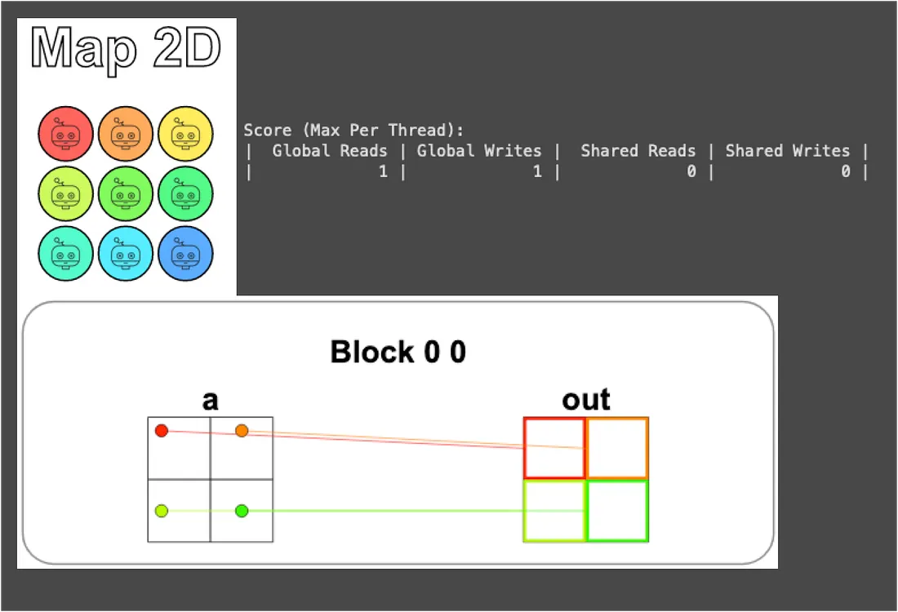
You can see that only the 4 threads in the top-left corner actually do work; the other 5 are blocked by the guard and sit obediently still. It's exactly the same spirit as the 1D Guard in the previous puzzle, just extended to two dimensions.
> [!NOTE] The hierarchy and the allowed counts
> In CUDA's thread hierarchy, a grid can be at most a 3-dimensional arrangement of blocks, and a block can also be at most a 3-dimensional arrangement of threads.
> So the 2D in this puzzle is just a minor case; you could directly assemble even 3D if needed.
### Puzzle 5 — Broadcast
This puzzle is very similar to Puzzle 2, Zip — both add two input vectors together. The difference is that this time the two inputs are of different sizes and must be aligned via [Broadcast](https://numpy.org/doc/stable/user/basics.broadcasting.html) before being added:
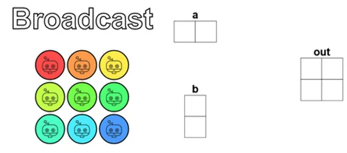
The puzzle again uses 2×2 data paired with 3×3 threads, so the "more threads than data" thing is the same as the previous puzzle, and the guard is just copied over too — this part we're already very familiar with.
What really requires thought is how to **map** the elements of `a` and `b` to the correct output positions.

From the figure above, you can see that `a` is a vector laid out horizontally along the x-axis, and `b` is an upright vector laid out along the y-axis. So for the thread responsible for `out[i, j]`, what it needs is the value of `a` at x-axis position `i` (`a[i, 0]`) plus the value of `b` at y-axis position `j` (`b[0, j]`):
```python
def broadcast_test(cuda):  
    def call(out, a, b, size) -> None:  
        local_i = cuda.threadIdx.x  
        local_j = cuda.threadIdx.y  
        # FILL ME IN (roughly 2 lines)  
        if local_i < size and local_j < size:  
            out[local_i, local_j] = a[local_i, 0] + b[0, local_j]  
    return call
```
The visualization result is as follows:
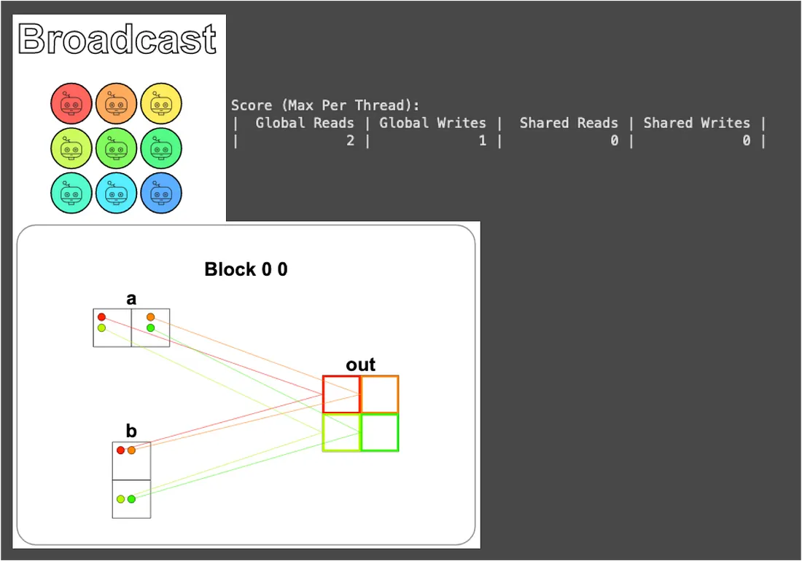
From the read/write report, you can see that each thread reads 2 times and writes 1 time, exactly the same as Zip. This is because each thread does roughly the same thing — grab values from two places, add them, and write back.

But the figure also shows something interesting: each element of `a` is **read repeatedly by two different threads** (and the same goes for `b`).
Take `a[0, 0]` as an example: it's read once each by the two different threads responsible for `out[0, 0]` and `out[0, 1]`.
The "2 reads" in the report is counted from the perspective of a single thread, so this duplicate cost doesn't show up in that number, but it really does exist — and it scales up proportionally as soon as `SIZE` gets larger (`SIZE × SIZE` outputs, but only `SIZE + SIZE` inputs).

Remember the foreshadowing planted at the end of Puzzle 2? What we talked about then was actually the "how many times each thread reads and writes" aspect, but this puzzle adds another layer: "how many threads repeatedly grab the same piece of data."
The two layers combined are the pain point we'll later solve with shared memory, but that won't be revealed until Puzzle 8 — let's let the bullet fly a little longer.
### Puzzle 6 — Blocks
Remember learning earlier that "each block can have at most 1024 threads"? This puzzle is meant to let us practice what to do when the amount of data grows too large for a single block to hold.

This puzzle gives 9 pieces of data, but a single block is only allotted 4 threads, so we're bound to have to bring in multiple blocks to increase the available number of threads, in order to process all the data.
This is also why this puzzle is called Blocks: because from here on, we no longer play within just one block like we did in the first five puzzles, but instead truly use the concept of "multiple blocks"!

From the `CudaProblem` below the puzzle, you can see that this time there's an extra argument `blockspergrid=Coord(3, 1)`, meaning **3 blocks per grid**, which amounts to a total of 3 × 4 = 12 threads on standby.
This number is 3 more than the 9 pieces of data, so the guard still can't be omitted in this puzzle.

Also, because we're crossing blocks, each thread can no longer just look at `threadIdx.x` (since `threadIdx.x` within each block counts from 0 again). We must switch to the global index formula already demonstrated earlier:
```python
i = cuda.blockIdx.x * cuda.blockDim.x + cuda.threadIdx.x
```
(This formula is exactly the one talk-back A-Wei taught us back then 😉)

Combining the global index with the guard, the answer comes out:
```python
def map_block_test(cuda):  
    def call(out, a, size) -> None:  
        i = cuda.blockIdx.x * cuda.blockDim.x + cuda.threadIdx.x  
        # FILL ME IN (roughly 2 lines)  
        if i < size:  
            out[i] = a[i] + 10  
    return call
```
The visualization result is as follows:
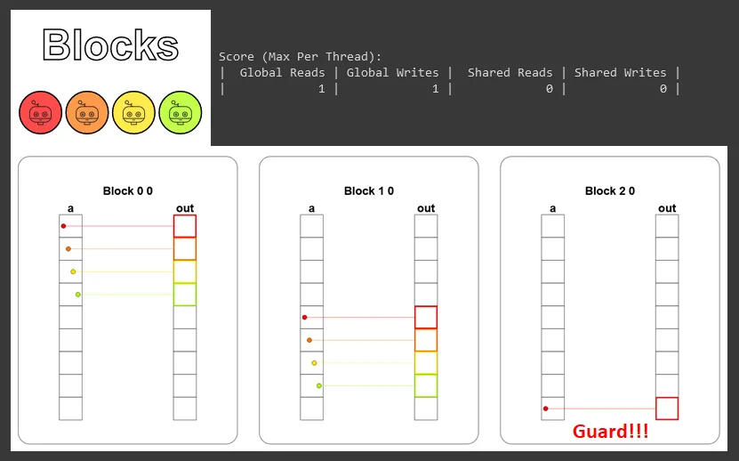
You can see that the 3 blocks each take in a contiguous segment of elements (block 0 handles 0–3, block 1 handles 4–7, block 2 handles 8), without overlapping or interfering with one another, and the last block uses the guard to block off the extra thread.
And this is when the GPU truly starts to flex its muscles: these blocks get dispatched to different SMs to **run at the same time**, rather than one finishing before the next takes its turn.
Conceptually, this is the "Divide & Conquer" mentioned earlier — using the block as the unit to break a big problem into small problems, with each block independently solving its own piece, which combine to form the complete answer.
### Puzzle 7 — Blocks 2D
This puzzle extends the previous one to 2D, and it's also the scenario closest to real applications (common data like images and matrices is inherently two-dimensional). But conceptually it's exactly the same as Puzzle 6, just with one more dimension added.
The solution is very intuitive too: apply the global index formula to both dimensions, and the guard gains one more condition:
```python
def map_block2D_test(cuda):  
    def call(out, a, size) -> None:  
        i = cuda.blockIdx.x * cuda.blockDim.x + cuda.threadIdx.x  
        # FILL ME IN (roughly 4 lines)  
        j = cuda.blockIdx.y * cuda.blockDim.y + cuda.threadIdx.y  
        if i < size and j < size:  
            out[i, j] = a[i, j] + 10  
    return call
```
The visualization result is shown below. You can clearly see how we use blocks to slice a large matrix into several small matrices and process them separately, and also how the guard blocks off the out-of-range threads:
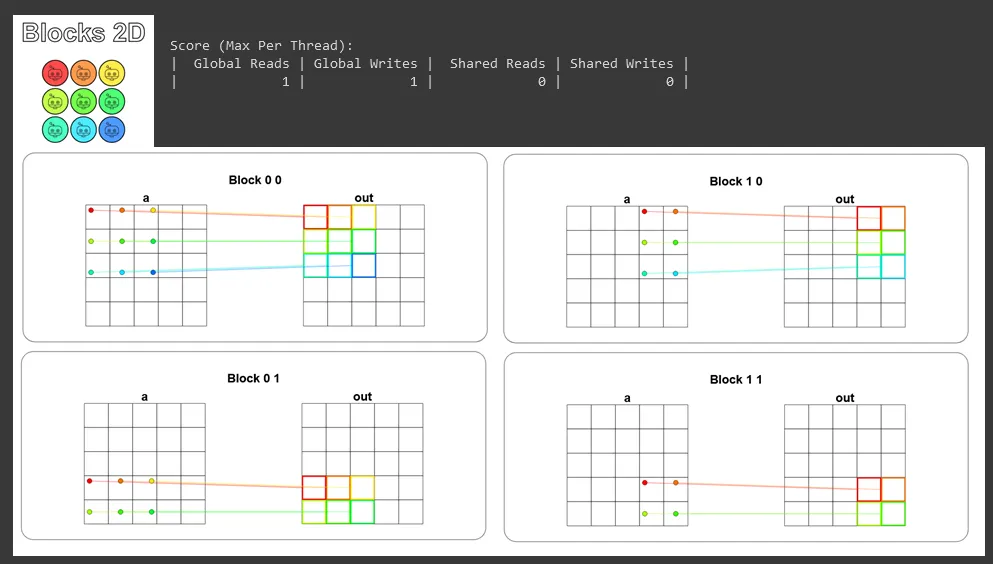
By this point, we've actually gone through CUDA's basic programming model once: threads, blocks, grids, guards, global indices, and the multi-block divide-and-conquer.
Starting with the next puzzle, the real main event takes the stage: **shared memory**.
### Puzzle 8 — Shared
Having come this far, we've learned how threads operate and how the thread hierarchy lets us map information from input to output.
But come to think of it, our treatment of the "block" is actually still quite shallow — at most we've used it to compute indices. Starting with this puzzle, we're going to unlock the block's true power: **shared memory**!

Its main function is to let all threads within the same block communicate with one another. On the hardware side, it shares the same high-speed built-in memory (on-chip) as the L1 cache. The difference is that the L1 is managed automatically by the hardware, while shared memory can be controlled manually by us. 
So when a kernel needs to read certain data repeatedly, we can first move it from global memory into shared memory, saving the cost of re-reading from global memory over and over like in Puzzle 5, which significantly helps performance.
But there's one thing to note in use: shared memory really is small, because it's the high-speed memory on each SM to be shared among all the blocks on it. Its capacity is usually only on the order of tens to a hundred or two hundred KB (for example, about 192 KB per SM on the A100, and about 64 KB on the T4 commonly seen on Colab), so use it sparingly.

Additionally, because multiple threads will read and write the same block of memory simultaneously, a **race condition** is hard to avoid. Therefore, we need to call [`cuda.syncthreads()`](https://numba.readthedocs.io/en/stable/cuda-reference/kernel.html#numba.cuda.syncthreads) to synchronize at the following two moments:
- **After loading data into shared memory** — wait for all threads to finish loading what they should load, ensuring the data all threads get is consistent, so that subsequent computations don't proceed from different baselines.
- **Before writing computed results back to global memory** — wait for all threads to finish computing, ensuring results aren't missed or overwritten.

Once we understand these, we can get to work:
```python
# 每個區塊內的執行緒數量 
TPB = 4 

def shared_test(cuda):  
    def call(out, a, size) -> None:  
        # 宣告要使用的共享記憶體大小與型別，我們這裡小心翼翼的使用 16 bytes
        shared = cuda.shared.array(TPB, numba.float32)  
        # 全域索引值，負責將資料寫入正確的輸出位置  
        i = cuda.blockIdx.x * cuda.blockDim.x + cuda.threadIdx.x  
        # 區塊內的執行緒索引值，負責對應到共享記憶體裡的位置
        local_i = cuda.threadIdx.x  
        
        # Guard  
        if i < size:
            # 將資料從全域記憶體中載入共享記憶體
            shared[local_i] = a[i]  
            cuda.syncthreads()  
            # FILL ME IN (roughly 2 lines)  
            # 這裡直接從共享記憶體讀完就寫回全域記憶體，沒有後續運算會用到 shared，所以不用再同步 
            out[i] = shared[local_i] + 10  
    return call
```
From the visualization, you can see that the data is first moved into shared memory, goes through one round of synchronization, and then is written back to global memory; shared memory is read and written exactly once each (the read/write order happens to be the reverse of global memory):
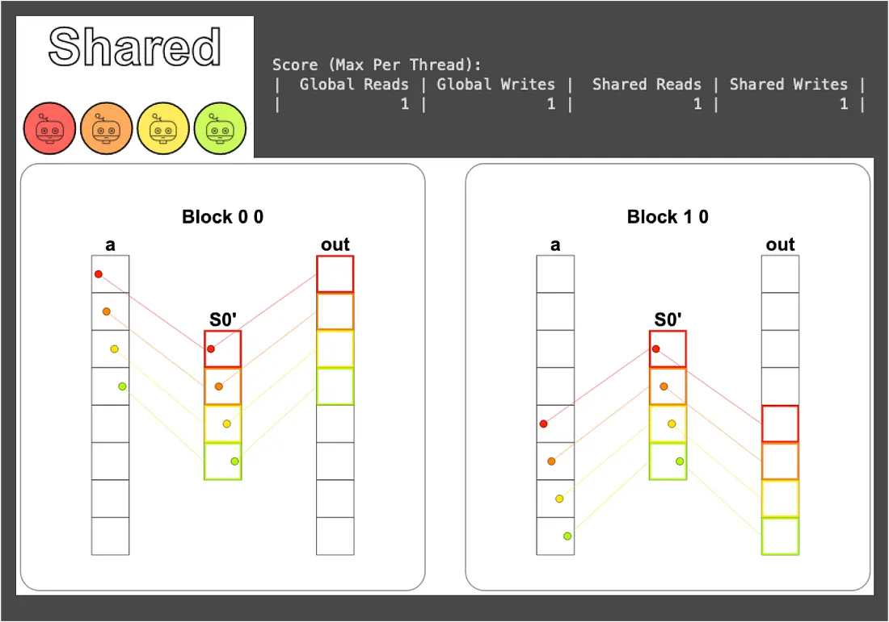
> [!NOTE] An advanced next step
> The point of this puzzle is really just to demonstrate how to use shared memory and `syncthreads`. To actually solve it, `out[i] = a[i] + 10` directly would pass — you don't need shared memory at all.
> If you're interested in more advanced uses of `syncthreads`, you can start by studying the official matrix multiplication example [`fast_matmul`](https://numba.pydata.org/numba-doc/latest/cuda/examples.html#matrix-multiplication) — that's where shared memory can truly show its power.

Due to length constraints (any more and it'd get too long!), this article's puzzle walkthroughs come to a pause here. For the rest, please see: [Learn CUDA with Numba! From Zero to Hero (Part 2)](/en/posts/numba-cuda-puzzles-2/)

See you in the next one~
## References
- [CUDA Refresher: Getting started with CUDA](https://developer.nvidia.com/blog/cuda-refresher-getting-started-with-cuda/)
- [CUDA Refresher: The CUDA Programming Model](https://developer.nvidia.com/blog/cuda-refresher-cuda-programming-model/)
- [GPU Puzzles Github](https://github.com/srush/GPU-Puzzles)
- [Minitorch — CUDA](https://minitorch.github.io/module3/cuda/)
- [Numba CUDA](https://numba.readthedocs.io/en/stable/cuda/overview.html)
- [Nvidia CUDA in 100 Seconds](https://www.youtube.com/watch?v=pPStdjuYzSI&t)
