:::caution[AI-translated]
This article was machine-translated from the original Chinese with AI assistance.

If anything reads oddly or looks wrong, please [leave a comment](#comments) and I'll fix it.
:::

> This series introduces how to write CUDA using Numba. This is the second installment; for the earlier content, please see: [Learn CUDA with Numba! From Zero to Hero (Part 1)](/en/posts/numba-cuda-puzzles-1/)
> 2026/05/30: Since Part 1 got a major overhaul, in keeping with the principle of not leaving things half-finished, Part 2 is also a 2026 super-remastered edition! I even used AI to upgrade both cover images to high resolution.
> I also redrew some of the diagrams. Two years of the same mistake, isn't that just heartbreaking 🥲
## GPU Puzzles
In the previous installment we walked through the basics of CUDA's programming model, going from Map and Zip all the way to Guard, multiple blocks, and shared memory.
In this installment we'll take those tools and actually go monster-hunting, going from pooling, dot product, convolution, prefix sum, and axis-wise summation all the way to matrix multiplication, translating these common deep-learning algorithms into CUDA versions one by one.

A reminder once again: any kids who haven't opened the exercises yet, go to [GPU Puzzles](https://github.com/srush/GPU-Puzzles) and fire it up in Colab to take on the challenge (remember to set the Runtime to use a GPU).
The complete solutions to the puzzles can be found in my [Repo](https://github.com/xavierforge/puzzles/blob/main/GPU_Puzzlers_Solution.ipynb); once you've solved them, do come back and check out the detailed explanations.
### Puzzle 9 — Pooling
This puzzle asks us to implement the pooling operation, one of the very common operations in CNNs, often used for downsampling and for enlarging the receptive field.
From `pool_spec`'s `out[i] = a[max(i - 2, 0) : i + 1].sum()` we can see that this puzzle's pooling rule is "yourself plus the previous two elements."
But on closer thought you'll realize that with this, every output computed requires 3 reads from global memory (`a[max(i-2, 0)]`, `a[max(i-1, 0)]`, and `a[i]`).
If `SIZE` were to become a few million, the read volume would be staggering, which is bad:

So this is where the shared memory we just learned in the previous puzzle comes into play. We move the data into shared memory once, and whenever we need to reuse it later we just grab it from shared memory, without having to bother global memory again:
```python
TPB = 8

def pool_test(cuda):  
    def call(out, a, size) -> None:
        # 共享記憶體的大小設為 TPB，剛好對應一個區塊負責的 TPB 筆資料
        shared = cuda.shared.array(TPB, numba.float32)
        
        # 全域索引值，負責寫入 out 的正確位置
        i = cuda.blockIdx.x * cuda.blockDim.x + cuda.threadIdx.x
        # 區塊內索引值，負責對應到共享記憶體裡的位置
        local_i = cuda.threadIdx.x  
        # FILL ME IN (roughly 8 lines)  
        if i < size:  
            # 先載入共享記憶體
            shared[local_i] = a[i]
            # 等大家都載完
            cuda.syncthreads()
            # 之後的讀取通通走共享記憶體，邊界用 max 處理
            out[i] = shared[max(local_i-2, 0)] + shared[max(local_i-1, 0)] + shared[local_i]  
    return call
```
It's worth noting that even though there's only one block here, and the length of the shared memory equals the number of threads in the block, we still need to keep the global index `i` distinct from the in-block index `local_i` — the global index is used to locate the input and output, and the in-block index is used to locate positions in shared memory.
> [!NOTE] Python built-in functions supported by Numba
> This puzzle uses `max()`, and sharp-eyed readers may worry that Numba doesn't support it, but a quick look at the [list](https://numba.readthedocs.io/en/stable/cuda/cudapysupported.html#built-in-functions) reveals that common built-ins like `max()`, `min()`, and `abs()` are all supported, so you can use them with confidence.

From the visualization you can see that global memory really is read and written just once each, with everything else absorbed by shared memory:
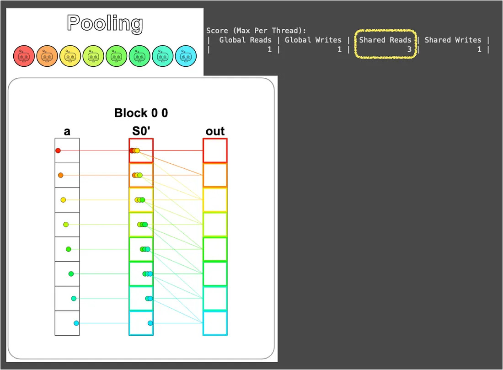
Although the number of global-memory reads only drops from 3 → 1, you should know that this ratio gets amplified as the computation grows more complex.
For example, if we widen the pooling window from 3 to 100 (a common size in image processing), each output would originally require 100 trips to global memory, but after moving into shared memory it only needs 1 trip. The power of the principle "keep data in fast memory as much as possible" then becomes apparent.
### Puzzle 10 — Dot Product
Starting from this puzzle things get a little more challenging!
The puzzle asks us to implement the dot product, that is, multiplying elements at corresponding positions and then summing them up.
This can be broken down into two steps:
1. **Multiply corresponding positions:** This part is relatively simple. We can do the multiplication at the same time as we load the data into shared memory; implementing it just requires a slight modification of the previous puzzle's code.
2. **Sum the multiplied elements:** This is the tricky part. How do we get 8 threads to cooperate in summing 8 values into 1 value?

Fortunately, the puzzle is kind enough to give a hint here: "don't worry about the number of shared-memory reads for now; you'll learn a better approach later."
So let's gratefully accept the offer. This time we'll be a bit crude: pick one thread and ask it to string everything into a chain and add it all up:
```python
TPB = 8
def dot_test(cuda):
    def call(out, a, b, size) -> None:
        shared = cuda.shared.array(TPB, numba.float32)
  
        i = cuda.blockIdx.x * cuda.blockDim.x + cuda.threadIdx.x
        local_i = cuda.threadIdx.x
        # FILL ME IN (roughly 9 lines)
        if i < size:
            # 在把資料載入共享記憶體的同時完成乘法運算
            shared[local_i] = a[i] * b[i]
            cuda.syncthreads()
        # syncthreads 確保資料都在共享記憶體中了
        # 挑 TPB - 1 號執行緒當代表 (純粹是因為視覺化的顏色漂亮)
        # 請它負責把所有數值加起來並寫入 out
        if local_i == TPB - 1:  
            sum = 0  
            for idx in range(size):  
                sum += shared[idx]  
            out[0] = sum  
    return call
```
From the visualization you can see the blue thread (number `TPB - 1`) single-handedly shouldering the responsibility of the summation, while the other 7 threads sit idle after finishing their own multiplications, so Shared Reads reaches 8:
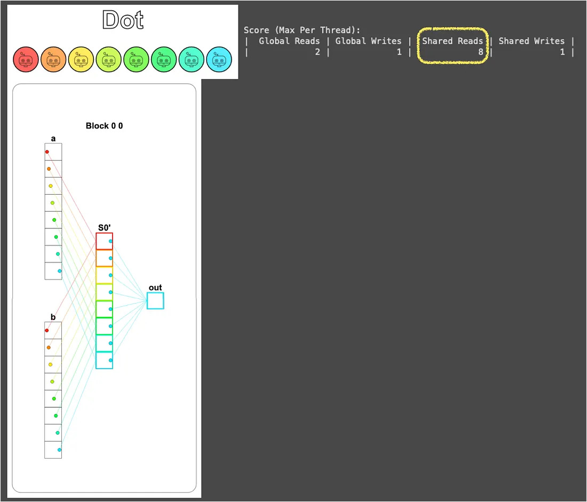
At this point the solution is actually done, but this approach has two very obvious wastes:
- **Severe serialization**: Out of the 8 threads, only 1 is doing the summation while the other 7 sit idle, with the spirit of parallel computation gone entirely.
- **Data read repeatedly**: Remember the foreshadowing planted at the end of Puzzle 5 (Broadcast)? There we said that "how many threads repeatedly grab the same piece of data" amplifies the read cost.
  And although this puzzle's scenario is one thread reading many pieces, it's essentially the same as multiple threads reading the same piece of data; both have the problem that "read volume doesn't decrease along with parallelization."

So is there a better way? Asking it this way, of course there is. Let me keep you in suspense for a bit; after we chew through the convolution puzzle that follows, we'll unravel this mystery in Puzzle 12.
### Puzzle 11 — 1D Convolution
This puzzle does 1D convolution, but before solving it, let's first break down `conv_spec` to confirm that our understanding of convolution matches the puzzle's:
```python
def conv_spec(a, b):
    out = np.zeros(*a.shape)
    b_len = b.shape[0]
    for i in range(a.shape[0]):
        out[i] = sum([a[i + j] * b[j] for j in range(b_len) if i + j < a.shape[0]])
    return out
```
We can see that here `a` is the input vector, `b` is the convolution kernel, and the value at position `i` in the output `out` is obtained by "anchoring the start of `b` at position `i` in `a`, then multiplying corresponding elements and summing them."
This operation can be illustrated by the figure below:
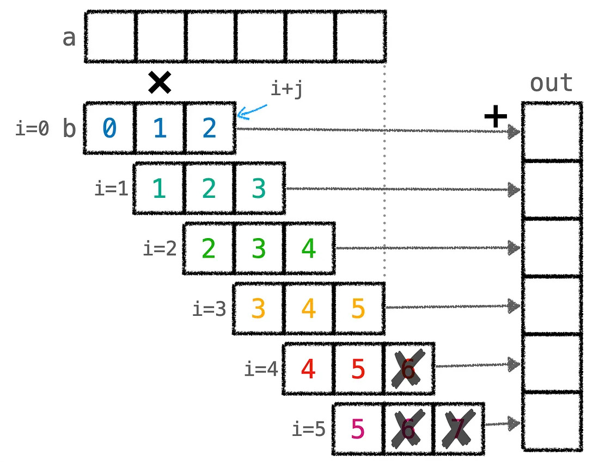
From the figure you can see that this puzzle's convolution automatically pads with zeros when the kernel extends past the end of `a` (`if i + j < a.shape[0]`), so the key to implementing this puzzle is correctly handling the case where the kernel slides to the end and goes beyond `a`.
> [!NOTE] Relationship to CNNs
> The reason we deliberately use a figure first to understand the operation the puzzle expects is that this puzzle's convolution is a little different from the convolution we're familiar with in CNNs.
> The convolution typically used in CNNs (valid convolution) is "the kernel stops when it can no longer move," and the output size ends up a bit smaller than the input (`a_size - b_size + 1`); throughout the process the kernel never protrudes beyond the range of the input vector.
> But this puzzle deliberately makes the output size the same as the input, so when the kernel slides to the end it goes beyond `a`, and the protruding part is treated as 0.
> Also, in deep learning `b` is usually a parameter learned through training (a filter), but in this puzzle `b` is fixed.

Following this line of thinking, and combined with the puzzle's hint (we need to support input vectors and convolution kernels of arbitrary size), we can first write a first version of the solution:
```python
MAX_CONV = 4   # 卷積核尺寸的上限
TPB = 8        # 每個區塊的執行緒數量
TPB_MAX_CONV = TPB + MAX_CONV  # = 12，共享記憶體的總長度
def conv_test(cuda):  
    # a_size: 輸入向量 a 的長度
    # b_size: 卷積核 b 的實際長度 (<= MAX_CONV)
    def call(out, a, b, a_size, b_size) -> None:  
        i = cuda.blockIdx.x * cuda.blockDim.x + cuda.threadIdx.x  
        local_i = cuda.threadIdx.x  
  
        # FILL ME IN (roughly 17 lines)  
        # 建立能放下輸入陣列與卷積核的共享記憶體  
        shared = cuda.shared.array(TPB_MAX_CONV, numba.float32)  
        # 將輸入陣列放入共享記憶體 (前 TPB = 8 個位置)
        if i < a_size:  
            shared[local_i] = a[i]  
        # 將卷積核放在執行緒長度之後的共享記憶體 (後 MAX_CONV = 4 個位置)
        # 這部分讓區塊前 b_size 個執行緒來負責就好  
        if local_i < b_size:  
            shared[TPB + local_i] = b[local_i]  
        # 同步一下，確保資料都進去共享記憶體了  
        cuda.syncthreads()  
        # 計算卷積  
        sum = 0  
        for j in range(b_size):  
            # 判斷卷積核是否會超過向量 a 以及共享記憶體中本區塊複製的向量 a 
            if local_i + j < a_size and local_i + j < TPB:  
                sum += shared[local_i + j] * shared[TPB + j]  
        # 寫到輸出  
        if i < a_size:  
            out[i] = sum  
    return call
```
The core idea of this solution is to stuff `a` and the kernel `b` together into the same block of shared memory: total length `TPB_MAX_CONV = TPB + MAX_CONV = 12`, where the first `TPB = 8` positions hold the segment of `a` this block is responsible for, and the last `MAX_CONV = 4` positions hold the kernel `b`.
To avoid having all threads swarm in to move the kernel (`b` only has `b_size` elements, so there's no need to mobilize `TPB` threads), this job is handled by just the first `b_size` threads.

This puzzle has two tests. The first is the simple case where `TPB` is larger than `a_size` (`a` fits entirely into one block's shared memory); press `problem.check()` and it passes easily.
The second test is where `a_size` is larger than `TPB`, so we have to mobilize multiple blocks to share the work; likewise press `problem.check()`, and it doesn't pass!

Don't wrap up just yet, and don't get discouraged; as engineers, we love debugging the most. Take a deep breath and let's see where it went wrong:
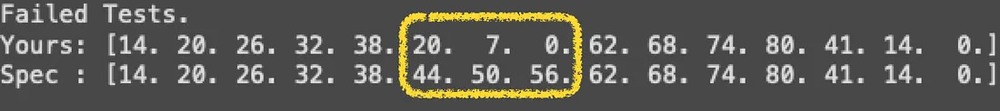
Only three are wrong, and they're all middle positions that came up short, not bad. At least it's not a clueless blunder; it's just that some situations weren't considered.

The diagram below makes the problem clear: when the kernel slides to the end of a block, it goes beyond the range that block loaded into shared memory (`TPB` elements), but at this point **`a` actually still has values afterward**, it's just that these values are loaded by **the next block**. The earlier code treated this part as zero, which is why three elements came up short:
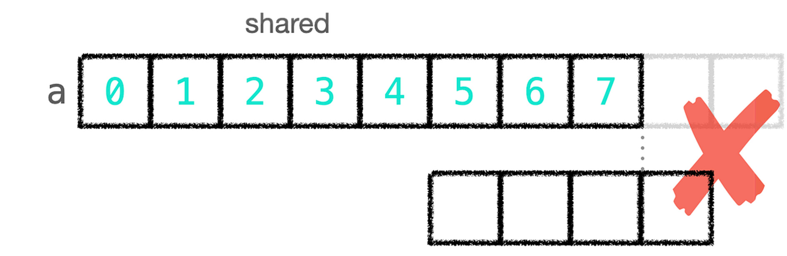
Once we know the problem, we can solve it from two directions:
1. Read the missing `a` directly from global memory, but this would betray our original intent of "stuffing everything into shared memory."
2. Load the missing `a` elements into shared memory too.

But approach 2 still has a practical issue to face: the last `MAX_CONV` positions of shared memory are already occupied by the kernel, so we actually have to do two things: move the kernel out into a separate block `shared_b`, and then use the freed-up positions to hold the missing `a`.
And whether these freed-up `MAX_CONV` positions are actually enough, we can work out with a concrete example.
Suppose `TPB = 8` and `b_size = 4`; the block loaded `a[0..7]`. At this point the block's last thread (`local_i = 7`) needs to compute `out[7]`; it needs the 4 elements `a[7], a[8], a[9], a[10]` to dot with `b`, but `a[8], a[9], a[10]` are all in the next segment, not within the block, so it's short by 3, which is exactly `b_size - 1`.
More generally, when the kernel slides off the end of a block, it reaches out at most `b_size - 1` positions (any more and the kernel has completely left the block), so the "missing `a`" is at most `b_size - 1` elements.
And `b_size` must be less than or equal to `MAX_CONV` (`MAX_CONV` is the upper bound on kernel size), so the `MAX_CONV` positions that originally held `b` are just enough to hold all the possible missing `a`!

In other words, the constant `MAX_CONV` has been pulling double duty from the start: it's both the capacity limit of the kernel and the upper bound on "how many `a` will be missing." That foreshadowing was buried deep.

So we'll choose approach 2, plus add a little trick: assign the task of "loading the extra `a`" to the threads that were supposed to load the kernel but have nothing to do (those beyond the first `b_size`). This way the number of global-memory reads doesn't increase either.
The full code then looks like this:
```python
MAX_CONV = 4 
TPB = 8  
TPB_MAX_CONV = TPB + MAX_CONV  
def conv_test(cuda):  
    def call(out, a, b, a_size, b_size) -> None:  
        i = cuda.blockIdx.x * cuda.blockDim.x + cuda.threadIdx.x  
        local_i = cuda.threadIdx.x  
  
        # FILL ME IN (roughly 17 lines)  
        # 拆成兩塊共享記憶體：
        # shared_a 裝這個區塊負責的 a (前 TPB 個) + 額外的 a 尾端 (後面最多 MAX_CONV 個)
        # shared_b 單獨裝卷積核 b
        shared_a = cuda.shared.array(TPB_MAX_CONV, numba.float32)  
        shared_b = cuda.shared.array(MAX_CONV, numba.float32)  
        # 將輸入陣列放入共享記憶體 (前 TPB 個位置)  
        if i < a_size:  
            shared_a[local_i] = a[i]  
              
        # 前 b_size 個執行緒負責載入卷積核到 shared_b
        if local_i < b_size:  
            shared_b[local_i] = b[local_i]  
        # 其餘執行緒 (local_i >= b_size) 負責載入額外的 a 尾端，補到 shared_a 後段
        # 這樣全部執行緒都有事做，全域記憶體的讀取次數也不會增加
        else:  
            # 把編號平移 b_size，重新解讀成「我是第 0 個額外載入者」、「我是第 1 個」這樣
            i_other = i - b_size  
            local_i_other = local_i - b_size  
            # local_i_other < b_size：最多只額外載入 b_size 個 (反正最多缺 b_size - 1 個)
            # TPB + i_other < a_size：避免讀到 a 的範圍外
            if local_i_other < b_size and TPB + i_other < a_size:  
                shared_a[TPB + local_i_other] = a[TPB + i_other]  
        # 同步一下，確保資料都進去共享記憶體了  
        cuda.syncthreads()  
        # 計算卷積  
        sum = 0  
        for j in range(b_size):  
            # 判斷卷積核是否會超過向量 a (注意這裡用 i 而非 local_i)  
            if i + j < a_size:  
                sum += shared_a[local_i + j] * shared_b[j]  
        # 寫到輸出  
        if i < a_size:  
            out[i] = sum  
    return call
```
After the detailed explanation above, the only part of this code that's less intuitive is the little "index shift" maneuver, so let me give an extra explanation here.
If we don't shift and just use the original `local_i` to evaluate the conditions, we'll find that the condition has to be written as a range that minds both ends, like "`local_i` is between `b_size` and `2 * b_size`," and moreover the position to load `shared_a[TPB + (local_i - b_size)]` and the global position `a[TPB + (i - b_size)]` both have to drag along that `- b_size` tail, making the whole thing messy to read.

But once we subtract `b_size` from the numbering, this group of threads can go from the offset numbering "`local_i = b_size, b_size+1, ...`" to a clean sequential numbering "`local_i_other = 0, 1, 2, ...`," which is equivalent to letting them also count from 0 in their own little world, so all the conditions and indices can be written in the most intuitive way, almost identical to the way the "load `a` into the first `TPB` positions" section was written.

Finally, let's look at the visualization result. Notice that although `S0'` in the left block of 1D Conv (Full) loaded the 12th element of vector `a`, it doesn't contribute to the `Out` that block is responsible for; this is the safety redundancy of "the extra-loaded `a` not being used" mentioned earlier:
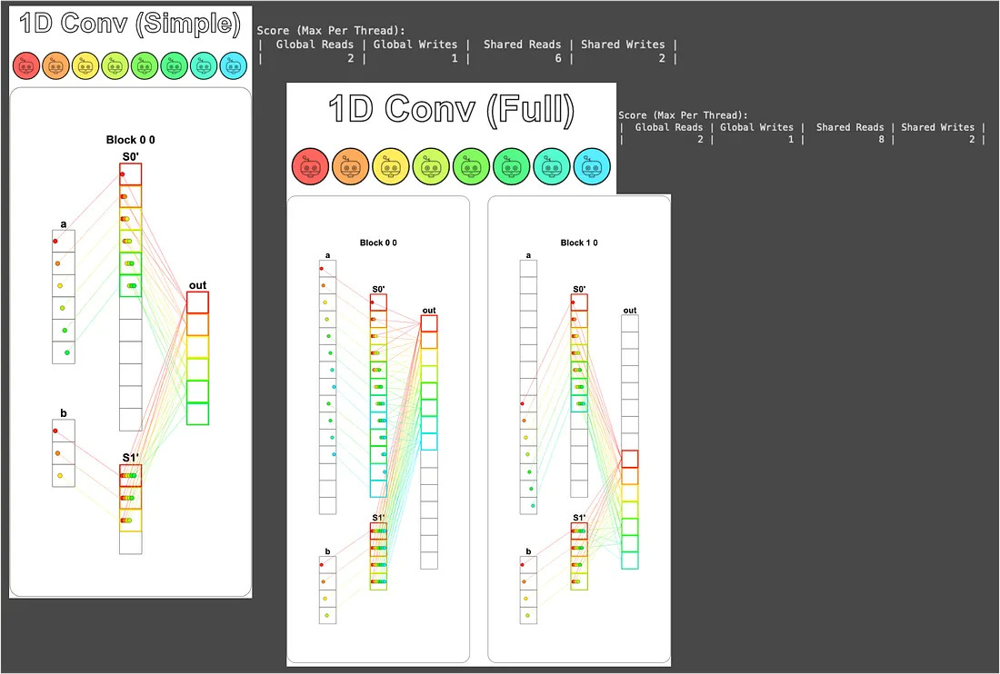
This solution's number of global-memory reads and writes also meets the puzzle's requirement. Great, great, great!
### Puzzle 12 — Prefix Sum
Remember the foreshadowing planted at the end of Puzzle 10? There I said the approach of "dispatching one thread to traverse all elements" was terrible, and that there would be a better algorithm later — that's this puzzle!

The puzzle asks us to compute the sum of `a`, but if the size of `a` is larger than the block size (`TPB`), then we just compute the sum of the elements within each block and write it to `out[blockIdx.x]`; the sum of the entire array is then obtained by the Host adding up these partial sums to get the final answer.
For example, if `TPB = 8` and the length of `a` is 16, one block can't hold it, so 2 blocks are mobilized to each handle a segment, and the final output becomes `out = [sum of the first 8 elements, sum of the last 8 elements]`; the Host then adds these two values to get the complete sum of `a`.
> [!NOTE] Why is it called Prefix Sum?
> Strictly speaking, [Prefix Sum](https://en.wikipedia.org/wiki/Prefix_sum) refers to the output `out[i] = a[0] + a[1] + ... + a[i]` (each position recording the running total so far), but this puzzle only needs the last running total (the sum of the whole segment), so it's essentially [Reduce sum](https://www.tensorflow.org/api_docs/python/tf/math/reduce_sum).
> However, to write the most efficient parallel version of reduce-sum, those intermediate running totals still get computed along the way, so it's simply called Prefix Sum, which conveniently sets up the next puzzle (Axis Sum).
> That's right! The author here was probably trying to provoke our thinking, which is why they used this name, letting us explore the efficient parallelized prefix-sum algorithm on our own. How considerate.
> 

The formal name of this puzzle's algorithm is the [Blelloch Algorithm](https://www.cs.cmu.edu/~guyb/papers/Ble93.pdf), but this puzzle actually only uses its first half, the Up-Sweep (Reduce) Phase.
The reason this algorithm can be parallelized is the **associative law of addition**.
If we sum sequentially, the computation looks like `((a + b) + c) + d`, where each step has to wait for the previous one to finish, with no way to compute in parallel.
But the associative law tells us we can reorganize this computation into `(a + b) + (c + d)`, so that `a + b` and `c + d` can be computed **simultaneously**.
Pushing this trick further, each round halves the number of pairs to add, and the original $O(N)$ time drops to $O(\log N)$:
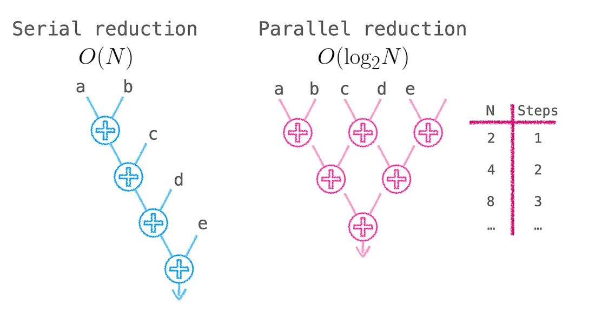
> [!NOTE] After Up-Sweep comes Down-Sweep
> The complete Blelloch Algorithm also requires a Down-Sweep phase to compute the truly complete Prefix Sum (the running total at each position), but the full version is beyond the scope of this article. Kids who are interested, please refer to [Chapter 39. Parallel Prefix Sum (Scan) with CUDA](https://developer.nvidia.com/gpugems/gpugems3/part-vi-gpu-computing/chapter-39-parallel-prefix-sum-scan-cuda).

In implementation, each round selects some threads to do adjacent additions, and the selection condition can be written as `local_i % stride == 0`, where `stride` starts at 1 and doubles each round.
For example, in the first round `stride = 1`, all even-numbered threads (`local_i = 0, 2, 4, 6`) get to work, adding themselves to their right neighbor at distance 1; in the second round `stride = 2`, only `local_i = 0, 4` remain at work, adding the neighbor at distance 2; in the third round `stride = 4`, only `local_i = 0` is left at work, adding the one at distance 4, and the sum of the whole segment is thus complete.
Because `TPB = 8`, three rounds are enough ($\log_2 8 = 3$):
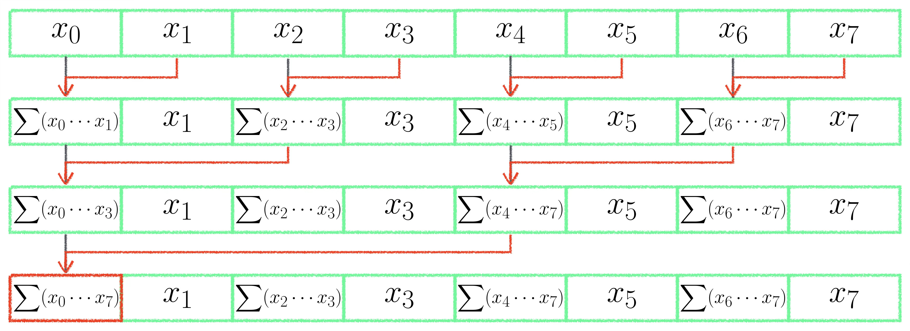
Writing these three rounds out individually looks like this (this isn't the final version yet, just a transitional one):
```python
def sum_test(cuda):  
    def call(out, a, size: int) -> None:  
        cache = cuda.shared.array(TPB, numba.float32)  
        i = cuda.blockIdx.x * cuda.blockDim.x + cuda.threadIdx.x  
        local_i = cuda.threadIdx.x  
        # FILL ME IN (roughly 12 lines)  
        if i < size:  
            # 把資料載入共享記憶體 (注意 index 是 local_i 而不是 i)
            cache[local_i] = a[i]  
            cuda.syncthreads()  
            # 第一輪：local_i = 0, 2, 4, 6 把自己跟距離 1 的鄰居加起來
            if local_i % 2 == 0:  
                cache[local_i] = cache[local_i] + cache[local_i + 1]  
                cuda.syncthreads()  
            # 第二輪：local_i = 0, 4 把自己跟距離 2 的鄰居加起來
            if local_i % 4 == 0:  
                cache[local_i] = cache[local_i] + cache[local_i + 2]  
                cuda.syncthreads()  
            # 第三輪：local_i = 0 把自己跟距離 4 的鄰居加起來，整段總和會落在 cache[0]
            if local_i % 8 == 0:  
                cache[local_i] = cache[local_i] + cache[local_i + 4]  
                cuda.syncthreads()  
    return call
```
Here `cuda.syncthreads()` must be called once at the end of each round, because the next round will read the results written in by the previous round; without proper synchronization you'll step on someone else's toes (a race condition).
From the visualization you can see the flow of values in shared memory matches the diagram:
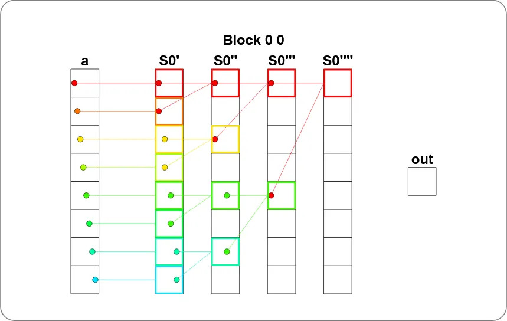
However, there are two places in this version that can still be tidied up:
1. The three rounds' `if`s are hard-coded; if `TPB` gets bigger you'd have to manually add more `if`s, which isn't general.
2. It doesn't handle the case of `i >= size`; if some thread has no corresponding data, its position in shared memory will be a dirty value left over from last time, and adding it in will pollute the entire result.
Fixing these two points gives the final version of the solution:
```python
def sum_test(cuda):  
    def call(out, a, size: int) -> None:  
        cache = cuda.shared.array(TPB, numba.float32)  
        i = cuda.blockIdx.x * cuda.blockDim.x + cuda.threadIdx.x  
        local_i = cuda.threadIdx.x  
        # FILL ME IN (roughly 12 lines)  
        # 把資料載入共享記憶體，超出 size 的執行緒就把對應位置填 0
        # 因為 0 是加法的單位元素，加進去不會影響結果，這個小技巧之後也會常用到
        if i < size:  
            cache[local_i] = a[i]  
        else:  
            cache[local_i] = 0.0  
        cuda.syncthreads()  
        # 用 while 把三輪合併成通用版本
        # stride 從 1 開始、每輪翻倍 (1 → 2 → 4)，
        # 搭配 local_i % (stride * 2) == 0 挑出這輪要動手的執行緒
        stride = 1  
        while stride < TPB:  
            if local_i % (stride * 2) == 0:  
                cache[local_i] = cache[local_i] + cache[local_i + stride]  
            cuda.syncthreads()  
            stride *= 2  
  
        # 整段總和最後會待在 cache[0]，派 local_i = 0 寫回對應的 out 位置
        if local_i == 0:  
            out[cuda.blockIdx.x] = cache[0]  
    return call
```
The visualization result is as follows:
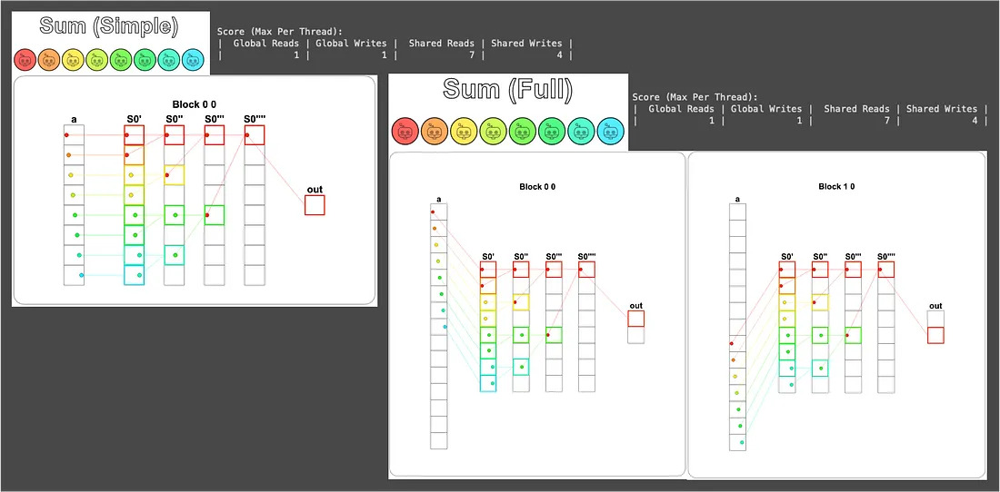
Although this version's Shared Reads is only 1 fewer than Puzzle 10 (8 reads → 7 reads), don't underestimate that 1.
When `TPB` gets bigger, the sequential version is $O(\text{TPB})$ while Blelloch is $O(\log_2 (\text{TPB}))$; by `TPB = 1024` the sequential version reads 1024 times while the parallel version only reads 10 times, a staggering gap.
Moreover, Blelloch lets all threads take turns coming on stage without sitting idle, which is the more important thing for a GPU; after all, an idle GPU is the last thing we want to see.
### Puzzle 13 — Axis Sum
This puzzle does Axis Sum (summation along an axis), equivalent to the version of PyTorch's `sum` function with the `dim` parameter set.

From `sum_spec`'s `out[..., j] = a[..., i : i + TPB].sum(-1)` we can see the puzzle wants summation along the last axis.
Combined with this puzzle's `a.shape = (BATCH, SIZE) = (4, 6)` and `out.shape = (BATCH, 1) = (4, 1)`, it means "summing the 6 elements of each row into a single value."
Here I've added 4 colored boxes to the puzzle's initial visualization to aid understanding:
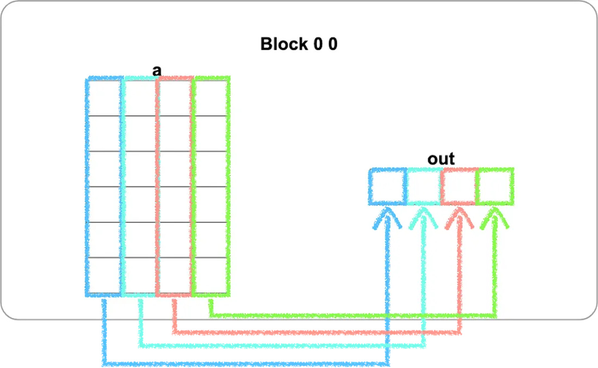
> [!WARNING] The orientation of the visualization
> Remember the warning at the start of Part 1 that GPU Puzzles' 2D visualization differs from the NumPy print view by a transpose?
> This puzzle is one such example. In the NumPy view `a` is 4 Rows × 6 Cols, but the visualization draws it as 6 Rows × 4 Cols (`threadIdx.x` runs horizontally, `threadIdx.y` runs vertically), so the 4 vertical colored columns you see in the figure actually correspond to the 4 Rows of `a` in the NumPy view.

There's a beautiful transformation in the implementation: look closely and you'll realize that the summation of each row is exactly what the previous puzzle, Prefix Sum, solved.
So we just need to let each block handle one row, directly applying the previous puzzle's code internally, and we're done.

But how do we get each block to correspond to one row? The answer is to use the **second-dimension block index** (`cuda.blockIdx.y`).
This time the puzzle sets `blockspergrid` to `Coord(1, BATCH)`, which means it only opens BATCH blocks in the y direction, and each block has its own unique `blockIdx.y` counting from 0 to BATCH - 1, which can conveniently serve as the index of "which row I'm responsible for":
```python
def axis_sum_test(cuda):
    def call(out, a, size: int) -> None:  
        cache = cuda.shared.array(TPB, numba.float32)  
        i = cuda.blockIdx.x * cuda.blockDim.x + cuda.threadIdx.x  
        local_i = cuda.threadIdx.x  
        # 第二維 block index，每個區塊靠這個值認領「我負責第幾 Row」
        batch = cuda.blockIdx.y  
        # FILL ME IN (roughly 12 lines)  
        # 載入第 batch row 的對應位置到共享記憶體
        # 超出 size 的執行緒一樣填 0，避免影響加總結果 (跟 Puzzle 12 同樣手法)
        if local_i < size:  
            cache[local_i] = a[batch, local_i]  
        else:  
            cache[local_i] = 0.0  
        cuda.syncthreads()  
        # 套用 Puzzle 12 的 Up-Sweep，整段總和會落在 cache[0]
        stride = 1  
        while stride < TPB:  
            if local_i % (stride * 2) == 0:  
                cache[local_i] = cache[local_i] + cache[local_i + stride]  
            cuda.syncthreads()  
            stride *= 2  
        # 派 local_i = 0 把這 Row 的總和寫到 out 對應的位置
        if local_i == 0:  
            out[batch, 0] = cache[0]  
            
    return call
```
The most crucial part here is `batch`, which lets each block know which row to handle; the rest is an extension of Puzzle 12.

The visualization result is as follows (here, for layout reasons, only two blocks are shown). You can see the Block index values are `(0, 0)`, `(0, 1)`, `(0, 2)`, `(0, 3)`, which is exactly the `blockIdx.y` that `batch` represents:
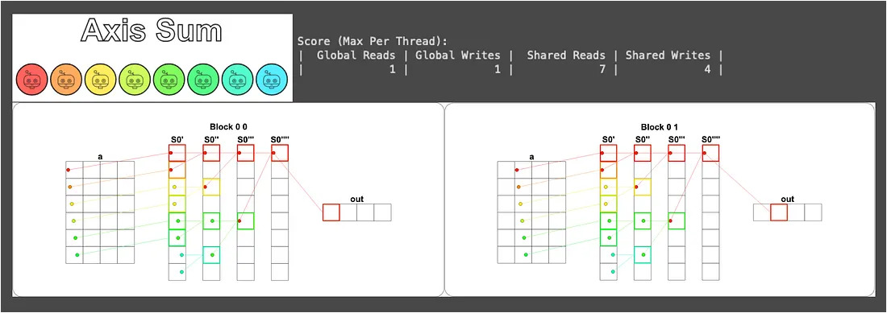
There's an observation here worth pausing to think about: because these blocks are completely independent (each handling a different row), they'll be automatically dispatched by the CUDA scheduler to different SMs to run **simultaneously**.
This is also why the "divide and conquer" discussed in Part 1 cuts the problem into independent small pieces, because "independence" is the strongest guarantee of parallelization.
### Puzzle 14 — Matrix Multiply!
We've finally reached the last puzzle 🥳

This puzzle can definitely be called the finishing touch of this series; after all, once matrix multiplication is solved, most deep-learning algorithms can be computed (further reading: [GPT in 60 Lines of NumPy](https://jaykmody.com/blog/gpt-from-scratch/)).

Intuitively, `out[i, j]` in matrix multiplication `out = a @ b` is the dot product of the `i`-th Row of `a` and the `j`-th Col of `b`.
But the biggest difference from the previous puzzles is that this is a 2D problem, so both blocks and threads are organized in 2D, with each thread responsible for computing one `out[i, j]`.

Let's start from the simple case. When the entire matrix fits into shared memory, we can directly load all of `a` and `b` into it, then let each thread do the one dot product it's responsible for.
But there's one thing to note: this time we can't do "compute while loading" like in Puzzle 10. Because Puzzle 10 was a dot product of a 1D vector, where each thread only needed the position it loaded itself (`a[i] * b[i]`), whereas now each thread needs "the whole Row / whole Col it's responsible for," but the data at these positions is loaded by other threads, so we must first load everything, synchronize, and then start computing:
```python
TPB = 3
def mm_oneblock_test(cuda):  
    def call(out, a, b, size: int) -> None:  
        # 兩塊 2D 共享記憶體，分別裝整個 a 跟整個 b
        a_shared = cuda.shared.array((TPB, TPB), numba.float32)  
        b_shared = cuda.shared.array((TPB, TPB), numba.float32)  
  
        i = cuda.blockIdx.x * cuda.blockDim.x + cuda.threadIdx.x  
        j = cuda.blockIdx.y * cuda.blockDim.y + cuda.threadIdx.y  
        local_i = cuda.threadIdx.x  
        local_j = cuda.threadIdx.y  
  
        # FILL ME IN (roughly 14 lines)  
        if i < size and j < size:  
            # 每個執行緒負責載入一個位置 (i, j)，全部執行緒合力把 a 跟 b 都載完
            a_shared[local_i, local_j] = a[i, j]  
            b_shared[local_i, local_j] = b[i, j]  
            # 必須等大家都載完，因為下面要讀其他執行緒載入的位置
            cuda.syncthreads()  
            # 計算 a 的第 local_i Row 跟 b 的第 local_j Col 的內積
            prod = 0  
            for k in range(size):  
                prod += a_shared[local_i, k] * b_shared[k, local_j]  
            # 寫到輸出  
            out[i, j] = prod  
    return call
```
The key point of this code is that one line in the loop: `prod += a_shared[local_i, k] * b_shared[k, local_j]`. For the thread responsible for `out[i, j]`, `local_i` and `local_j` are fixed, and by having `k` run from 0 to `size - 1`, it walks the entire `local_i`-th Row of `a` and the entire `local_j`-th Col of `b` and finishes the dot product.

For the visualization here we only draw the red thread (using `problem.show(sparse=True)` in the setup), otherwise it would be too cluttered:
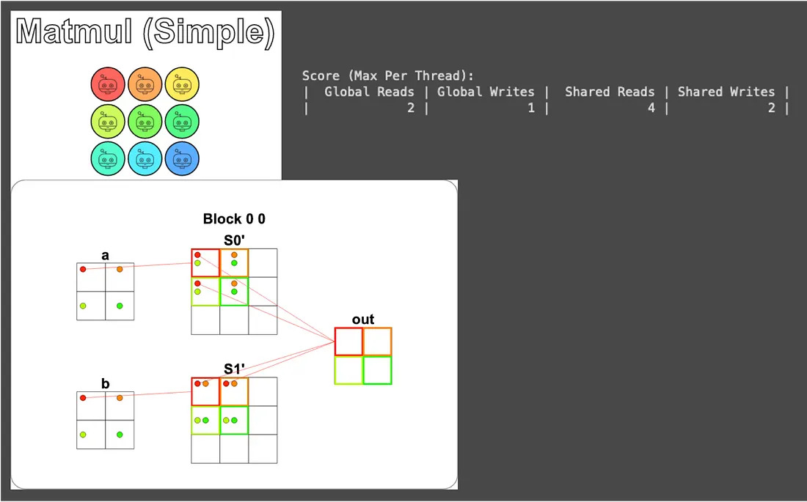
Next comes the harder but more common case — when the matrix size is larger than the shared-memory size.
For this puzzle, shared memory is only `TPB × TPB`, so when the matrix exceeds this size, we can't load all of `a` and `b` at once and must switch to block-wise loading: split `a` and `b` into pieces, loading them into shared memory one at a time, and accumulate the partial dot product computed from each piece; after running through all pieces, `prod` is the complete dot-product value:
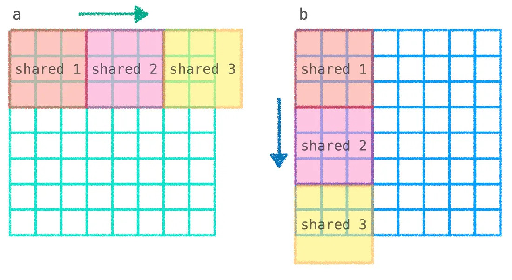
From the figure above you can see that computing `out[i, j]` requires the dot product of the entire `i`-th Row of `a` and the entire `j`-th Col of `b`, but because neither row nor column fits into shared memory, we have to split it into the flow of "load a segment of `a` + a segment of `b` → compute the dot product of this segment → accumulate into `prod` → then load the next segment," iteratively accumulating the local dot products into the total:
```python
TPB = 3  
def mm_oneblock_test(cuda):  
    def call(out, a, b, size: int) -> None:  
        a_shared = cuda.shared.array((TPB, TPB), numba.float32)  
        b_shared = cuda.shared.array((TPB, TPB), numba.float32)  
  
        i = cuda.blockIdx.x * cuda.blockDim.x + cuda.threadIdx.x  
        j = cuda.blockIdx.y * cuda.blockDim.y + cuda.threadIdx.y  
        local_i = cuda.threadIdx.x  
        local_j = cuda.threadIdx.y  
        # FILL ME IN (roughly 14 lines)  
        # prod 在每輪疊代外面初始化，這樣每塊算出來的部分內積才能累加上去
        prod = 0  
        # 無條件進位算出要跑幾輪疊代 (因為 size 不一定整除 TPB)
        # 例如 size = 8、TPB = 3 時，要 3 輪才能跑完 (3 + 3 + 2)
        blocks = size // TPB + bool(size % TPB)  
        # block 在這裡代表「目前處理到第幾塊」，從 0 數到 blocks - 1
        for block in range(blocks):  
            # b_i、b_j 是「目前這一塊」在原始矩陣 a / b 中對應的位置
            # 第 block 塊就把 a 的第 block 段、b 的第 block 段拉進共享記憶體
            b_i = block * cuda.blockDim.x + cuda.threadIdx.x  
            b_j = block * cuda.blockDim.y + cuda.threadIdx.y  
            # 載入 a 的這一塊：固定 Row i (這個執行緒負責的)、跨 Col 跟著 block 跑
            if i < size and b_j < size:  
                a_shared[local_i, local_j] = a[i, b_j]  
            # 載入 b 的這一塊：跨 Row 跟著 block 跑、固定 Col j
            if b_i < size and j < size:  
                b_shared[local_i, local_j] = b[b_i, j]  
            cuda.syncthreads()  
            # 計算這一塊的內積並累加到 prod
            # 內迴圈最多跑 TPB 次，但最後一塊可能不滿 TPB，所以用 min 限制
            for k in range(min(TPB, size - block*TPB)):  
                prod += a_shared[local_i, k] * b_shared[k, local_j]  
        # 所有塊都跑完之後，prod 就是完整內積，寫到輸出
        if i < size and j < size:  
            out[i, j] = prod  
  
    return call
```
The only less intuitive part of this whole thing is the computation of `b_i` and `b_j`, so let me pull it out and explain it separately.
For the thread responsible for `out[i, j]`, what it needs to grab is the `i`-th Row of `a` and the `j`-th Col of `b`, and these two values are fixed throughout the whole computation.
What varies is "which segment of the Row / Col we're currently processing," and that's the role of `b_i` and `b_j`. As `block` increases, these two values shift forward by `TPB` positions, corresponding exactly to the next segment of `a`'s `i`-th Row and the next segment of `b`'s `j`-th Col.
So when loading `a`, the Row is fixed at `i` and the Col follows `b_j`; when loading `b`, the Row follows `b_i` and the Col is fixed at `j`.

The hard test case uses an 8×8 matrix, processed with a 3×3 arrangement of 3×3-sized blocks. Here we only show the visualization of the computation for the first and last blocks; the rest can be inferred by analogy:
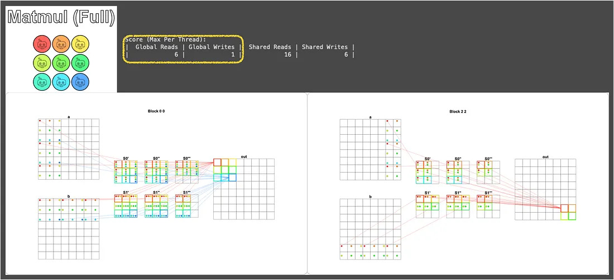
You can see this only took 6 global-memory reads, which is already an approach that meets the puzzle's requirement!
> [!NOTE] Matrix multiplication in the real world
> Remember the [`fast_matmul`](https://numba.pydata.org/numba-doc/latest/cuda/examples.html#matrix-multiplication) mentioned at the end of Puzzle 8? This puzzle is actually a streamlined version of it!
> Real high-performance matrix multiplication (e.g. cuBLAS, CUTLASS) does many more optimizations on top of this foundation (Tiling, Tensor Core, Mixed Precision, etc.), but the core spirit is the "block-wise loading into shared memory" here.
> In other words, chewing through this puzzle is equivalent to touching the threshold of modern deep learning's underlying acceleration; dig further down from here and you're in the world where NVIDIA engineers earn seven-figure monthly salaries 🤑 (just kidding).
## Closing
Congratulations to all the kids who've made it this far. Together we've completed 14 puzzles, starting from the most basic Map and Zip, working through Guard, multiple blocks, and shared memory, and finally breaking through convolution, parallel reduction, and matrix multiplication.

And the core mindset supporting this whole journey is really just the following few items:
- **One thread per piece of data**: First think about what a single thread needs to do, then let the hardware spin up a whole bunch running simultaneously.
- **Use a Guard to block off when there are more threads than data**: Avoid going out of bounds, and avoid some threads polluting the computation with dirty values.
- **Keep hot data in fast memory as much as possible**: If you can use shared memory, don't repeatedly read global memory.
- **Pair shared memory with `syncthreads()`**: Always synchronize after writing and before reading, otherwise a race condition awaits you.
- **Cut the problem into independent small pieces**: The more independent the blocks are, the more freely the GPU can dispatch them to different SMs for parallel processing.

Master these few items, plus the Thread / Block / Grid hierarchy discussed in the previous installment, and when you encounter a new algorithm, you can mostly piece together a usable CUDA version.

And if you want to take one more step forward, you might consider checking out:
- **[NUMBA CUDA Guide](https://numba.readthedocs.io/en/stable/cuda/index.html)**: This series is only an introduction; Numba also has advanced topics like Atomic Operations, Cooperative Groups, and CUDA Streams.
- **[Apache TVM](https://tvm.apache.org/) and [OpenAI Triton](https://openai.com/index/triton/)**: High-level approaches that break free of the hardware framework, so you don't have to rewrite for every architecture.
- **[CUTLASS](https://github.com/NVIDIA/cutlass)**: The source code of NVIDIA's own high-performance matrix-multiplication library; reading it is guaranteed to fill you with respect for the "advanced version" of Puzzle 14.

Finally, to all of you in the Awei army, well done! See you next time~

## References
- [Chapter 39. Parallel Prefix Sum (Scan) with CUDA](https://developer.nvidia.com/gpugems/gpugems3/part-vi-gpu-computing/chapter-39-parallel-prefix-sum-scan-cuda)
- [Blelloch Scan — Intro to Parallel Programming](https://www.youtube.com/watch?v=mmYv3Haj6uc)
- [Understanding the implementation of the Blelloch Algorithm (Work-Efficient Parallel Prefix Scan)](https://medium.com/nerd-for-tech/understanding-implementation-of-work-efficient-parallel-prefix-scan-cca2d5335c9b)
- [和TensorFlow一樣，NVIDIA CUDA的壟斷格局將被打破？](https://www.techbang.com/posts/103424-tensorflow-nvidia-cudas)
