> 本系列文介紹如何使用 Numba 來進行 CUDA 編寫，這是系列文的第二篇，前面的內容請參考: [用 Numba 學 CUDA! 從入門到精通 (上)](/posts/numba-cuda-puzzles-1/)
> 2026/05/30：因為上集都大改了，所以秉持著不能虎頭蛇尾的原則，下集也是 2026 超級重製版！甚至兩張封面圖都用 AI 改成高畫質了～
> 還重畫了一些示意圖，一錯錯兩年，你看悲不悲傷 🥲
## GPU 謎題
前一篇我們已經把 CUDA 的基本程式設計模型走過一輪，從 Map、Zip 一路寫到 Guard、多區塊、共享記憶體。
這一篇就要拿這些工具來實際打怪了，從池化、內積、卷積、前綴和、軸向求和，一路寫到矩陣乘法，把這些深度學習中常見的演算法一個一個翻譯成 CUDA 的版本。

再次提醒，還沒打開習題的小朋友請去 [GPU Puzzles](https://github.com/srush/GPU-Puzzles) 用 Colab 開起來挑戰看看 (記得 Runtime 要使用 GPU)。
謎題完整的解答可以在我的 [Repo](https://github.com/xavierforge/puzzles/blob/main/GPU_Puzzlers_Solution.ipynb) 找到，解完也記得回來看看詳解哦。
### Puzzle 9 — Pooling
這題要我們實作池化 (Pooling) 運算，這是 CNN 中很常見的操作之一，常用來降採樣 (Downsampling)、擴大感受視野 (Receptive field)。
從 `pool_spec` 的 `out[i] = a[max(i - 2, 0) : i + 1].sum()` 可以看出這題的池化規則是「自己加上前兩個元素」。
但仔細一想就會發現，這樣每算一個輸出，全域記憶體就得讀 3 次 (`a[max(i-2, 0)]`、`a[max(i-1, 0)]` 和 `a[i]`)。
如果 `SIZE` 變成幾百萬，那這個讀取量就會非常驚人，這是不好的：

所以這時候就輪到上一題剛學會的共享記憶體派上用場啦，把資料先一次性搬進共享記憶體，後面要重複用時就到共享記憶體拿就好，不必再去打擾全域記憶體：
```python
TPB = 8

def pool_test(cuda):  
    def call(out, a, size) -> None:
        # 共享記憶體的大小設為 TPB，剛好對應一個區塊負責的 TPB 筆資料
        shared = cuda.shared.array(TPB, numba.float32)
        
        # 全域索引值，負責寫入 out 的正確位置
        i = cuda.blockIdx.x * cuda.blockDim.x + cuda.threadIdx.x
        # 區塊內索引值，負責對應到共享記憶體裡的位置
        local_i = cuda.threadIdx.x  
        # FILL ME IN (roughly 8 lines)  
        if i < size:  
            # 先載入共享記憶體
            shared[local_i] = a[i]
            # 等大家都載完
            cuda.syncthreads()
            # 之後的讀取通通走共享記憶體，邊界用 max 處理
            out[i] = shared[max(local_i-2, 0)] + shared[max(local_i-1, 0)] + shared[local_i]  
    return call
```
值得注意的是，雖然這裡只有一個區塊、且共享記憶體的長度跟區塊內執行緒數量一樣，我們還是要把全域索引值 `i` 跟區塊內的索引值 `local_i` 分清楚 — 全域索引值用來定位輸入跟輸出，區塊內索引值用來定位共享記憶體。
> [!NOTE] Numba 支援的 Python 內建函式
> 這題用了 `max()`，敏銳的讀者可能會擔心 Numba 不支援，但翻一下 [清單](https://numba.readthedocs.io/en/stable/cuda/cudapysupported.html#built-in-functions) 就會發現 `max()`、`min()`、`abs()` 這類常見內建函式都有支援，可以放心使用。

從視覺化可以看到全域記憶體真的就只有讀寫各一次，剩下都被共享記憶體吃下來了：
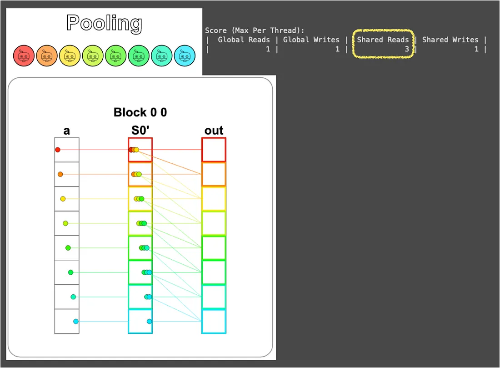
雖然全域記憶體的讀取次數只是從 3 → 1 而已，但要知道這個比例會隨著運算的複雜度被放大。
舉例來說，如果把池化窗口從 3 拉到 100 (圖像處理裡常見的尺寸)，每個輸出原本得跑 100 趟全域記憶體，搬進共享記憶體之後就只需要 1 趟，「資料盡量待在快的記憶體裡」這條原則的威力也就顯現出來啦。
### Puzzle 10 — Dot Product
從這題開始稍微有點挑戰性囉！
題目要我們實作內積，也就是把對應位置的元素相乘後加總。
這件事可以拆成兩個步驟來想：
1. **對應位置相乘：** 這部分相對簡單，我們可以在把資料載入共享記憶體的同時完成相乘，實作時只需要把上一題的程式碼稍加修改就好。
2. **相乘後的元素加總：** 這就麻煩了，怎麼讓 8 個執行緒合作把 8 個值加成 1 個值？

幸好這裡題目很貼心地給了個提示：「先不要在意共享記憶體的讀取次數，之後會學到更好的做法」。
那我們就恭敬不如從命，這次先粗暴一點，挑一個執行緒出來，請它把所有東西串成一串加起來吧：
```python
TPB = 8
def dot_test(cuda):
    def call(out, a, b, size) -> None:
        shared = cuda.shared.array(TPB, numba.float32)
  
        i = cuda.blockIdx.x * cuda.blockDim.x + cuda.threadIdx.x
        local_i = cuda.threadIdx.x
        # FILL ME IN (roughly 9 lines)
        if i < size:
            # 在把資料載入共享記憶體的同時完成乘法運算
            shared[local_i] = a[i] * b[i]
            cuda.syncthreads()
        # syncthreads 確保資料都在共享記憶體中了
        # 挑 TPB - 1 號執行緒當代表 (純粹是因為視覺化的顏色漂亮)
        # 請它負責把所有數值加起來並寫入 out
        if local_i == TPB - 1:  
            sum = 0  
            for idx in range(size):  
                sum += shared[idx]  
            out[0] = sum  
    return call
```
從視覺化的結果可以看到藍色 (`TPB - 1` 號) 執行緒一個人扛起加總的責任，其它 7 個執行緒在完成自己的乘法之後就閒著，因此 Shared Reads 來到了 8 次：
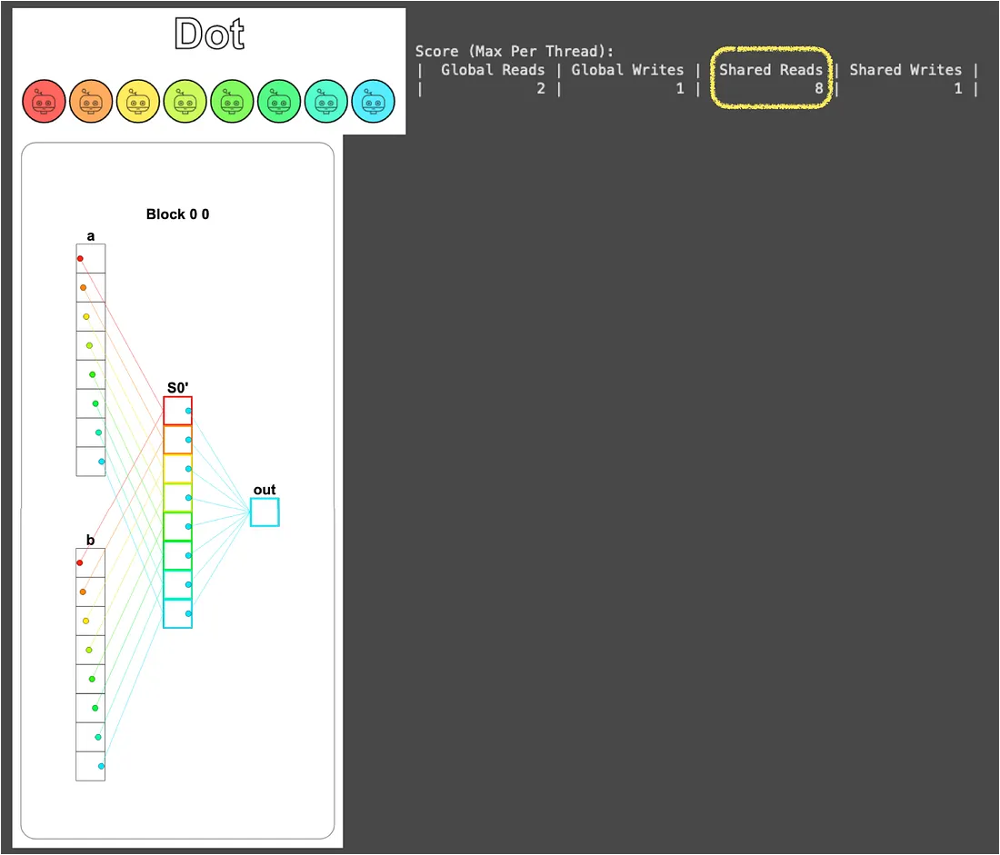
到這裡解答其實就完成了，但這個做法有兩個非常明顯的浪費：
- **嚴重序列化**：8 個執行緒裡只有 1 個在做加總，其它 7 個都閒著，平行運算的精神蕩然無存。
- **資料被重複讀**：還記得 Puzzle 5 (Broadcast) 結尾埋的伏筆嗎？在那裡我們說「同一筆資料被多少執行緒重複拿」會放大讀取成本。
  而這題情境雖然是一個執行緒讀很多筆，但本質上跟多個執行緒讀同一筆資料是一樣的，都有「讀取量沒有跟著平行化降下來」的問題。

那有沒有更好的辦法？會這樣問當然有啦，先賣個關子，等我們把後面卷積一題啃下來之後，在 Puzzle 12 解開這個謎。
### Puzzle 11 — 1D Convolution
這題要做一維卷積，但在解題之前，先來拆解 `conv_spec` 確認一下我們對卷積的理解是否與題目相同：
```python
def conv_spec(a, b):
    out = np.zeros(*a.shape)
    b_len = b.shape[0]
    for i in range(a.shape[0]):
        out[i] = sum([a[i + j] * b[j] for j in range(b_len) if i + j < a.shape[0]])
    return out
```
可以看出這裡的 `a` 是輸入向量、`b` 是卷積核 (Kernel)，而輸出 `out` 中位置 `i` 的值是透過「將 `b` 的開頭卡在 `a` 的位置 `i`，再把對應元素相乘後加總」得來。
這個運算可以用下圖表示：
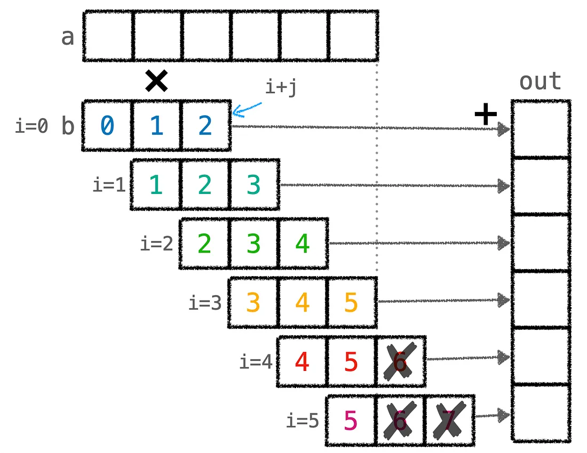
從圖中可以看到，這題的卷積在卷積核超出 `a` 尾端時會自動補零 (`if i + j < a.shape[0]`)，因此實作這題的關鍵在於正確處理卷積核滑到尾端、超過 `a` 的情況。
> [!NOTE] 與 CNN 的關係
> 這裡之所以特別先用圖像來理解題目預期的運算，是因為這題的卷積跟我們在 CNN 裡熟悉的卷積有點不一樣。
> 一般 CNN 的卷積 (valid convolution) 是「卷積核走到不能再走就停」，輸出尺寸會比輸入小一點 (`a_size - b_size + 1`)，整個過程中卷積核永遠不會突出輸入向量的範圍。
> 但這題刻意讓輸出尺寸跟輸入一樣大，因此卷積核滑到尾端時會超出 `a`，並將超出的部分視為 0。
> 另外，深度學習裡的 `b` 通常是訓練學到的參數 (Filter)，但這題的 `b` 是固定的。

根據這個思路，配合題目的提示 (要支援任意大小的輸入向量與卷積核)，可以先寫出第一版的解法：
```python
MAX_CONV = 4   # 卷積核尺寸的上限
TPB = 8        # 每個區塊的執行緒數量
TPB_MAX_CONV = TPB + MAX_CONV  # = 12，共享記憶體的總長度
def conv_test(cuda):  
    # a_size: 輸入向量 a 的長度
    # b_size: 卷積核 b 的實際長度 (<= MAX_CONV)
    def call(out, a, b, a_size, b_size) -> None:  
        i = cuda.blockIdx.x * cuda.blockDim.x + cuda.threadIdx.x  
        local_i = cuda.threadIdx.x  
  
        # FILL ME IN (roughly 17 lines)  
        # 建立能放下輸入陣列與卷積核的共享記憶體  
        shared = cuda.shared.array(TPB_MAX_CONV, numba.float32)  
        # 將輸入陣列放入共享記憶體 (前 TPB = 8 個位置)
        if i < a_size:  
            shared[local_i] = a[i]  
        # 將卷積核放在執行緒長度之後的共享記憶體 (後 MAX_CONV = 4 個位置)
        # 這部分讓區塊前 b_size 個執行緒來負責就好  
        if local_i < b_size:  
            shared[TPB + local_i] = b[local_i]  
        # 同步一下，確保資料都進去共享記憶體了  
        cuda.syncthreads()  
        # 計算卷積  
        sum = 0  
        for j in range(b_size):  
            # 判斷卷積核是否會超過向量 a 以及共享記憶體中本區塊複製的向量 a 
            if local_i + j < a_size and local_i + j < TPB:  
                sum += shared[local_i + j] * shared[TPB + j]  
        # 寫到輸出  
        if i < a_size:  
            out[i] = sum  
    return call
```
這個解法的核心想法是把 `a` 跟卷積核 `b` 一起塞進同一塊共享記憶體：總長度 `TPB_MAX_CONV = TPB + MAX_CONV = 12`，前 `TPB = 8` 個位置放這個區塊負責的 `a` 那一段，後 `MAX_CONV = 4` 個位置放卷積核 `b`。 
為了避免所有執行緒一窩蜂去搬卷積核 (`b` 只有 `b_size` 個元素，沒必要動用 `TPB` 個執行緒)，這份工作交給前 `b_size` 個執行緒就好。

這題有兩個測試，第一個是 `TPB` 大於 `a_size` 的簡單情況 (`a` 完全放得進一個區塊的共享記憶體)，`problem.check()` 按下去，輕鬆通過。
第二個測試則是 `a_size` 大於 `TPB`，所以必須動用多個區塊來分擔，一樣 `problem.check()` 按下去，沒過！

先別收工、別氣餒，身為工程師，我們最愛 Debug 了，深呼吸，來看看錯在哪：
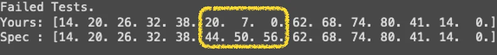
只錯三個，而且都是中間幾個位置少算，還不賴，至少不是無腦寫錯，只是有些情境沒考慮到。

從下面的示意圖就能看出問題：當卷積核滑到一個區塊的尾端時，會超出該區塊載入共享記憶體的範圍 (`TPB` 個元素)，但這時候 **`a` 在後面其實還有值**，只是這些值是由 **下一個區塊** 負責載入的，前面的程式碼把這部分當零來算，所以才會少算三個元素：
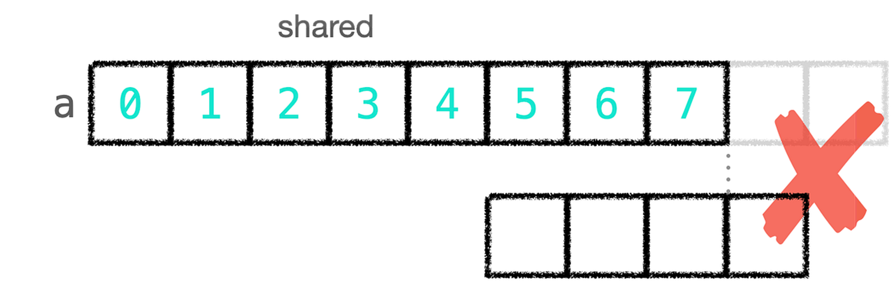
知道問題之後，可以從兩個方向解決：
1. 直接從全域記憶體把缺失的 `a` 讀進來，但這就違背了「把所有東西塞進共享記憶體」的初衷。
2. 把缺失的 `a` 元素也載進共享記憶體。

但做法 2 還是有個現實問題要面對，共享記憶體後面那 `MAX_CONV` 個位置已經被卷積核佔走了，所以實際上得做兩件事，把卷積核搬出去獨立成一塊 `shared_b`，然後把騰出來的位置拿來裝缺失的 `a`。
而騰出來的這 `MAX_CONV` 個位置究竟夠不夠裝，我們可以實際拿一個具體例子算算看。
假設 `TPB = 8`、`b_size = 4`，區塊載入了 `a[0..7]`，這時候區塊最後一個執行緒 (`local_i = 7`) 要算 `out[7]`，它需要 `a[7], a[8], a[9], a[10]` 這 4 個元素跟 `b` 做內積，但 `a[8], a[9], a[10]` 都在下一段、不在區塊內，所以缺了 3 個，剛好等於 `b_size - 1`。
更廣泛地說，卷積核從區塊尾端滑出去時，最多會探出 `b_size - 1` 個位置 (再多卷積核就完全離開區塊了)，所以「缺失的 `a`」最多就是 `b_size - 1` 個。
而 `b_size` 又必定小於等於 `MAX_CONV` (`MAX_CONV` 是卷積核尺寸的上限)，因此原本放 `b` 的那 `MAX_CONV` 個位置剛好夠裝下所有可能缺失的 `a` 啦！

也就是說，`MAX_CONV` 這個常數從一開始就是一身二用，既是卷積核的容量上限，又是「會缺失多少個 `a`」的上限，伏筆藏得真深啊。

那我們就選擇做法 2，再加上一個小巧思，把「載入額外 `a`」這個任務交給原本要載入卷積核但沒事做的執行緒 (前 `b_size` 個之外的那些)，這樣全域記憶體的讀取次數也不會增加。
整套程式碼就會長這樣：
```python
MAX_CONV = 4 
TPB = 8  
TPB_MAX_CONV = TPB + MAX_CONV  
def conv_test(cuda):  
    def call(out, a, b, a_size, b_size) -> None:  
        i = cuda.blockIdx.x * cuda.blockDim.x + cuda.threadIdx.x  
        local_i = cuda.threadIdx.x  
  
        # FILL ME IN (roughly 17 lines)  
        # 拆成兩塊共享記憶體：
        # shared_a 裝這個區塊負責的 a (前 TPB 個) + 額外的 a 尾端 (後面最多 MAX_CONV 個)
        # shared_b 單獨裝卷積核 b
        shared_a = cuda.shared.array(TPB_MAX_CONV, numba.float32)  
        shared_b = cuda.shared.array(MAX_CONV, numba.float32)  
        # 將輸入陣列放入共享記憶體 (前 TPB 個位置)  
        if i < a_size:  
            shared_a[local_i] = a[i]  
              
        # 前 b_size 個執行緒負責載入卷積核到 shared_b
        if local_i < b_size:  
            shared_b[local_i] = b[local_i]  
        # 其餘執行緒 (local_i >= b_size) 負責載入額外的 a 尾端，補到 shared_a 後段
        # 這樣全部執行緒都有事做，全域記憶體的讀取次數也不會增加
        else:  
            # 把編號平移 b_size，重新解讀成「我是第 0 個額外載入者」、「我是第 1 個」這樣
            i_other = i - b_size  
            local_i_other = local_i - b_size  
            # local_i_other < b_size：最多只額外載入 b_size 個 (反正最多缺 b_size - 1 個)
            # TPB + i_other < a_size：避免讀到 a 的範圍外
            if local_i_other < b_size and TPB + i_other < a_size:  
                shared_a[TPB + local_i_other] = a[TPB + i_other]  
        # 同步一下，確保資料都進去共享記憶體了  
        cuda.syncthreads()  
        # 計算卷積  
        sum = 0  
        for j in range(b_size):  
            # 判斷卷積核是否會超過向量 a (注意這裡用 i 而非 local_i)  
            if i + j < a_size:  
                sum += shared_a[local_i + j] * shared_b[j]  
        # 寫到輸出  
        if i < a_size:  
            out[i] = sum  
    return call
```
經過前面詳細的說明，這段程式碼比較不直覺的地方就剩下「索引平移」這個小動作，這裡再來額外解釋一下。
如果不做平移、直接用原本的 `local_i` 來算條件，會發現條件得寫成「`local_i` 介於 `b_size` 跟 `2 * b_size` 之間」這種兩端都要顧的範圍，而且要載入的位置 `shared_a[TPB + (local_i - b_size)]` 跟全域位置 `a[TPB + (i - b_size)]` 裡面也都得帶著 `- b_size` 這個尾巴，整段讀起來很雜。

但只要把編號減掉 `b_size`，這群執行緒就能從「`local_i = b_size, b_size+1, ...`」這種偏移的編號，重新編成「`local_i_other = 0, 1, 2, ...`」這種乾淨的順號，等於是讓他們在自己的小世界裡也是從 0 開始數，所有判斷條件跟索引就都能用最直觀的方式寫出來，跟「載入 `a` 到前 `TPB` 個位置」那段的寫法幾乎一模一樣。

最後來看一下視覺化結果，可以注意到 1D Conv (Full) 左邊區塊的 `S0'` 雖然載入了 `a` 向量的第 12 個元素，但它對該區塊負責的 `Out` 並沒有貢獻，這就是前面提到「額外載入的 `a` 不會用到」的安全冗餘：
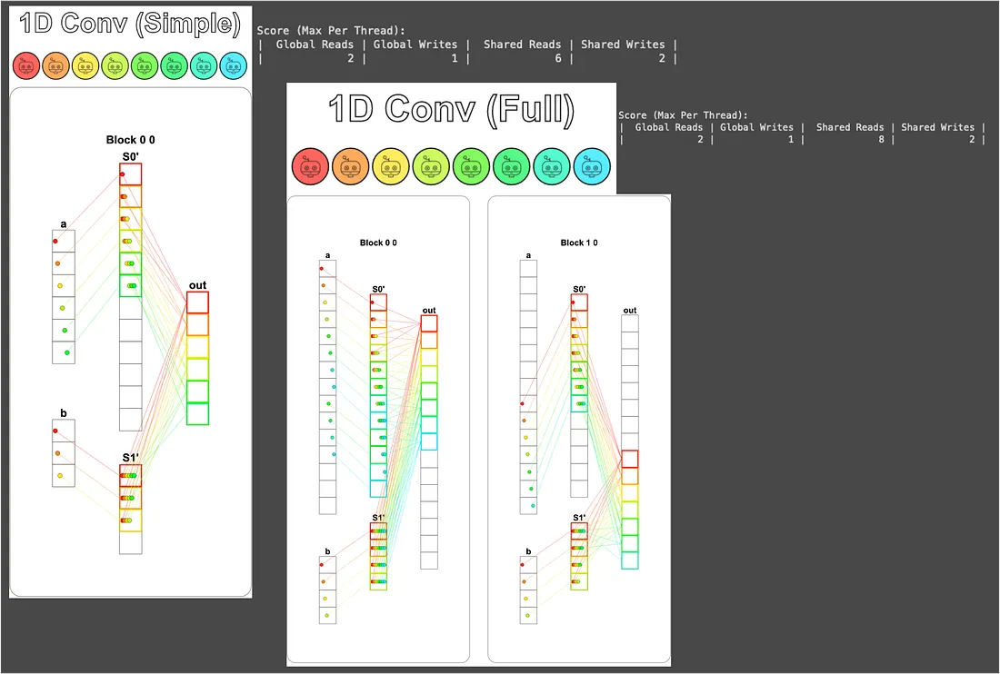
這個解法對全域記憶體的讀寫次數也符合題目要求，讚讚讚！
### Puzzle 12 — Prefix Sum
還記得在 Puzzle 10 結尾埋的伏筆嗎？在那裡我說「派一個執行緒走訪所有元素」這個做法很爛，之後會有更好的演算法，說的就是這題～

題目要求我們計算 `a` 的總和，但如果 `a` 的尺寸大於區塊尺寸 (`TPB`)，那只需要分別計算每個區塊內元素的總和並寫到 `out[blockIdx.x]`，最後整個 array 的總和會由 Host 把這些 partial sum 再加起來，得到最終的答案。
舉個例子，如果 `TPB = 8`、`a` 的長度是 16，一個區塊吃不下，所以會動用 2 個區塊各自負責一段，最終的輸出就會是 `out = [前 8 個元素的總和, 後 8 個元素的總和]`，Host 再把這兩個值加起來就是 `a` 的完整總和。
> [!NOTE] 為什麼叫 Prefix Sum?
> 嚴格來說，[Prefix Sum](https://en.wikipedia.org/wiki/Prefix_sum) 是指輸出 `out[i] = a[0] + a[1] + ... + a[i]` (每個位置都記錄到目前為止的累加值)，但這題只要最後一個累加值 (整段的和)，所以本質上是 [Reduce sum](https://www.tensorflow.org/api_docs/python/tf/math/reduce_sum) (歸約求和)。
> 不過要寫出歸約求和最有效率的平行版本，前面那些中間累加值還是會被算出來，因此就索性叫它 Prefix Sum，正好為下一題 (Axis Sum) 鋪路。
> 沒錯！這裡作者應該是想刺激我們的思考，所以才用了這個名稱，讓我們自行探索有效率的平行化前綴和演算法，就甘心噎。
> 

而本題演算法的正式名稱是 [Blelloch Algorithm](https://www.cs.cmu.edu/~guyb/papers/Ble93.pdf)，但這題實際上只用了其前半段 Up-Sweep (Reduce) Phase。
這個演算法之所以能平行化，靠的是 **加法的結合律 (Associative law)**。
若序列式地加總，計算會長得像 `((a + b) + c) + d`，每一步都要等前一步算完才能繼續，沒辦法平行計算。
但結合律告訴我們可以把這個計算重組成 `(a + b) + (c + d)`，這樣 `a + b` 跟 `c + d` 就能 **同時** 算啦。
把這招繼續推下去，每一輪都把要相加的對數減半，原本 $O(N)$ 的時間就會降成 $O(\log N)$：
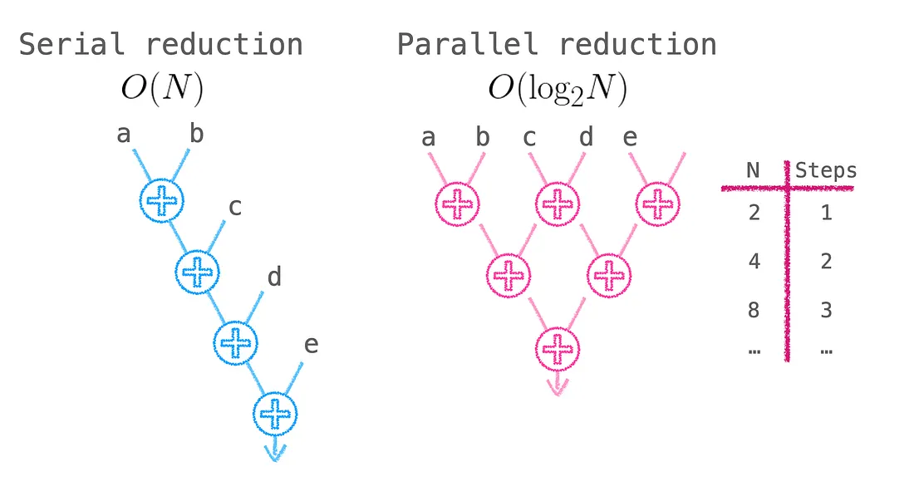
> [!NOTE] Up-Sweep 之後還有 Down-Sweep
> 完整的 Blelloch Algorithm 還需要進行 Down-Sweep 階段才能算出真正完整的 Prefix Sum (每個位置的累加值)，但完整版超出本文範疇，有興趣的孩子請參考 [Chapter 39. Parallel Prefix Sum (Scan) with CUDA](https://developer.nvidia.com/gpugems/gpugems3/part-vi-gpu-computing/chapter-39-parallel-prefix-sum-scan-cuda)。

實作上每一輪都會挑出部分執行緒做相鄰相加，挑選的條件可以寫成 `local_i % stride == 0`，`stride` 從 1 開始、每輪翻倍。
舉例來說，第一輪 `stride = 1`，所有偶數編號的執行緒 (`local_i = 0, 2, 4, 6`) 動手，把自己跟距離 1 的右邊鄰居加起來；第二輪 `stride = 2`，只剩 `local_i = 0, 4` 動手，加上距離 2 的鄰居；第三輪 `stride = 4`，最後就只剩 `local_i = 0` 動手，加上距離 4 的那個，整段總和就此完成。
因為 `TPB = 8`，所以三輪就能搞定 ($\log_2 8 = 3$)：
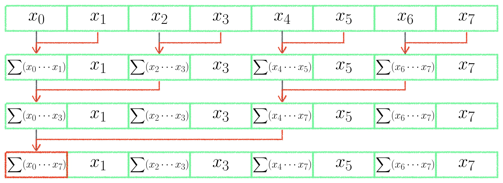
把這三輪獨立寫出來，會長這樣 (這還不是最終版，先過渡一下)：
```python
def sum_test(cuda):  
    def call(out, a, size: int) -> None:  
        cache = cuda.shared.array(TPB, numba.float32)  
        i = cuda.blockIdx.x * cuda.blockDim.x + cuda.threadIdx.x  
        local_i = cuda.threadIdx.x  
        # FILL ME IN (roughly 12 lines)  
        if i < size:  
            # 把資料載入共享記憶體 (注意 index 是 local_i 而不是 i)
            cache[local_i] = a[i]  
            cuda.syncthreads()  
            # 第一輪：local_i = 0, 2, 4, 6 把自己跟距離 1 的鄰居加起來
            if local_i % 2 == 0:  
                cache[local_i] = cache[local_i] + cache[local_i + 1]  
                cuda.syncthreads()  
            # 第二輪：local_i = 0, 4 把自己跟距離 2 的鄰居加起來
            if local_i % 4 == 0:  
                cache[local_i] = cache[local_i] + cache[local_i + 2]  
                cuda.syncthreads()  
            # 第三輪：local_i = 0 把自己跟距離 4 的鄰居加起來，整段總和會落在 cache[0]
            if local_i % 8 == 0:  
                cache[local_i] = cache[local_i] + cache[local_i + 4]  
                cuda.syncthreads()  
    return call
```
其中 `cuda.syncthreads()` 在每一輪結束都要呼叫一次，因為下一輪會去讀上一輪寫進去的結果，沒同步好就會踩到別人的腳趾頭 (Race condition)。
從視覺化可以看到共享記憶體的數值流向跟示意圖一致：
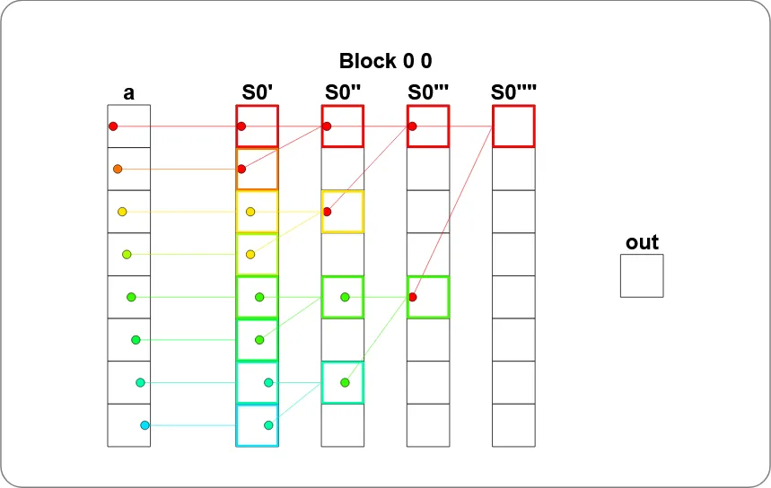
不過這版有兩個地方還可以再修一下：
1. 三輪的 `if` 寫死了，如果 `TPB` 變大就要手動再加 `if`，不通用。
2. 沒處理 `i >= size` 的情況，如果某個執行緒沒有對應的資料，它在共享記憶體裡的位置會是上次留下來的髒值，加進來就會污染整個結果。
把這兩點修一修，就是最終版解答：
```python
def sum_test(cuda):  
    def call(out, a, size: int) -> None:  
        cache = cuda.shared.array(TPB, numba.float32)  
        i = cuda.blockIdx.x * cuda.blockDim.x + cuda.threadIdx.x  
        local_i = cuda.threadIdx.x  
        # FILL ME IN (roughly 12 lines)  
        # 把資料載入共享記憶體，超出 size 的執行緒就把對應位置填 0
        # 因為 0 是加法的單位元素，加進去不會影響結果，這個小技巧之後也會常用到
        if i < size:  
            cache[local_i] = a[i]  
        else:  
            cache[local_i] = 0.0  
        cuda.syncthreads()  
        # 用 while 把三輪合併成通用版本
        # stride 從 1 開始、每輪翻倍 (1 → 2 → 4)，
        # 搭配 local_i % (stride * 2) == 0 挑出這輪要動手的執行緒
        stride = 1  
        while stride < TPB:  
            if local_i % (stride * 2) == 0:  
                cache[local_i] = cache[local_i] + cache[local_i + stride]  
            cuda.syncthreads()  
            stride *= 2  
  
        # 整段總和最後會待在 cache[0]，派 local_i = 0 寫回對應的 out 位置
        if local_i == 0:  
            out[cuda.blockIdx.x] = cache[0]  
    return call
```
視覺化結果如下：
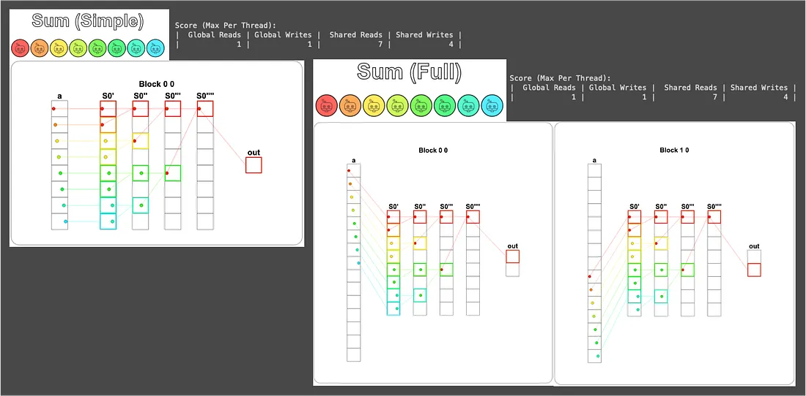
雖然這版的 Shared Reads 只比 Puzzle 10 (8 次) 少 1 (變 7 次)，但別小看這 1 次。
當 `TPB` 變大，序列版本是 $O(\text{TPB})$、Blelloch 是 $O(\log_2 (\text{TPB}))$，到 `TPB = 1024` 時序列版要讀 1024 次，平行版只要 10 次，差距會大得嚇人。
而且 Blelloch 讓所有執行緒輪番上場、不會閒著，這對 GPU 來說才是更重要的事，畢竟閒置的 GPU 是我們最不想看到的。
### Puzzle 13 — Axis Sum
這題要做 Axis Sum (沿軸加總)，相當於 PyTorch `sum` 函式設 `dim` 參數的版本。

從 `sum_spec` 的 `out[..., j] = a[..., i : i + TPB].sum(-1)` 可以看出題目要的是沿著最後一個軸加總。
配合這次題目的 `a.shape = (BATCH, SIZE) = (4, 6)`、`out.shape = (BATCH, 1) = (4, 1)`，意思就是「把每一列的 6 個元素加總成一個值」。
這裡把題目初始的視覺化加上 4 條彩色框框，以幫助理解：
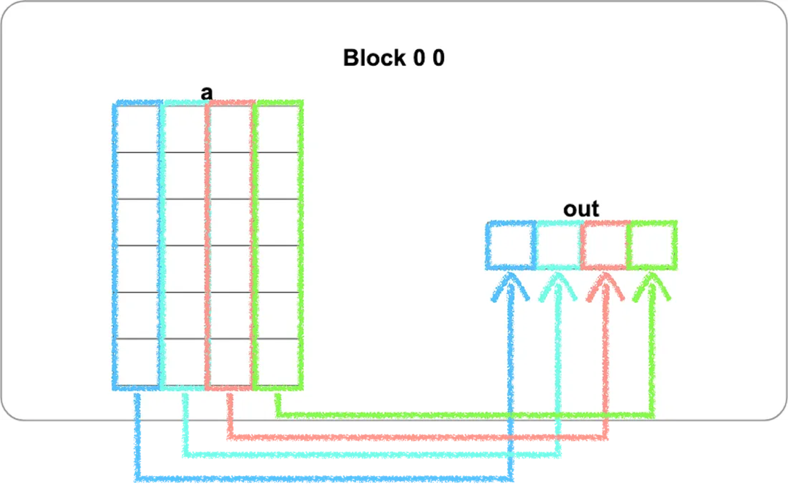
> [!WARNING] 視覺化的方向
> 還記得第一篇開頭警告過 GPU Puzzles 的 2D 視覺化跟 NumPy print 視角差一個轉置嗎？
> 這題就是其中一個例子，NumPy 視角下 `a` 是 4 Row × 6 Col，但視覺化會把它畫成 6 Row × 4 Col (`threadIdx.x` 走水平、`threadIdx.y` 走垂直)，所以圖上看到的 4 條垂直彩色欄，實際上對應的是 NumPy 視角下 `a` 的 4 Row。

實作上有個很美的轉換，仔細一看就能發現，每一 Row 的加總不就是上一題 Prefix Sum 解決的內容嗎？
所以我們只要讓每個區塊負責一 Row，內部直接套上一題的程式碼就完工了。

但要怎麼讓區塊各自對應到一 Row 呢？答案就是用 **第二維 block index** (`cuda.blockIdx.y`)。
題目這次把 `blockspergrid` 設成 `Coord(1, BATCH)`，等於只在 y 方向開了 BATCH 個區塊，每個區塊都有自己唯一的 `blockIdx.y`，從 0 數到 BATCH - 1，剛好可以拿來當作「我負責第幾 Row」的索引值：
```python
def axis_sum_test(cuda):
    def call(out, a, size: int) -> None:  
        cache = cuda.shared.array(TPB, numba.float32)  
        i = cuda.blockIdx.x * cuda.blockDim.x + cuda.threadIdx.x  
        local_i = cuda.threadIdx.x  
        # 第二維 block index，每個區塊靠這個值認領「我負責第幾 Row」
        batch = cuda.blockIdx.y  
        # FILL ME IN (roughly 12 lines)  
        # 載入第 batch row 的對應位置到共享記憶體
        # 超出 size 的執行緒一樣填 0，避免影響加總結果 (跟 Puzzle 12 同樣手法)
        if local_i < size:  
            cache[local_i] = a[batch, local_i]  
        else:  
            cache[local_i] = 0.0  
        cuda.syncthreads()  
        # 套用 Puzzle 12 的 Up-Sweep，整段總和會落在 cache[0]
        stride = 1  
        while stride < TPB:  
            if local_i % (stride * 2) == 0:  
                cache[local_i] = cache[local_i] + cache[local_i + stride]  
            cuda.syncthreads()  
            stride *= 2  
        # 派 local_i = 0 把這 Row 的總和寫到 out 對應的位置
        if local_i == 0:  
            out[batch, 0] = cache[0]  
            
    return call
```
其中最關鍵的就是 `batch`，它讓每個區塊都知道要負責哪一 Row，剩下都是 Puzzle 12 的延伸。

視覺化結果如下 (這裡因為版面關係，放兩個區塊而已)，可以看到 Block 的索引值是 `(0, 0)`、`(0, 1)`、`(0, 2)`、`(0, 3)`，對應的正是 `batch` 所代表的 `blockIdx.y`：
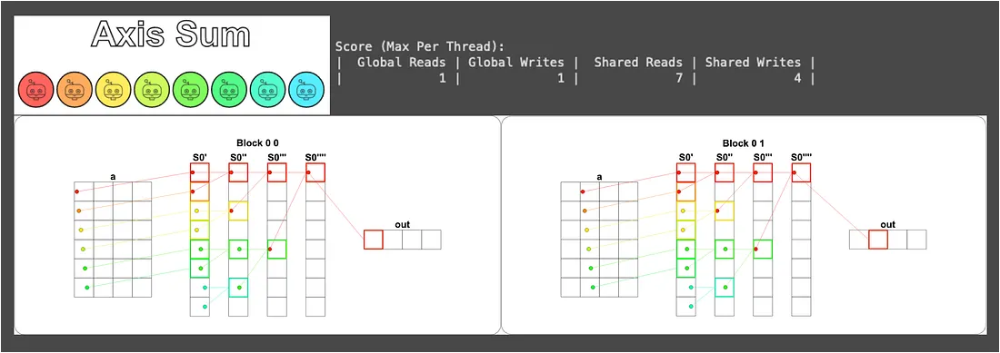
到這裡有個觀察值得我們稍微停下來想想，因為這些區塊之間完全獨立 (各自負責不同的 Row)，它們會被 CUDA 排程器自動派發到不同的 SM 上 **同時** 跑。
這也是為什麼第一篇講的 "分進合擊" 要把問題切成獨立的小塊，因為 "獨立" 就是平行化最強的保證。
### Puzzle 14 — Matrix Multiply！
終於走到最後一題啦 🥳

這題絕對可以稱得上是為本系列畫龍點睛的一題，畢竟矩陣乘法解決了，大部分深度學習演算法都能算了 (延伸閱讀：[GPT in 60 Lines of NumPy](https://jaykmody.com/blog/gpt-from-scratch/))。

直觀來說，矩陣乘法 `out = a @ b` 中的 `out[i, j]` 就是 `a` 的第 `i` Row 跟 `b` 的第 `j` Col 做內積。
但這裡跟前面的題目最大的不同就是它是個 2D 問題，所以區塊與執行緒也都會用 2D 來組織，由每個執行緒負責算出一個 `out[i, j]`。

先從簡單情況講起，當整個矩陣放得下共享記憶體時，我們可以直接把 `a` 跟 `b` 全部裝進去，再讓每個執行緒做自己負責的那一個內積。
但要注意一件事，這次不能像 Puzzle 10 那樣 "邊載邊算"。 因為 Puzzle 10 是內積一個 1D 向量，每個執行緒只需要自己載入的那個位置 (`a[i] * b[i]`)，而現在每個執行緒需要的是「自己負責的那一整 Row / 那一整 Col」，但這些位置的資料是由其他執行緒載入的，所以必須先全部載完、同步、再開始算：
```python
TPB = 3
def mm_oneblock_test(cuda):  
    def call(out, a, b, size: int) -> None:  
        # 兩塊 2D 共享記憶體，分別裝整個 a 跟整個 b
        a_shared = cuda.shared.array((TPB, TPB), numba.float32)  
        b_shared = cuda.shared.array((TPB, TPB), numba.float32)  
  
        i = cuda.blockIdx.x * cuda.blockDim.x + cuda.threadIdx.x  
        j = cuda.blockIdx.y * cuda.blockDim.y + cuda.threadIdx.y  
        local_i = cuda.threadIdx.x  
        local_j = cuda.threadIdx.y  
  
        # FILL ME IN (roughly 14 lines)  
        if i < size and j < size:  
            # 每個執行緒負責載入一個位置 (i, j)，全部執行緒合力把 a 跟 b 都載完
            a_shared[local_i, local_j] = a[i, j]  
            b_shared[local_i, local_j] = b[i, j]  
            # 必須等大家都載完，因為下面要讀其他執行緒載入的位置
            cuda.syncthreads()  
            # 計算 a 的第 local_i Row 跟 b 的第 local_j Col 的內積
            prod = 0  
            for k in range(size):  
                prod += a_shared[local_i, k] * b_shared[k, local_j]  
            # 寫到輸出  
            out[i, j] = prod  
    return call
```
這段程式碼的重點是迴圈裡那一行 `prod += a_shared[local_i, k] * b_shared[k, local_j]`，對於負責 `out[i, j]` 的執行緒來說，`local_i` 跟 `local_j` 是固定的，靠著 `k` 從 0 跑到 `size - 1`，就把 `a` 的第 `local_i` Row 跟 `b` 的第 `local_j` Col 整條都走過、做完內積。

視覺化的部分這裡只畫紅色執行緒 (設置上使用 `problem.show(sparse=True)`)，不然會太雜：
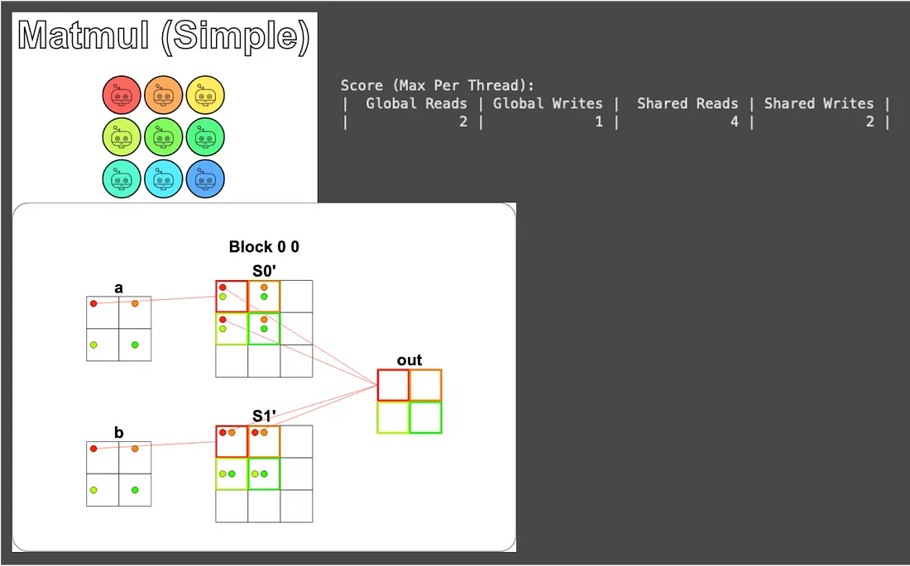
接下來則是比較困難但更常見的情況 — 矩陣尺寸比共享記憶體尺寸還要大。
以此題來說，共享記憶體只有 `TPB × TPB`，所以當矩陣超出這個大小時，就沒辦法一次把整個 `a` 跟 `b` 裝進去，必須改用分塊載入的方式，把 `a` 跟 `b` 拆成一塊一塊輪流載入共享記憶體，並把每一塊算出來的部分內積累加起來，跑完所有塊之後 `prod` 就是完整的內積值：
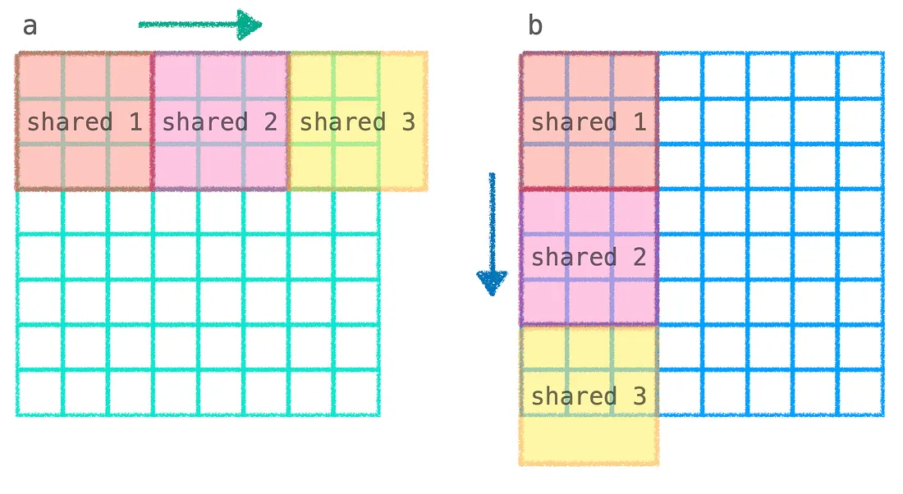
從上圖可以看到，計算 `out[i, j]` 需要 `a` 第 `i` Row 的整條跟 `b` 第 `j` Col 的整條做內積，但因為兩條都裝不進共享記憶體，所以必須拆成「載入 `a` 的一段 + `b` 的一段 → 算這段的內積 → 累加到 `prod` → 再載下一段」這樣疊代地將局部內積累積到總和的流程：
```python
TPB = 3  
def mm_oneblock_test(cuda):  
    def call(out, a, b, size: int) -> None:  
        a_shared = cuda.shared.array((TPB, TPB), numba.float32)  
        b_shared = cuda.shared.array((TPB, TPB), numba.float32)  
  
        i = cuda.blockIdx.x * cuda.blockDim.x + cuda.threadIdx.x  
        j = cuda.blockIdx.y * cuda.blockDim.y + cuda.threadIdx.y  
        local_i = cuda.threadIdx.x  
        local_j = cuda.threadIdx.y  
        # FILL ME IN (roughly 14 lines)  
        # prod 在每輪疊代外面初始化，這樣每塊算出來的部分內積才能累加上去
        prod = 0  
        # 無條件進位算出要跑幾輪疊代 (因為 size 不一定整除 TPB)
        # 例如 size = 8、TPB = 3 時，要 3 輪才能跑完 (3 + 3 + 2)
        blocks = size // TPB + bool(size % TPB)  
        # block 在這裡代表「目前處理到第幾塊」，從 0 數到 blocks - 1
        for block in range(blocks):  
            # b_i、b_j 是「目前這一塊」在原始矩陣 a / b 中對應的位置
            # 第 block 塊就把 a 的第 block 段、b 的第 block 段拉進共享記憶體
            b_i = block * cuda.blockDim.x + cuda.threadIdx.x  
            b_j = block * cuda.blockDim.y + cuda.threadIdx.y  
            # 載入 a 的這一塊：固定 Row i (這個執行緒負責的)、跨 Col 跟著 block 跑
            if i < size and b_j < size:  
                a_shared[local_i, local_j] = a[i, b_j]  
            # 載入 b 的這一塊：跨 Row 跟著 block 跑、固定 Col j
            if b_i < size and j < size:  
                b_shared[local_i, local_j] = b[b_i, j]  
            cuda.syncthreads()  
            # 計算這一塊的內積並累加到 prod
            # 內迴圈最多跑 TPB 次，但最後一塊可能不滿 TPB，所以用 min 限制
            for k in range(min(TPB, size - block*TPB)):  
                prod += a_shared[local_i, k] * b_shared[k, local_j]  
        # 所有塊都跑完之後，prod 就是完整內積，寫到輸出
        if i < size and j < size:  
            out[i, j] = prod  
  
    return call
```
這整段比較不直覺的地方只有 `b_i` 跟 `b_j` 的計算，所以再單獨拉出來解釋一下。
對於負責 `out[i, j]` 的執行緒來說，它要拿到的是 `a` 的第 `i` Row、`b` 的第 `j` Col，這兩個值在整段運算中是固定的。
變的是「目前處理到 Row / Col 的哪一段」，這就是 `b_i` 跟 `b_j` 的角色，隨著 `block` 增加，這兩個值會跟著往後移動 `TPB` 個位置，剛好對應到 `a` 第 `i` Row 的下一段、`b` 第 `j` Col 的下一段。
所以載入 `a` 時 Row 固定用 `i`、Col 跟著 `b_j` 跑；載入 `b` 時 Row 跟著 `b_i` 跑、Col 固定用 `j`。

困難的測試案例使用了 8×8 矩陣，搭配 3×3 個尺寸為 3×3 的區塊處理，這裡只放第一個與最後一個區塊的運算視覺化，其餘部分可依此類推：
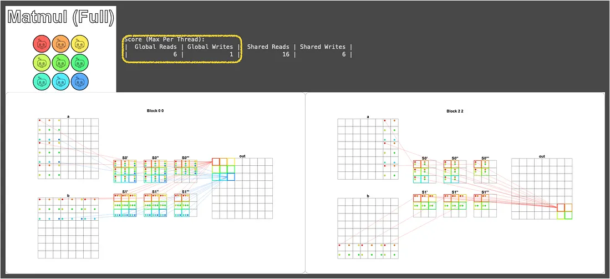
可以看到這裡只花了 6 次的全域記憶體讀取，已經是符合題目要求的做法了！
> [!NOTE] 真實世界的矩陣乘法
> 還記得 Puzzle 8 結尾提到的 [`fast_matmul`](https://numba.pydata.org/numba-doc/latest/cuda/examples.html#matrix-multiplication) 嗎？這題其實就是它的精簡版！
> 真實的高效能矩陣乘法 (例如 cuBLAS、CUTLASS) 在這個基礎之上還會做很多優化 (Tiling、Tensor Core、Mixed Precision 等等)，但核心精神就是這裡的「分塊載入共享記憶體」。
> 也就是說，把這題啃下來，就等於摸到了現代深度學習底層加速的門檻，從這裡再往下挖，就是 NVIDIA 工程師月薪七位數的世界了 🤑 (開玩笑的)。
## 結語
恭喜各位看到這裡的小朋友，我們一起完成了 14 個謎題，從最基本的 Map、Zip 出發，一路走過 Guard、多區塊、共享記憶體，最後打通了卷積、平行歸約、矩陣乘法。

而支撐這趟旅程的核心心法，其實就只有以下幾條：
- **每筆資料配一個執行緒**：先想單一個執行緒要做什麼，再讓硬體幫我們開出一大堆同時跑。
- **執行緒比資料多就用 Guard 擋掉**：避免越界，也避免某些執行緒拿髒值來污染運算。
- **熱資料盡量待在快的記憶體裡**：能用共享記憶體就別反覆讀全域記憶體。
- **共享記憶體配 `syncthreads()`**：寫入後、讀取前一定要同步，否則 Race condition 等著你。
- **把問題切成獨立的小塊**：區塊之間越獨立，GPU 越能自由地分派到不同 SM 平行處理。

掌握這幾條，再加上前一篇講的 Thread / Block / Grid 階層架構，遇到新的演算法時，大多都能套出一個堪用的 CUDA 版本。

而如果想再往前一步，可以考慮看看：
- **[NUMBA CUDA Guide](https://numba.readthedocs.io/en/stable/cuda/index.html)**：本系列只是入門，Numba 還有 Atomic Operations、Cooperative Groups、CUDA Streams 等進階主題。
- **[Apache TVM](https://tvm.apache.org/) 與 [OpenAI Triton](https://openai.com/index/triton/)**：跳脫硬體框架的高階寫法，讓你不必每個架構都重寫一遍。
- **[CUTLASS](https://github.com/NVIDIA/cutlass)**：NVIDIA 自家的高效能矩陣乘法函式庫原始碼，看完保證對 Puzzle 14 的「進階版」充滿敬意。

最後，各位阿瑋大軍，辛苦了！我們下次見啦～

## 參考資料
- [Chapter 39. Parallel Prefix Sum (Scan) with CUDA](https://developer.nvidia.com/gpugems/gpugems3/part-vi-gpu-computing/chapter-39-parallel-prefix-sum-scan-cuda)
- [Blelloch Scan — Intro to Parallel Programming](https://www.youtube.com/watch?v=mmYv3Haj6uc)
- [Understanding the implementation of the Blelloch Algorithm (Work-Efficient Parallel Prefix Scan)](https://medium.com/nerd-for-tech/understanding-implementation-of-work-efficient-parallel-prefix-scan-cca2d5335c9b)
- [和TensorFlow一樣，NVIDIA CUDA的壟斷格局將被打破？](https://www.techbang.com/posts/103424-tensorflow-nvidia-cudas)